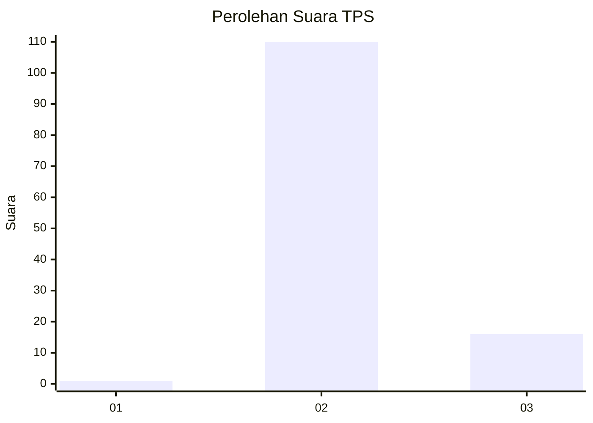
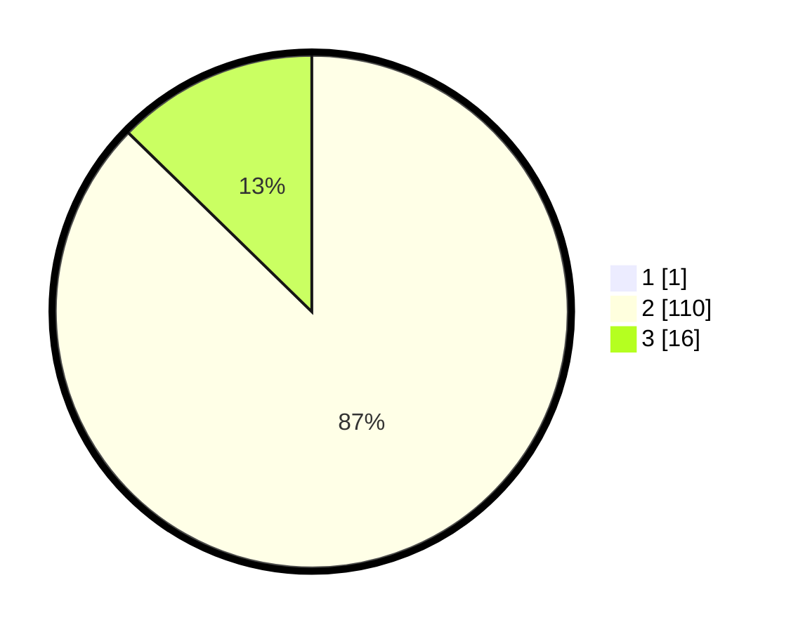

# Hasil

## Grafik

## Tabel

| No. | Nama Paslon    | Suara | Suara (raw) | Persentase |
|:--- |:-------------- | -----:| -----------:| ----------:|
| 1   | ANIES MUHAIMIN | 1     | [1][p-1]    | 0,79       |
| 2   | PRABOWO GIBRAN | 110   | [110][p-2]  | 86,61      |
| 3   | GANJAR MAHFUD  | 16    | [16][p-3]   | 12,60      |

[p-1]: https://github.com/gigit-pemilu/pemilu-2024/blob/main/pilpres/hitung-suara/sub/35-jawa-timur/sub/23-tuban/sub/10-montong/sub/2005-talangkembar/sub/008-tps/sub/paslon-1.txt
[p-2]: https://github.com/gigit-pemilu/pemilu-2024/blob/main/pilpres/hitung-suara/sub/35-jawa-timur/sub/23-tuban/sub/10-montong/sub/2005-talangkembar/sub/008-tps/sub/paslon-2.txt
[p-3]: https://github.com/gigit-pemilu/pemilu-2024/blob/main/pilpres/hitung-suara/sub/35-jawa-timur/sub/23-tuban/sub/10-montong/sub/2005-talangkembar/sub/008-tps/sub/paslon-3.txt

## Foto C Plano

https://sirekap-obj-formc.kpu.go.id/923d/pemilu/ppwp/35/23/10/20/05/3523102005008-20240216-155135--c3bda690-8c09-4324-92fb-b8e8e680e710.jpg

https://sirekap-obj-formc.kpu.go.id/923d/pemilu/ppwp/35/23/10/20/05/3523102005008-20240216-155229--b93de0ff-dd12-4dbd-a455-13fe17be52a3.jpg

https://sirekap-obj-formc.kpu.go.id/923d/pemilu/ppwp/35/23/10/20/05/3523102005008-20240214-155339--b779283b-9bb1-425d-858d-3d47626b20a3.jpg

## Metadata

| Key        | Value               |
| ---------- | ------------------- |
| Time Stamp | 2024-02-19 15:00:00 |

