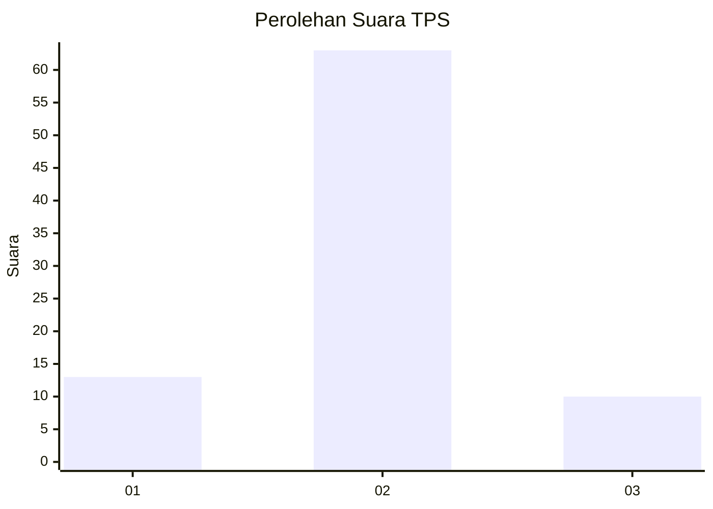
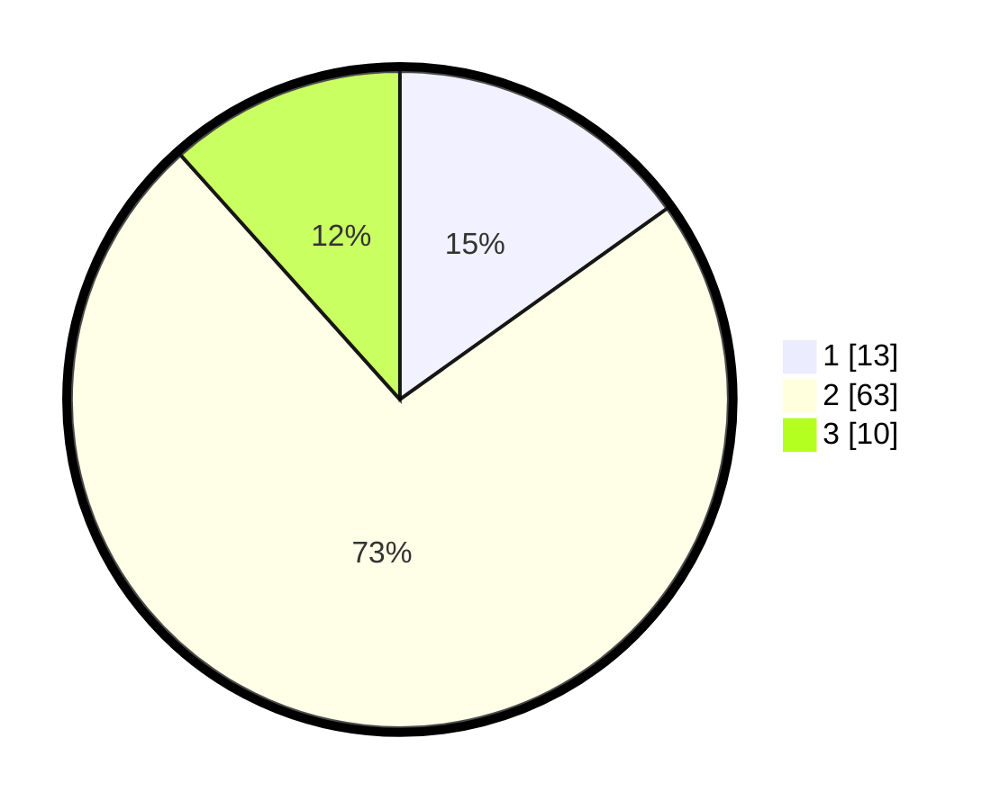

# Hasil

## Grafik

## Tabel

| No. | Nama Paslon    | Suara | Suara (raw) | Persentase |
|:--- |:-------------- | -----:| -----------:| ----------:|
| 1   | ANIES MUHAIMIN | 13    | [13][p-1]   | 15,12      |
| 2   | PRABOWO GIBRAN | 63    | [63][p-2]   | 73,26      |
| 3   | GANJAR MAHFUD  | 10    | [10][p-3]   | 11,63      |

[p-1]: https://github.com/gigit-pemilu/pemilu-2024/blob/main/pilpres/hitung-suara/sub/35-jawa-timur/sub/23-tuban/sub/10-montong/sub/2008-sumurgung/sub/020-tps/sub/paslon-1.txt
[p-2]: https://github.com/gigit-pemilu/pemilu-2024/blob/main/pilpres/hitung-suara/sub/35-jawa-timur/sub/23-tuban/sub/10-montong/sub/2008-sumurgung/sub/020-tps/sub/paslon-2.txt
[p-3]: https://github.com/gigit-pemilu/pemilu-2024/blob/main/pilpres/hitung-suara/sub/35-jawa-timur/sub/23-tuban/sub/10-montong/sub/2008-sumurgung/sub/020-tps/sub/paslon-3.txt

## Foto C Plano

https://sirekap-obj-formc.kpu.go.id/9b7d/pemilu/ppwp/35/23/10/20/08/3523102008020-20240214-212339--67095bf4-7fb2-4ef4-89a2-aa5af24ad432.jpg

https://sirekap-obj-formc.kpu.go.id/9b7d/pemilu/ppwp/35/23/10/20/08/3523102008020-20240214-141818--832b1626-b254-4762-bcb1-afeed005d068.jpg

https://sirekap-obj-formc.kpu.go.id/9b7d/pemilu/ppwp/35/23/10/20/08/3523102008020-20240216-153857--17480a2c-700d-4698-a40e-fc79d270118d.jpg

## Metadata

| Key        | Value               |
| ---------- | ------------------- |
| Time Stamp | 2024-02-16 16:25:10 |

