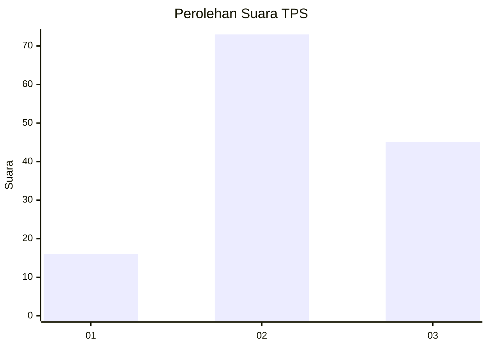
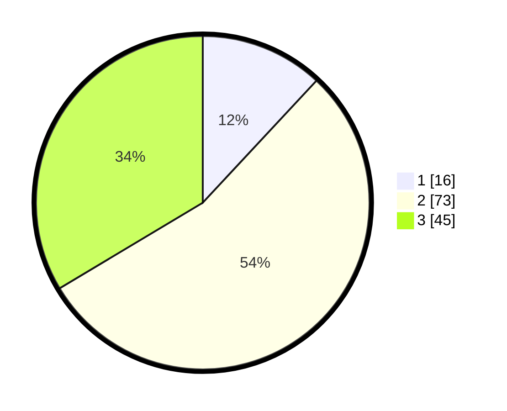

# Hasil

## Grafik

## Tabel

| No. | Nama Paslon    | Suara | Suara (raw) | Persentase |
|:--- |:-------------- | -----:| -----------:| ----------:|
| 1   | ANIES MUHAIMIN | 16    | [16][p-1]   | 11,94      |
| 2   | PRABOWO GIBRAN | 73    | [73][p-2]   | 54,48      |
| 3   | GANJAR MAHFUD  | 45    | [45][p-3]   | 33,58      |

[p-1]: https://github.com/gigit-pemilu/pemilu-2024/blob/main/pilpres/hitung-suara/sub/35-jawa-timur/sub/23-tuban/sub/10-montong/sub/2011-maindu/sub/013-tps/sub/paslon-1.txt
[p-2]: https://github.com/gigit-pemilu/pemilu-2024/blob/main/pilpres/hitung-suara/sub/35-jawa-timur/sub/23-tuban/sub/10-montong/sub/2011-maindu/sub/013-tps/sub/paslon-2.txt
[p-3]: https://github.com/gigit-pemilu/pemilu-2024/blob/main/pilpres/hitung-suara/sub/35-jawa-timur/sub/23-tuban/sub/10-montong/sub/2011-maindu/sub/013-tps/sub/paslon-3.txt

## Foto C Plano

https://sirekap-obj-formc.kpu.go.id/2356/pemilu/ppwp/35/23/10/20/11/3523102011013-20240215-020233--4ad9a9b2-e669-4b79-8249-68a9997d58ac.jpg

https://sirekap-obj-formc.kpu.go.id/2356/pemilu/ppwp/35/23/10/20/11/3523102011013-20240215-021450--2d2f7a94-4972-4aba-8c23-8c703e8b8b02.jpg

https://sirekap-obj-formc.kpu.go.id/2356/pemilu/ppwp/35/23/10/20/11/3523102011013-20240215-021612--4c8fa96d-849a-478e-bf26-c0433458af3d.jpg

## Metadata

| Key        | Value               |
| ---------- | ------------------- |
| Time Stamp | 2024-02-16 12:51:22 |

