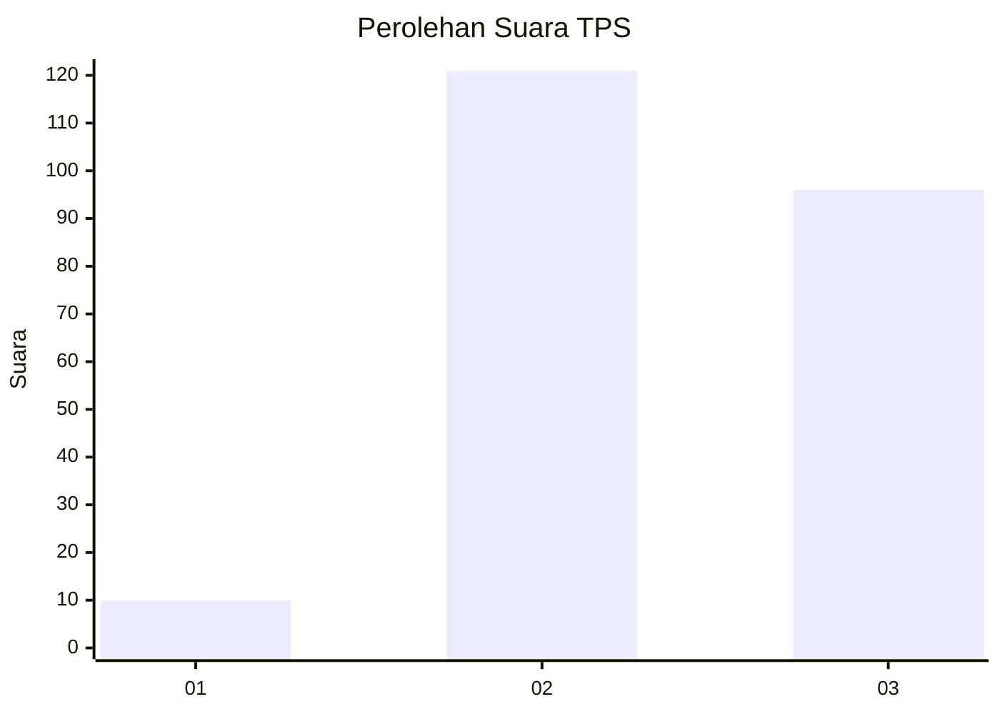
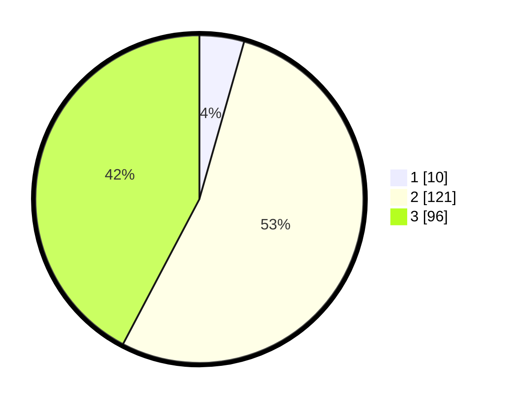

# Hasil

## Grafik

## Tabel

| No. | Nama Paslon    | Suara | Suara (raw) | Persentase |
|:--- |:-------------- | -----:| -----------:| ----------:|
| 1   | ANIES MUHAIMIN | 10    | [10][p-1]   | 4,41       |
| 2   | PRABOWO GIBRAN | 121   | [121][p-2]  | 53,30      |
| 3   | GANJAR MAHFUD  | 96    | [96][p-3]   | 42,29      |

[p-1]: https://github.com/gigit-pemilu/pemilu-2024-35-jawa-timur/blob/main/pilpres/hitung-suara/sub/35-jawa-timur/sub/23-tuban/sub/11-soko/sub/2008-klumpit/sub/005-tps/sub/paslon-1.txt
[p-2]: https://github.com/gigit-pemilu/pemilu-2024-35-jawa-timur/blob/main/pilpres/hitung-suara/sub/35-jawa-timur/sub/23-tuban/sub/11-soko/sub/2008-klumpit/sub/005-tps/sub/paslon-2.txt
[p-3]: https://github.com/gigit-pemilu/pemilu-2024-35-jawa-timur/blob/main/pilpres/hitung-suara/sub/35-jawa-timur/sub/23-tuban/sub/11-soko/sub/2008-klumpit/sub/005-tps/sub/paslon-3.txt

## Foto C Plano

https://sirekap-obj-formc.kpu.go.id/6c18/pemilu/ppwp/35/23/11/20/08/3523112008005-20240214-230456--dbefae64-f9b1-44b8-aff2-b76ec4f1db3d.jpg

https://sirekap-obj-formc.kpu.go.id/6c18/pemilu/ppwp/35/23/11/20/08/3523112008005-20240214-233301--b8c466f2-09f2-4fd3-821b-fffdabbb0277.jpg

https://sirekap-obj-formc.kpu.go.id/6c18/pemilu/ppwp/35/23/11/20/08/3523112008005-20240214-233438--e0de1423-758e-479b-acd6-b8588c75bfc5.jpg

## Metadata

| Key        | Value               |
| ---------- | ------------------- |
| Time Stamp | 2024-02-15 17:30:25 |

