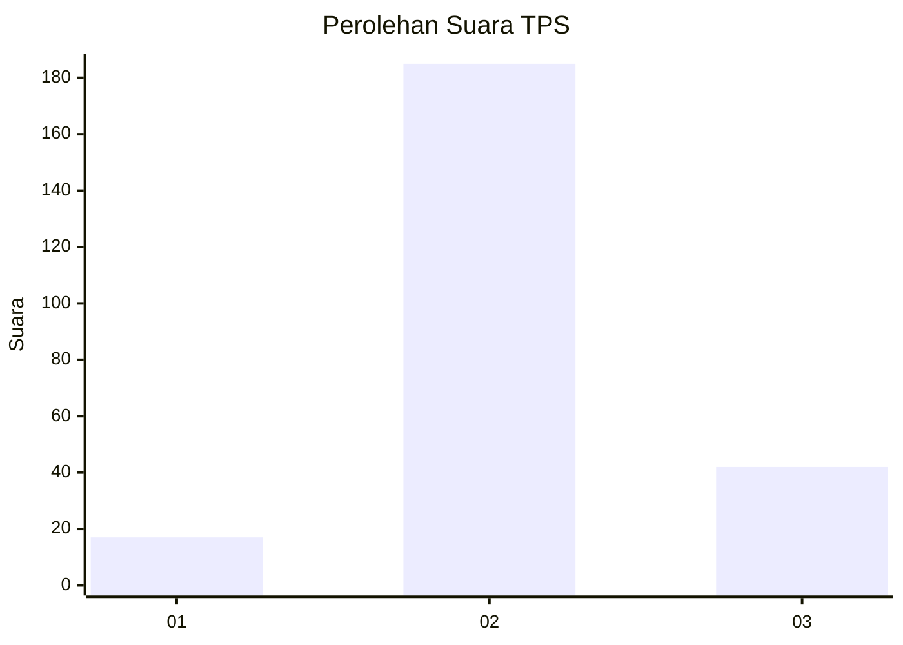

# Hasil

## Grafik

## Tabel

| No. | Nama Paslon    | Suara | Suara (raw) | Persentase |
|:--- |:-------------- | -----:| -----------:| ----------:|
| 1   | ANIES MUHAIMIN | 17    | [17][p-1]   | 6,97       |
| 2   | PRABOWO GIBRAN | 185   | [185][p-2]  | 75,82      |
| 3   | GANJAR MAHFUD  | 42    | [42][p-3]   | 17,21      |

[p-1]: https://github.com/gigit-pemilu/pemilu-2024/blob/main/pilpres/hitung-suara/sub/35-jawa-timur/sub/23-tuban/sub/13-merakurak/sub/2011-tahulu/sub/002-tps/sub/paslon-1.txt
[p-2]: https://github.com/gigit-pemilu/pemilu-2024/blob/main/pilpres/hitung-suara/sub/35-jawa-timur/sub/23-tuban/sub/13-merakurak/sub/2011-tahulu/sub/002-tps/sub/paslon-2.txt
[p-3]: https://github.com/gigit-pemilu/pemilu-2024/blob/main/pilpres/hitung-suara/sub/35-jawa-timur/sub/23-tuban/sub/13-merakurak/sub/2011-tahulu/sub/002-tps/sub/paslon-3.txt

## Foto C Plano

https://sirekap-obj-formc.kpu.go.id/d3a6/pemilu/ppwp/35/23/13/20/11/3523132011002-20240218-220100--e3c02a8d-27f4-4321-b3fd-9b34dc49e544.jpg

https://sirekap-obj-formc.kpu.go.id/d3a6/pemilu/ppwp/35/23/13/20/11/3523132011002-20240218-220257--93e9fd6b-3145-4634-bdd3-f13e65cabb68.jpg

https://sirekap-obj-formc.kpu.go.id/d3a6/pemilu/ppwp/35/23/13/20/11/3523132011002-20240218-220454--c6bb0b26-2e18-4aae-83ab-cb943eba6593.jpg

## Metadata

| Key        | Value               |
| ---------- | ------------------- |
| Time Stamp | 2024-02-19 15:00:00 |

