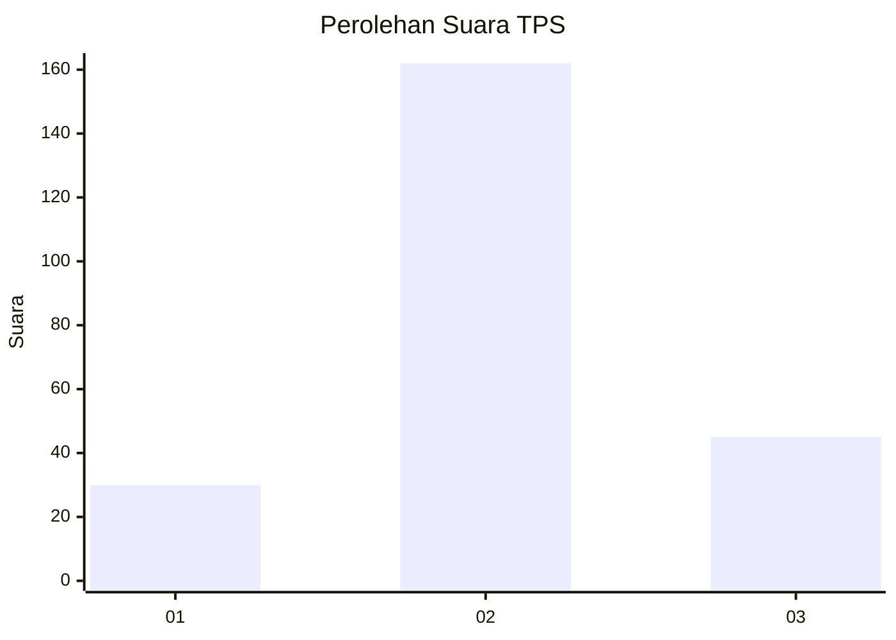
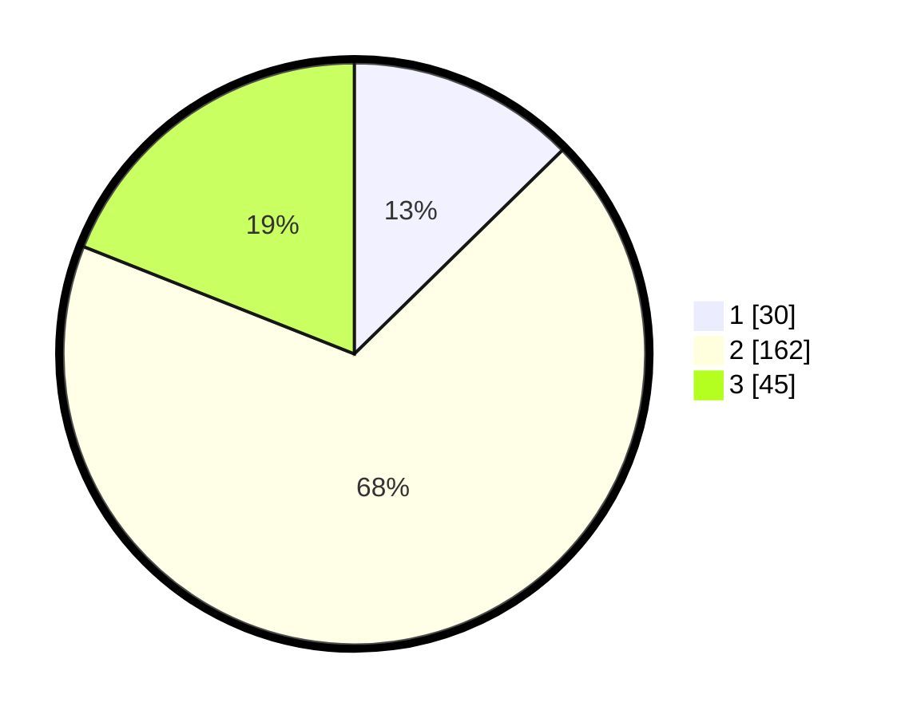

# Hasil

## Grafik

## Tabel

| No. | Nama Paslon    | Suara | Suara (raw) | Persentase |
|:--- |:-------------- | -----:| -----------:| ----------:|
| 1   | ANIES MUHAIMIN | 30    | [30][p-1]   | 12,66      |
| 2   | PRABOWO GIBRAN | 162   | [162][p-2]  | 68,35      |
| 3   | GANJAR MAHFUD  | 45    | [45][p-3]   | 18,99      |

[p-1]: https://github.com/gigit-pemilu/pemilu-2024/blob/main/pilpres/hitung-suara/sub/35-jawa-timur/sub/23-tuban/sub/15-semanding/sub/1006-karang/sub/006-tps/sub/paslon-1.txt
[p-2]: https://github.com/gigit-pemilu/pemilu-2024/blob/main/pilpres/hitung-suara/sub/35-jawa-timur/sub/23-tuban/sub/15-semanding/sub/1006-karang/sub/006-tps/sub/paslon-2.txt
[p-3]: https://github.com/gigit-pemilu/pemilu-2024/blob/main/pilpres/hitung-suara/sub/35-jawa-timur/sub/23-tuban/sub/15-semanding/sub/1006-karang/sub/006-tps/sub/paslon-3.txt

## Foto C Plano

https://sirekap-obj-formc.kpu.go.id/9192/pemilu/ppwp/35/23/15/10/06/3523151006006-20240214-195048--9194287f-7242-4a24-90fb-a52611b5ae01.jpg

https://sirekap-obj-formc.kpu.go.id/9192/pemilu/ppwp/35/23/15/10/06/3523151006006-20240214-194832--fcdf6269-17dd-4b3d-b094-79106fb440c6.jpg

https://sirekap-obj-formc.kpu.go.id/9192/pemilu/ppwp/35/23/15/10/06/3523151006006-20240214-194759--3bcb3172-3cce-4d2b-9c1e-4a12900dcaa2.jpg

## Metadata

| Key        | Value               |
| ---------- | ------------------- |
| Time Stamp | 2024-02-15 15:00:29 |

