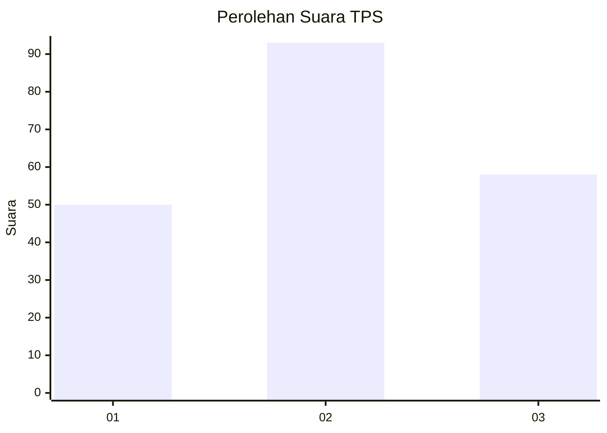
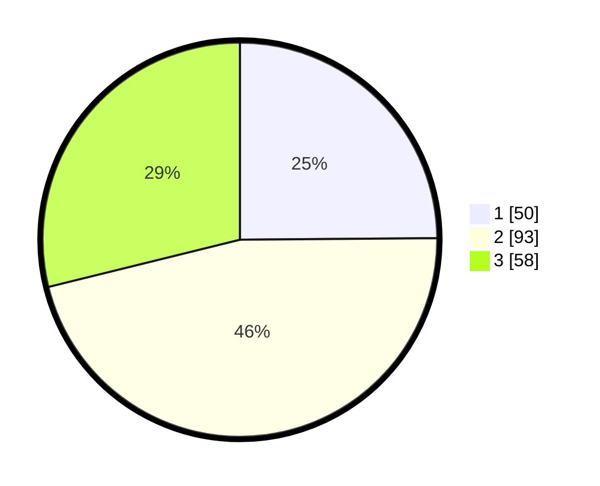

# Hasil

## Grafik

## Tabel

| No. | Nama Paslon    | Suara | Suara (raw) | Persentase |
|:--- |:-------------- | -----:| -----------:| ----------:|
| 1   | ANIES MUHAIMIN | 50    | [50][p-1]   | 24,88      |
| 2   | PRABOWO GIBRAN | 93    | [93][p-2]   | 46,27      |
| 3   | GANJAR MAHFUD  | 58    | [58][p-3]   | 28,86      |

[p-1]: https://github.com/gigit-pemilu/pemilu-2024/blob/main/pilpres/hitung-suara/sub/35-jawa-timur/sub/23-tuban/sub/15-semanding/sub/1015-gedongombo/sub/006-tps/sub/paslon-1.txt
[p-2]: https://github.com/gigit-pemilu/pemilu-2024/blob/main/pilpres/hitung-suara/sub/35-jawa-timur/sub/23-tuban/sub/15-semanding/sub/1015-gedongombo/sub/006-tps/sub/paslon-2.txt
[p-3]: https://github.com/gigit-pemilu/pemilu-2024/blob/main/pilpres/hitung-suara/sub/35-jawa-timur/sub/23-tuban/sub/15-semanding/sub/1015-gedongombo/sub/006-tps/sub/paslon-3.txt

## Foto C Plano

https://sirekap-obj-formc.kpu.go.id/6d35/pemilu/ppwp/35/23/15/10/15/3523151015006-20240217-101714--dd281751-a696-4998-878a-d4203ae404db.jpg

https://sirekap-obj-formc.kpu.go.id/6d35/pemilu/ppwp/35/23/15/10/15/3523151015006-20240217-101833--27843eb0-a300-4ddc-b273-37fe34389dc8.jpg

https://sirekap-obj-formc.kpu.go.id/6d35/pemilu/ppwp/35/23/15/10/15/3523151015006-20240217-102014--6e81247d-8138-486d-8555-4556e3211119.jpg

## Metadata

| Key        | Value               |
| ---------- | ------------------- |
| Time Stamp | 2024-02-17 16:00:02 |

