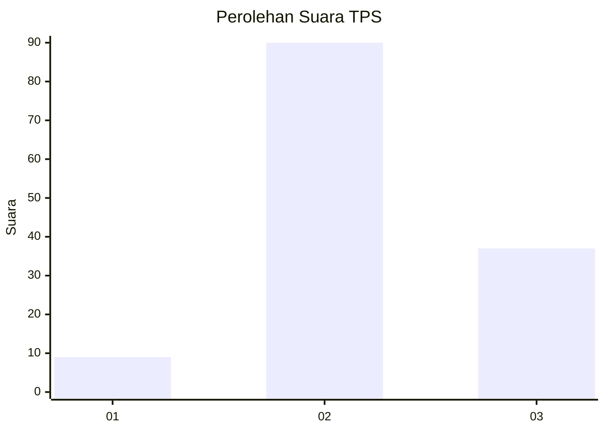
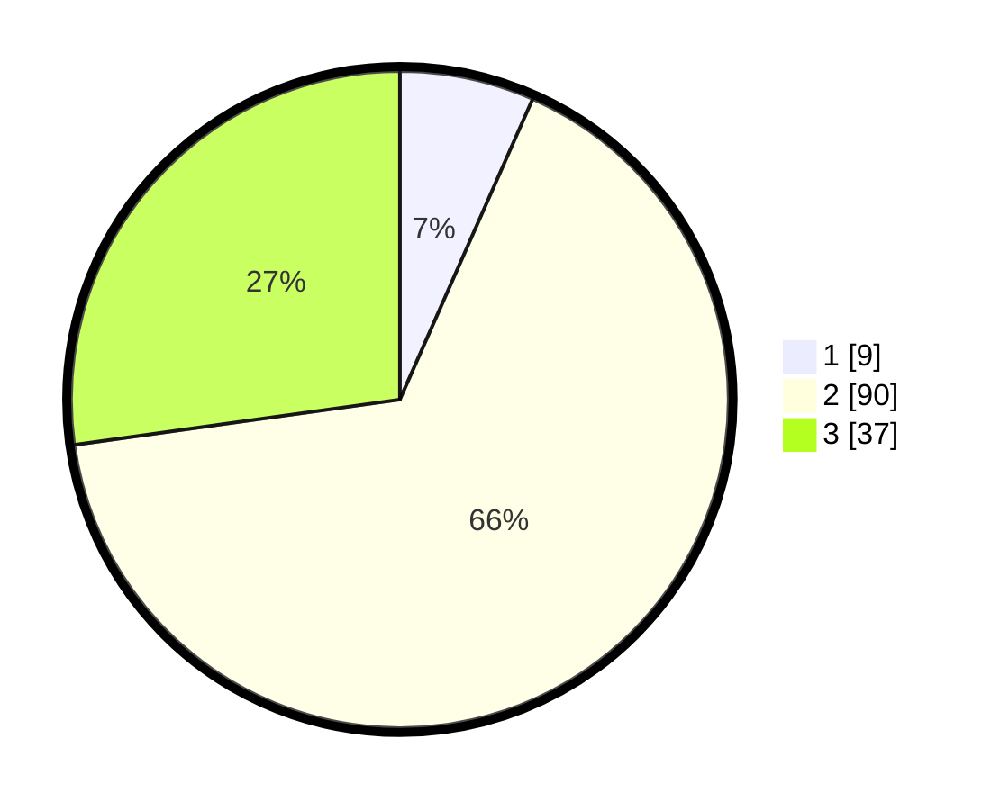

# Hasil

## Grafik

## Tabel

| No. | Nama Paslon    | Suara | Suara (raw) | Persentase |
|:--- |:-------------- | -----:| -----------:| ----------:|
| 1   | ANIES MUHAIMIN | 9     | [9][p-1]    | 6,62       |
| 2   | PRABOWO GIBRAN | 90    | [90][p-2]   | 66,18      |
| 3   | GANJAR MAHFUD  | 37    | [37][p-3]   | 27,21      |

[p-1]: https://github.com/gigit-pemilu/pemilu-2024/blob/main/pilpres/hitung-suara/sub/35-jawa-timur/sub/23-tuban/sub/15-semanding/sub/1015-gedongombo/sub/034-tps/sub/paslon-1.txt
[p-2]: https://github.com/gigit-pemilu/pemilu-2024/blob/main/pilpres/hitung-suara/sub/35-jawa-timur/sub/23-tuban/sub/15-semanding/sub/1015-gedongombo/sub/034-tps/sub/paslon-2.txt
[p-3]: https://github.com/gigit-pemilu/pemilu-2024/blob/main/pilpres/hitung-suara/sub/35-jawa-timur/sub/23-tuban/sub/15-semanding/sub/1015-gedongombo/sub/034-tps/sub/paslon-3.txt

## Foto C Plano

https://sirekap-obj-formc.kpu.go.id/e9d6/pemilu/ppwp/35/23/15/10/15/3523151015034-20240214-215739--2c3db71d-d329-4678-b91b-a54bed29ed50.jpg

https://sirekap-obj-formc.kpu.go.id/e9d6/pemilu/ppwp/35/23/15/10/15/3523151015034-20240214-215816--3a8bf5db-91d8-486c-9af0-9dbfbf275a4b.jpg

https://sirekap-obj-formc.kpu.go.id/e9d6/pemilu/ppwp/35/23/15/10/15/3523151015034-20240214-215845--cd296fc3-2284-481d-b21e-b48cdda28b75.jpg

## Metadata

| Key        | Value               |
| ---------- | ------------------- |
| Time Stamp | 2024-02-17 13:37:34 |

