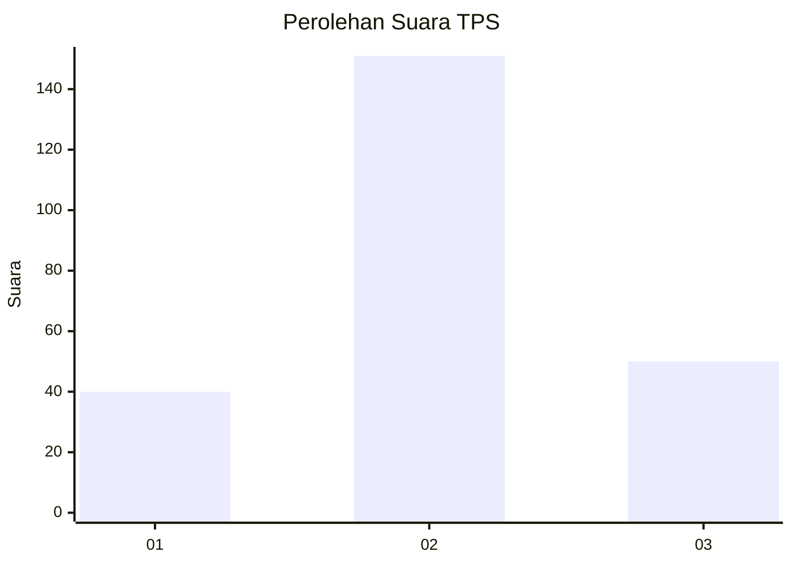
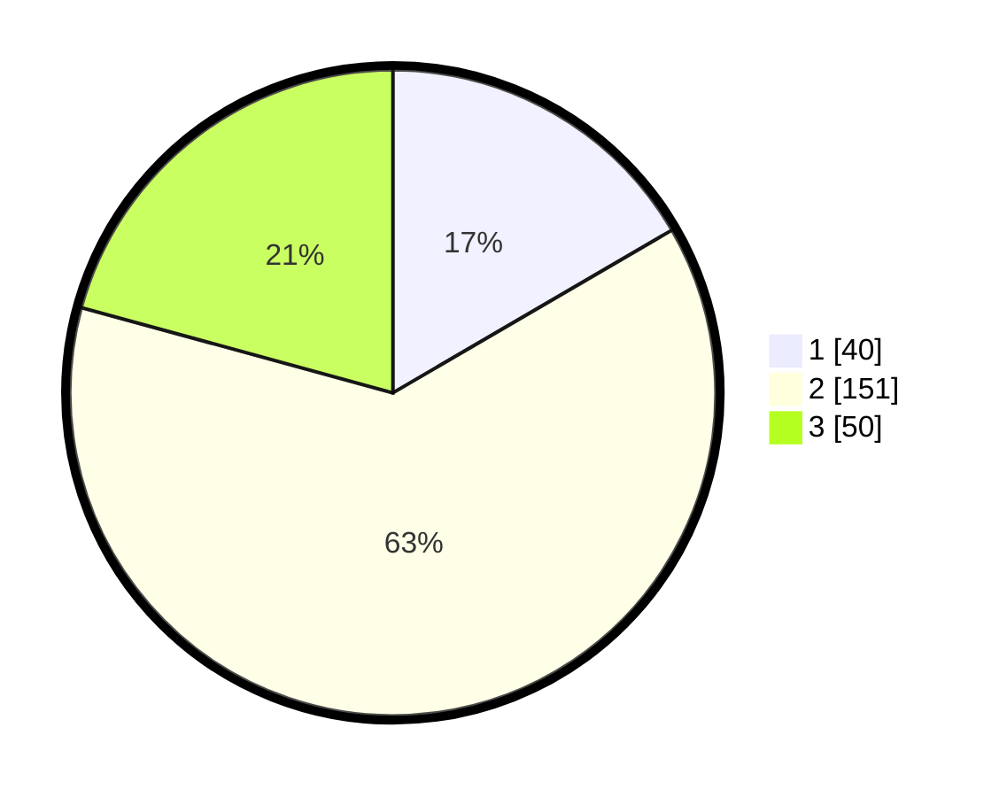

# Hasil

## Grafik

## Tabel

| No. | Nama Paslon    | Suara | Suara (raw) | Persentase |
|:--- |:-------------- | -----:| -----------:| ----------:|
| 1   | ANIES MUHAIMIN | 40    | [40][p-1]   | 16,60      |
| 2   | PRABOWO GIBRAN | 151   | [151][p-2]  | 62,66      |
| 3   | GANJAR MAHFUD  | 50    | [50][p-3]   | 20,75      |

[p-1]: https://github.com/gigit-pemilu/pemilu-2024/blob/main/pilpres/hitung-suara/sub/35-jawa-timur/sub/23-tuban/sub/15-semanding/sub/2003-prunggahan-kulon/sub/003-tps/sub/paslon-1.txt
[p-2]: https://github.com/gigit-pemilu/pemilu-2024/blob/main/pilpres/hitung-suara/sub/35-jawa-timur/sub/23-tuban/sub/15-semanding/sub/2003-prunggahan-kulon/sub/003-tps/sub/paslon-2.txt
[p-3]: https://github.com/gigit-pemilu/pemilu-2024/blob/main/pilpres/hitung-suara/sub/35-jawa-timur/sub/23-tuban/sub/15-semanding/sub/2003-prunggahan-kulon/sub/003-tps/sub/paslon-3.txt

## Foto C Plano

https://sirekap-obj-formc.kpu.go.id/f84e/pemilu/ppwp/35/23/15/20/03/3523152003003-20240216-171103--6316cc9b-ca3c-4c97-b79e-8e66402796fa.jpg

https://sirekap-obj-formc.kpu.go.id/f84e/pemilu/ppwp/35/23/15/20/03/3523152003003-20240218-131858--ef3f744f-9a35-49a5-9830-479a99362eeb.jpg

https://sirekap-obj-formc.kpu.go.id/f84e/pemilu/ppwp/35/23/15/20/03/3523152003003-20240216-171241--85832522-3dbb-43b3-87a2-c30a9483a790.jpg

## Metadata

| Key        | Value               |
| ---------- | ------------------- |
| Time Stamp | 2024-02-19 06:16:00 |

## DATA PEMILIH TETAP

Jumlah pemilih dalam DPT: **282**.
 * L: **433**.
 * P: **54**.

## DATA PENGGUNA HAK PILIH

Jumlah pengguna hak pilih dalam DPT: **244**.
 * L: **756**.
 * P: **633**.

Jumlah pengguna hak pilih dalam DPTb: **80**.
 * L: **858**.
 * P: **800**.

Jumlah pengguna hak pilih dalam DPK: **850**.
 * L: **800**.
 * P: **50**.

Jumlah pengguna hak pilih: **249**.
 * L: **845**.
 * P: **733**.

## JUMLAH SUARA SAH DAN TIDAK SAH

JUMLAH SELURUH SUARA SAH: **241**.

JUMLAH SUARA TIDAK SAH: **3**.

JUMLAH SELURUH SUARA SAH DAN SUARA TIDAK SAH: **244**.

