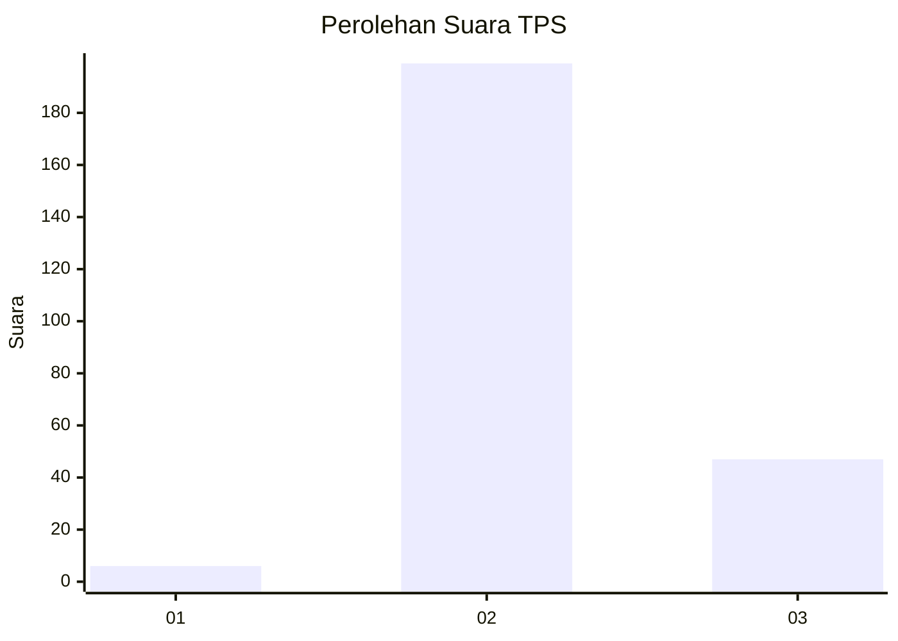
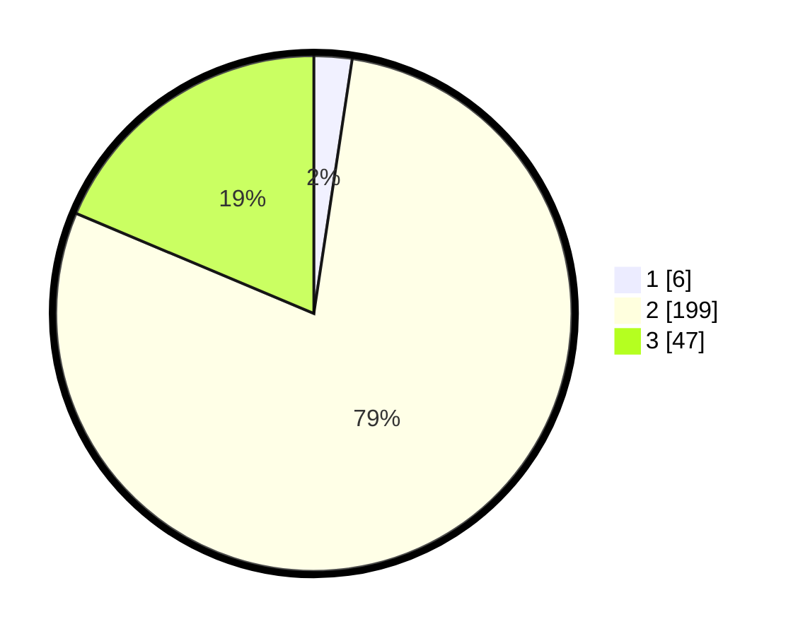

# Hasil

## Grafik

## Tabel

| No. | Nama Paslon    | Suara | Suara (raw) | Persentase |
|:--- |:-------------- | -----:| -----------:| ----------:|
| 1   | ANIES MUHAIMIN | 6     | [6][p-1]    | 2,38       |
| 2   | PRABOWO GIBRAN | 199   | [199][p-2]  | 78,97      |
| 3   | GANJAR MAHFUD  | 47    | [47][p-3]   | 18,65      |

[p-1]: https://github.com/gigit-pemilu/pemilu-2024/blob/main/pilpres/hitung-suara/sub/35-jawa-timur/sub/23-tuban/sub/15-semanding/sub/2018-kowang/sub/003-tps/sub/paslon-1.txt
[p-2]: https://github.com/gigit-pemilu/pemilu-2024/blob/main/pilpres/hitung-suara/sub/35-jawa-timur/sub/23-tuban/sub/15-semanding/sub/2018-kowang/sub/003-tps/sub/paslon-2.txt
[p-3]: https://github.com/gigit-pemilu/pemilu-2024/blob/main/pilpres/hitung-suara/sub/35-jawa-timur/sub/23-tuban/sub/15-semanding/sub/2018-kowang/sub/003-tps/sub/paslon-3.txt

## Foto C Plano

https://sirekap-obj-formc.kpu.go.id/ba75/pemilu/ppwp/35/23/15/20/18/3523152018003-20240215-123135--3acb8a70-b9c2-4cf7-ab22-18b817164a40.jpg

https://sirekap-obj-formc.kpu.go.id/ba75/pemilu/ppwp/35/23/15/20/18/3523152018003-20240215-123324--7576fd27-a247-4e89-9d33-a2c88bb430ba.jpg

https://sirekap-obj-formc.kpu.go.id/ba75/pemilu/ppwp/35/23/15/20/18/3523152018003-20240215-123544--4e30de21-d127-424f-8227-347228587352.jpg

## Metadata

| Key        | Value               |
| ---------- | ------------------- |
| Time Stamp | 2024-02-17 17:30:00 |

