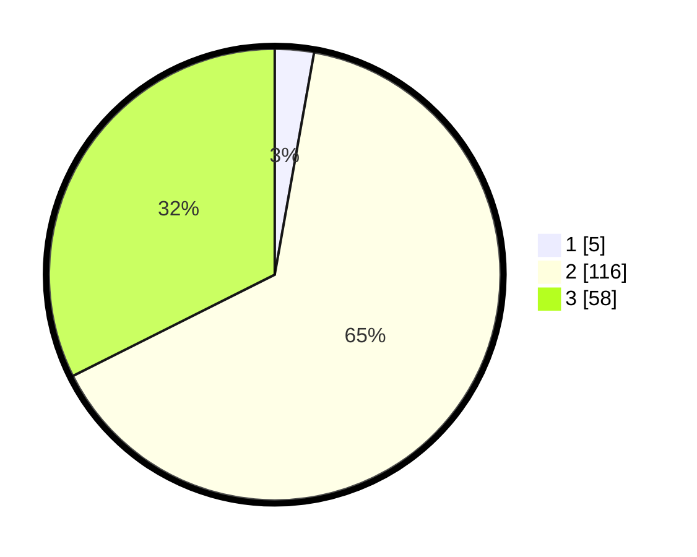

# Hasil

## Grafik

## Tabel

| No. | Nama Paslon    | Suara | Suara (raw) | Persentase |
|:--- |:-------------- | -----:| -----------:| ----------:|
| 1   | ANIES MUHAIMIN | 5     | [5][p-1]    | 2,79       |
| 2   | PRABOWO GIBRAN | 116   | [116][p-2]  | 64,80      |
| 3   | GANJAR MAHFUD  | 58    | [58][p-3]   | 32,40      |

[p-1]: https://github.com/gigit-pemilu/pemilu-2024-35-jawa-timur/blob/main/pilpres/hitung-suara/sub/35-jawa-timur/sub/23-tuban/sub/15-semanding/sub/2020-gesing/sub/008-tps/sub/paslon-1.txt
[p-2]: https://github.com/gigit-pemilu/pemilu-2024-35-jawa-timur/blob/main/pilpres/hitung-suara/sub/35-jawa-timur/sub/23-tuban/sub/15-semanding/sub/2020-gesing/sub/008-tps/sub/paslon-2.txt
[p-3]: https://github.com/gigit-pemilu/pemilu-2024-35-jawa-timur/blob/main/pilpres/hitung-suara/sub/35-jawa-timur/sub/23-tuban/sub/15-semanding/sub/2020-gesing/sub/008-tps/sub/paslon-3.txt

## Foto C Plano

https://sirekap-obj-formc.kpu.go.id/2c87/pemilu/ppwp/35/23/15/20/20/3523152020008-20240214-233657--c9236b33-b05c-4149-ab9f-e5478010fb2d.jpg

https://sirekap-obj-formc.kpu.go.id/2c87/pemilu/ppwp/35/23/15/20/20/3523152020008-20240214-233857--10c96481-6cb1-4141-95fc-9e6b17285109.jpg

https://sirekap-obj-formc.kpu.go.id/2c87/pemilu/ppwp/35/23/15/20/20/3523152020008-20240214-234011--f2f1564b-7b85-4e51-ad7d-56d2556329a1.jpg

## Metadata

| Key        | Value               |
| ---------- | ------------------- |
| Time Stamp | 2024-02-17 14:56:33 |

