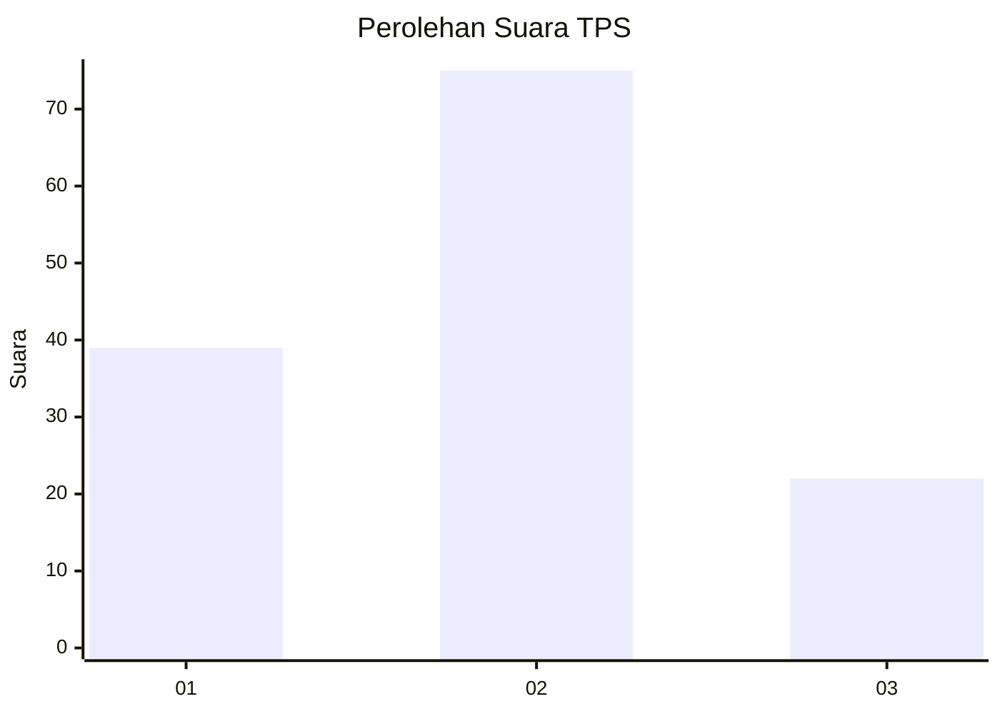
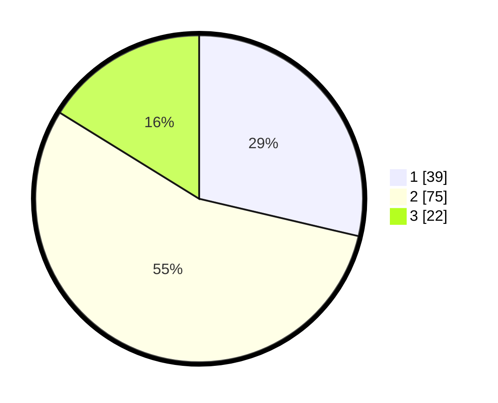

# Hasil

## Grafik

## Tabel

| No. | Nama Paslon    | Suara | Suara (raw) | Persentase |
|:--- |:-------------- | -----:| -----------:| ----------:|
| 1   | ANIES MUHAIMIN | 39    | [39][p-1]   | 28,68      |
| 2   | PRABOWO GIBRAN | 75    | [75][p-2]   | 55,15      |
| 3   | GANJAR MAHFUD  | 22    | [22][p-3]   | 16,18      |

[p-1]: https://github.com/gigit-pemilu/pemilu-2024-35-jawa-timur/blob/main/pilpres/hitung-suara/sub/35-jawa-timur/sub/23-tuban/sub/16-tuban/sub/1010-sidorejo/sub/009-tps/sub/paslon-1.txt
[p-2]: https://github.com/gigit-pemilu/pemilu-2024-35-jawa-timur/blob/main/pilpres/hitung-suara/sub/35-jawa-timur/sub/23-tuban/sub/16-tuban/sub/1010-sidorejo/sub/009-tps/sub/paslon-2.txt
[p-3]: https://github.com/gigit-pemilu/pemilu-2024-35-jawa-timur/blob/main/pilpres/hitung-suara/sub/35-jawa-timur/sub/23-tuban/sub/16-tuban/sub/1010-sidorejo/sub/009-tps/sub/paslon-3.txt

## Foto C Plano

https://sirekap-obj-formc.kpu.go.id/1ce8/pemilu/ppwp/35/23/16/10/10/3523161010009-20240215-003300--35be9dbd-2ae2-4c98-9f78-850085f53b69.jpg

https://sirekap-obj-formc.kpu.go.id/1ce8/pemilu/ppwp/35/23/16/10/10/3523161010009-20240215-003101--c2b5808a-b015-4bd9-8578-cbe8271afd2c.jpg

https://sirekap-obj-formc.kpu.go.id/1ce8/pemilu/ppwp/35/23/16/10/10/3523161010009-20240215-003352--162a933b-bed8-4d14-a4f2-7c304d7544d8.jpg

## Metadata

| Key        | Value               |
| ---------- | ------------------- |
| Time Stamp | 2024-02-19 18:00:00 |

