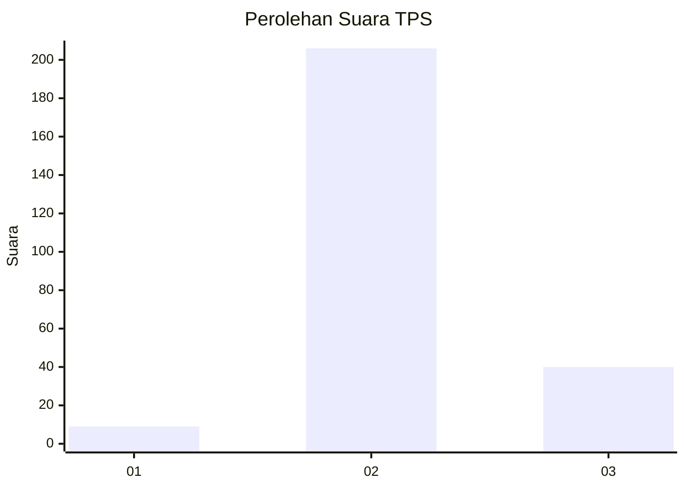
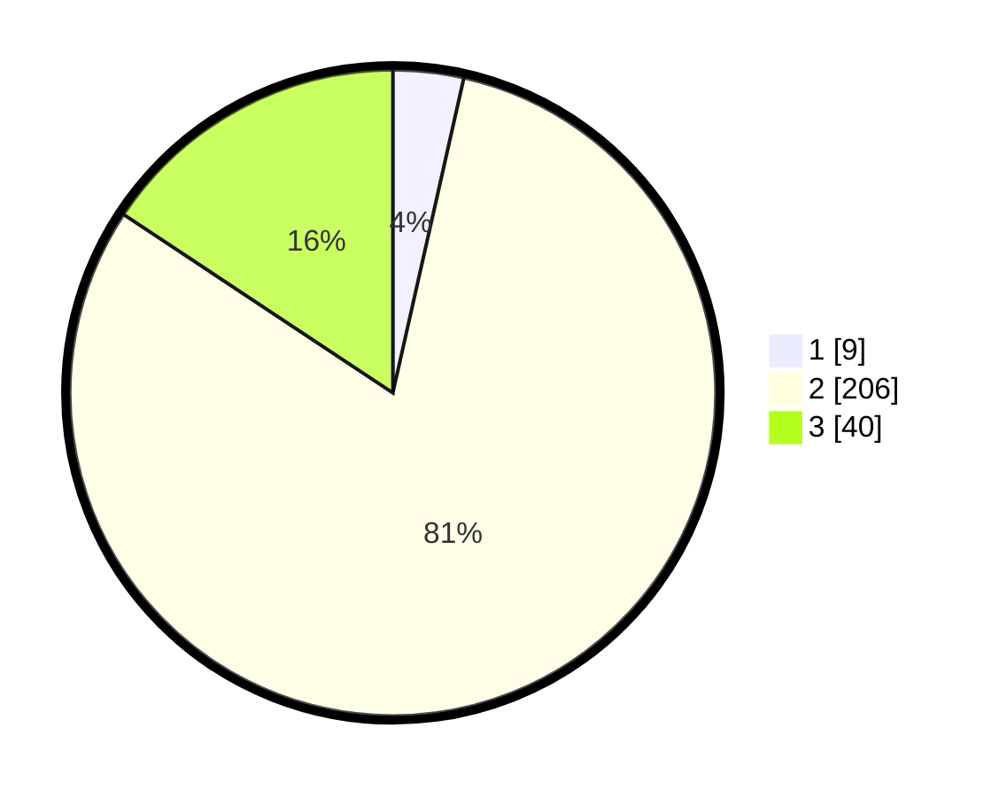

# Hasil

## Grafik

## Tabel

| No. | Nama Paslon    | Suara | Suara (raw) | Persentase |
|:--- |:-------------- | -----:| -----------:| ----------:|
| 1   | ANIES MUHAIMIN | 9     | [9][p-1]    | 3,53       |
| 2   | PRABOWO GIBRAN | 206   | [206][p-2]  | 80,78      |
| 3   | GANJAR MAHFUD  | 40    | [40][p-3]   | 15,69      |

[p-1]: https://github.com/gigit-pemilu/pemilu-2024-35-jawa-timur/blob/main/pilpres/hitung-suara/sub/35-jawa-timur/sub/23-tuban/sub/18-palang/sub/2004-sumurgung/sub/006-tps/sub/paslon-1.txt
[p-2]: https://github.com/gigit-pemilu/pemilu-2024-35-jawa-timur/blob/main/pilpres/hitung-suara/sub/35-jawa-timur/sub/23-tuban/sub/18-palang/sub/2004-sumurgung/sub/006-tps/sub/paslon-2.txt
[p-3]: https://github.com/gigit-pemilu/pemilu-2024-35-jawa-timur/blob/main/pilpres/hitung-suara/sub/35-jawa-timur/sub/23-tuban/sub/18-palang/sub/2004-sumurgung/sub/006-tps/sub/paslon-3.txt

## Foto C Plano

https://sirekap-obj-formc.kpu.go.id/d5c6/pemilu/ppwp/35/23/18/20/04/3523182004006-20240215-222858--a531bdb6-d837-4e16-be43-c42f0a1403a9.jpg

https://sirekap-obj-formc.kpu.go.id/d5c6/pemilu/ppwp/35/23/18/20/04/3523182004006-20240215-223018--80e258c5-248c-4d49-a0dc-57a7b92ceba6.jpg

https://sirekap-obj-formc.kpu.go.id/d5c6/pemilu/ppwp/35/23/18/20/04/3523182004006-20240214-195720--827e4614-3ced-45c3-aad5-907534299b4f.jpg

## Metadata

| Key        | Value               |
| ---------- | ------------------- |
| Time Stamp | 2024-02-16 00:00:26 |

