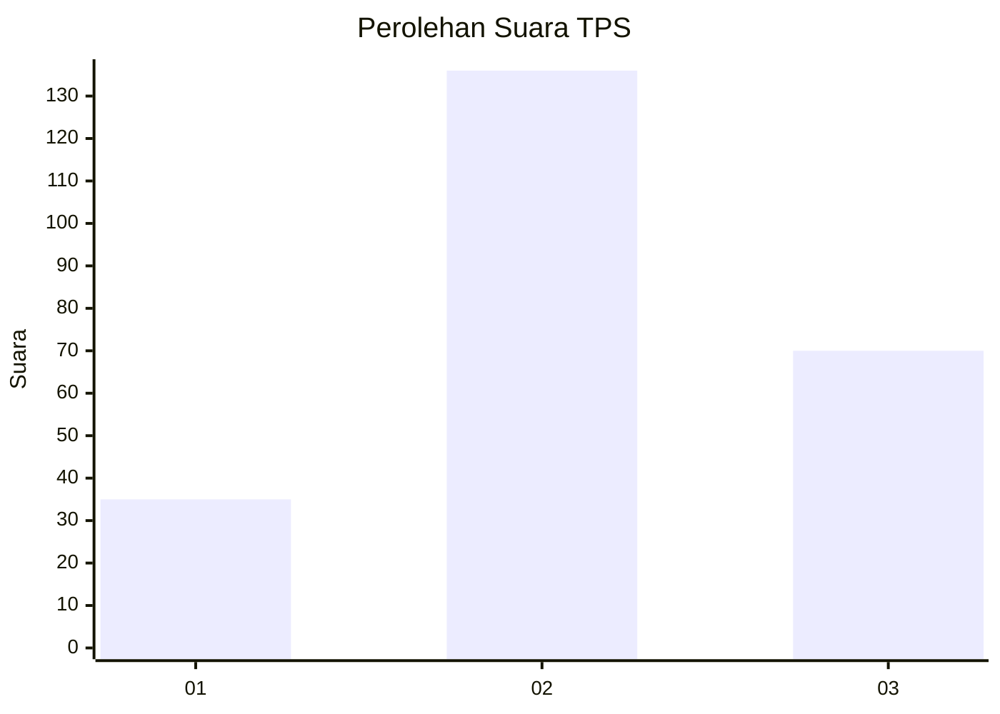
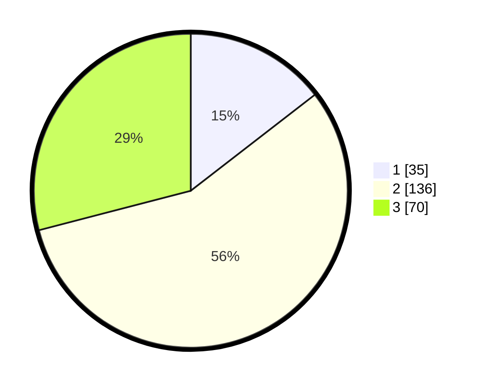

# Hasil

## Grafik

## Tabel

| No. | Nama Paslon    | Suara | Suara (raw) | Persentase |
|:--- |:-------------- | -----:| -----------:| ----------:|
| 1   | ANIES MUHAIMIN | 35    | [35][p-1]   | 14,52      |
| 2   | PRABOWO GIBRAN | 136   | [136][p-2]  | 56,43      |
| 3   | GANJAR MAHFUD  | 70    | [70][p-3]   | 29,05      |

[p-1]: https://github.com/gigit-pemilu/pemilu-2024/blob/main/pilpres/hitung-suara/sub/35-jawa-timur/sub/23-tuban/sub/18-palang/sub/2013-leran-kulon/sub/004-tps/sub/paslon-1.txt
[p-2]: https://github.com/gigit-pemilu/pemilu-2024/blob/main/pilpres/hitung-suara/sub/35-jawa-timur/sub/23-tuban/sub/18-palang/sub/2013-leran-kulon/sub/004-tps/sub/paslon-2.txt
[p-3]: https://github.com/gigit-pemilu/pemilu-2024/blob/main/pilpres/hitung-suara/sub/35-jawa-timur/sub/23-tuban/sub/18-palang/sub/2013-leran-kulon/sub/004-tps/sub/paslon-3.txt

## Foto C Plano

https://sirekap-obj-formc.kpu.go.id/2e42/pemilu/ppwp/35/23/18/20/13/3523182013004-20240215-120729--535eb5e8-3b65-46bf-aabe-af66136a3554.jpg

https://sirekap-obj-formc.kpu.go.id/2e42/pemilu/ppwp/35/23/18/20/13/3523182013004-20240215-030752--fae5edb0-4219-4e38-b272-40cc20ae8b75.jpg

https://sirekap-obj-formc.kpu.go.id/2e42/pemilu/ppwp/35/23/18/20/13/3523182013004-20240215-151100--1379129b-8d2b-4aab-a681-44eeb49773dc.jpg

## Metadata

| Key        | Value               |
| ---------- | ------------------- |
| Time Stamp | 2024-02-15 18:30:25 |

