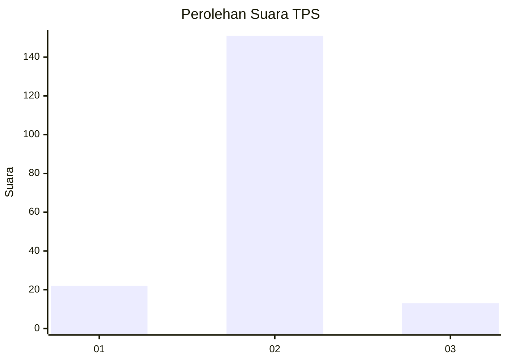
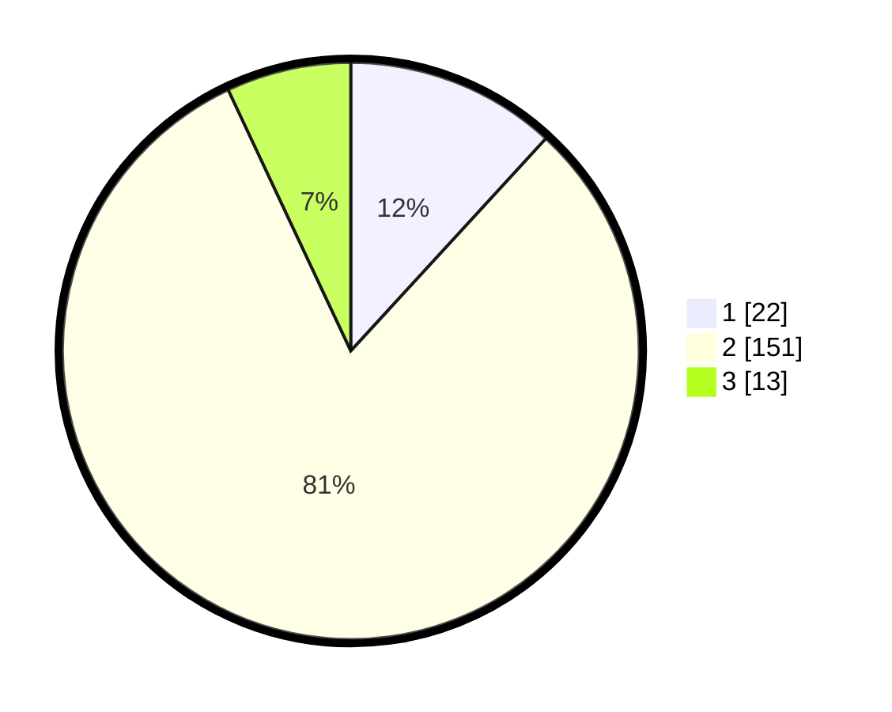

# Hasil

## Grafik

## Tabel

| No. | Nama Paslon    | Suara | Suara (raw) | Persentase |
|:--- |:-------------- | -----:| -----------:| ----------:|
| 1   | ANIES MUHAIMIN | 22    | [22][p-1]   | 11,83      |
| 2   | PRABOWO GIBRAN | 151   | [151][p-2]  | 81,18      |
| 3   | GANJAR MAHFUD  | 13    | [13][p-3]   | 6,99       |

[p-1]: https://github.com/gigit-pemilu/pemilu-2024-35-jawa-timur/blob/main/pilpres/hitung-suara/sub/35-jawa-timur/sub/23-tuban/sub/18-palang/sub/2019-ketambul/sub/002-tps/sub/paslon-1.txt
[p-2]: https://github.com/gigit-pemilu/pemilu-2024-35-jawa-timur/blob/main/pilpres/hitung-suara/sub/35-jawa-timur/sub/23-tuban/sub/18-palang/sub/2019-ketambul/sub/002-tps/sub/paslon-2.txt
[p-3]: https://github.com/gigit-pemilu/pemilu-2024-35-jawa-timur/blob/main/pilpres/hitung-suara/sub/35-jawa-timur/sub/23-tuban/sub/18-palang/sub/2019-ketambul/sub/002-tps/sub/paslon-3.txt

## Foto C Plano

https://sirekap-obj-formc.kpu.go.id/fb2b/pemilu/ppwp/35/23/18/20/19/3523182019002-20240215-152414--f8e45496-dc51-42ac-b81c-b7778e8e8c09.jpg

https://sirekap-obj-formc.kpu.go.id/fb2b/pemilu/ppwp/35/23/18/20/19/3523182019002-20240215-184157--750033d2-800c-4aaf-8ab1-1ad62dbe4681.jpg

https://sirekap-obj-formc.kpu.go.id/fb2b/pemilu/ppwp/35/23/18/20/19/3523182019002-20240215-184248--2461df61-e43c-4f71-ad2c-07ac4db259a2.jpg

## Metadata

| Key        | Value               |
| ---------- | ------------------- |
| Time Stamp | 2024-02-15 21:01:18 |

