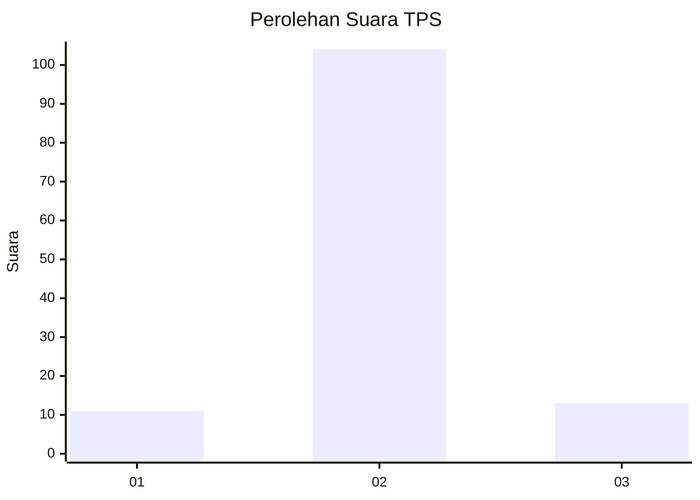
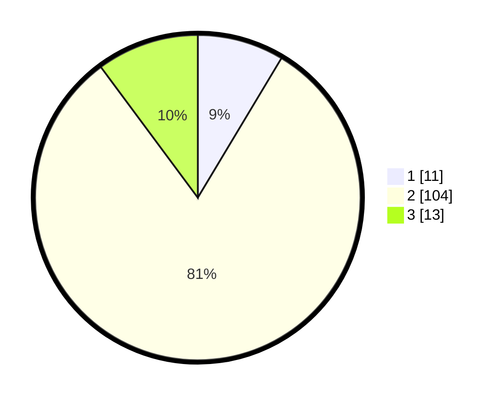

# Hasil

## Grafik

## Tabel

| No. | Nama Paslon    | Suara | Suara (raw) | Persentase |
|:--- |:-------------- | -----:| -----------:| ----------:|
| 1   | ANIES MUHAIMIN | 11    | [11][p-1]   | 8,59       |
| 2   | PRABOWO GIBRAN | 104   | [104][p-2]  | 81,25      |
| 3   | GANJAR MAHFUD  | 13    | [13][p-3]   | 10,16      |

[p-1]: https://github.com/gigit-pemilu/pemilu-2024-35-jawa-timur/blob/main/pilpres/hitung-suara/sub/35-jawa-timur/sub/23-tuban/sub/18-palang/sub/2019-ketambul/sub/007-tps/sub/paslon-1.txt
[p-2]: https://github.com/gigit-pemilu/pemilu-2024-35-jawa-timur/blob/main/pilpres/hitung-suara/sub/35-jawa-timur/sub/23-tuban/sub/18-palang/sub/2019-ketambul/sub/007-tps/sub/paslon-2.txt
[p-3]: https://github.com/gigit-pemilu/pemilu-2024-35-jawa-timur/blob/main/pilpres/hitung-suara/sub/35-jawa-timur/sub/23-tuban/sub/18-palang/sub/2019-ketambul/sub/007-tps/sub/paslon-3.txt

## Foto C Plano

https://sirekap-obj-formc.kpu.go.id/8122/pemilu/ppwp/35/23/18/20/19/3523182019007-20240215-114903--2a55ea82-a395-48f5-86dc-021abc9d4771.jpg

https://sirekap-obj-formc.kpu.go.id/8122/pemilu/ppwp/35/23/18/20/19/3523182019007-20240215-122815--1a701bae-97c6-40b8-aa01-20f3df542644.jpg

https://sirekap-obj-formc.kpu.go.id/8122/pemilu/ppwp/35/23/18/20/19/3523182019007-20240215-122958--4b82ba42-d229-4949-a15a-c5e7992d49bd.jpg

## Metadata

| Key        | Value               |
| ---------- | ------------------- |
| Time Stamp | 2024-02-15 17:30:25 |

