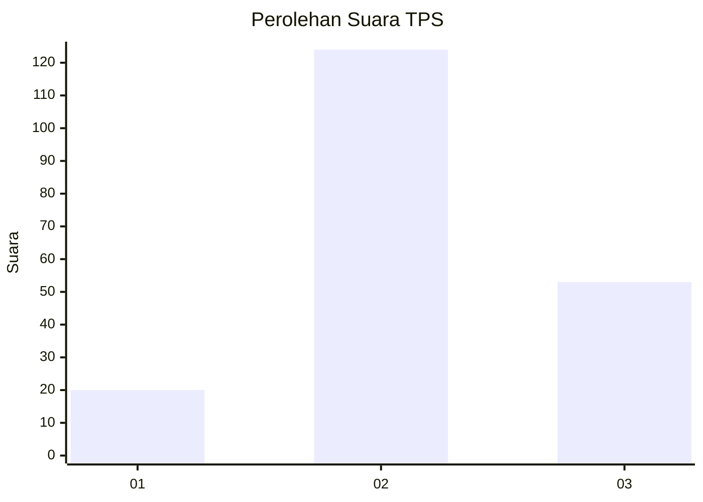
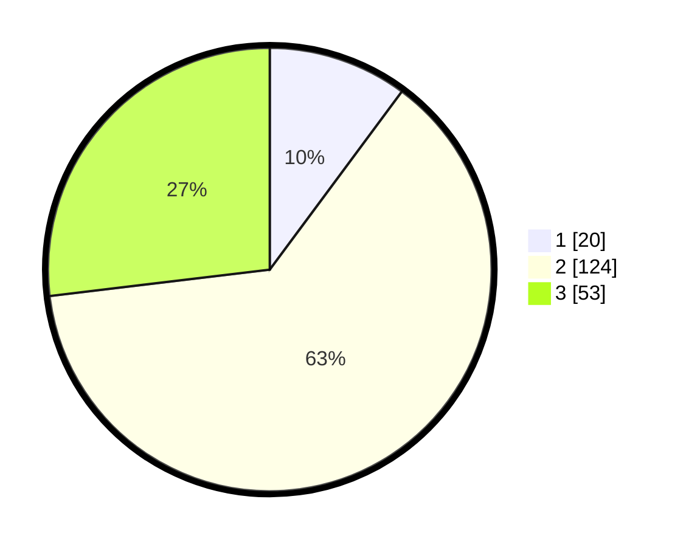

# Hasil

## Grafik

## Tabel

| No. | Nama Paslon    | Suara | Suara (raw) | Persentase |
|:--- |:-------------- | -----:| -----------:| ----------:|
| 1   | ANIES MUHAIMIN | 20    | [20][p-1]   | 10,15      |
| 2   | PRABOWO GIBRAN | 124   | [124][p-2]  | 62,94      |
| 3   | GANJAR MAHFUD  | 53    | [53][p-3]   | 26,90      |

[p-1]: https://github.com/gigit-pemilu/pemilu-2024-35-jawa-timur/blob/main/pilpres/hitung-suara/sub/35-jawa-timur/sub/23-tuban/sub/19-widang/sub/2001-patihan/sub/003-tps/sub/paslon-1.txt
[p-2]: https://github.com/gigit-pemilu/pemilu-2024-35-jawa-timur/blob/main/pilpres/hitung-suara/sub/35-jawa-timur/sub/23-tuban/sub/19-widang/sub/2001-patihan/sub/003-tps/sub/paslon-2.txt
[p-3]: https://github.com/gigit-pemilu/pemilu-2024-35-jawa-timur/blob/main/pilpres/hitung-suara/sub/35-jawa-timur/sub/23-tuban/sub/19-widang/sub/2001-patihan/sub/003-tps/sub/paslon-3.txt

## Foto C Plano

https://sirekap-obj-formc.kpu.go.id/c1bb/pemilu/ppwp/35/23/19/20/01/3523192001003-20240219-165304--03e368c1-d5f7-49fd-8a25-0b3dd4bdcdbe.jpg

https://sirekap-obj-formc.kpu.go.id/c1bb/pemilu/ppwp/35/23/19/20/01/3523192001003-20240219-165350--49156632-e63a-41e6-9cb3-c90ede301cc5.jpg

https://sirekap-obj-formc.kpu.go.id/c1bb/pemilu/ppwp/35/23/19/20/01/3523192001003-20240219-165441--ac91650f-114b-4897-b4b5-a1bfbabe5189.jpg

## Metadata

| Key        | Value               |
| ---------- | ------------------- |
| Time Stamp | 2024-02-19 17:00:00 |

