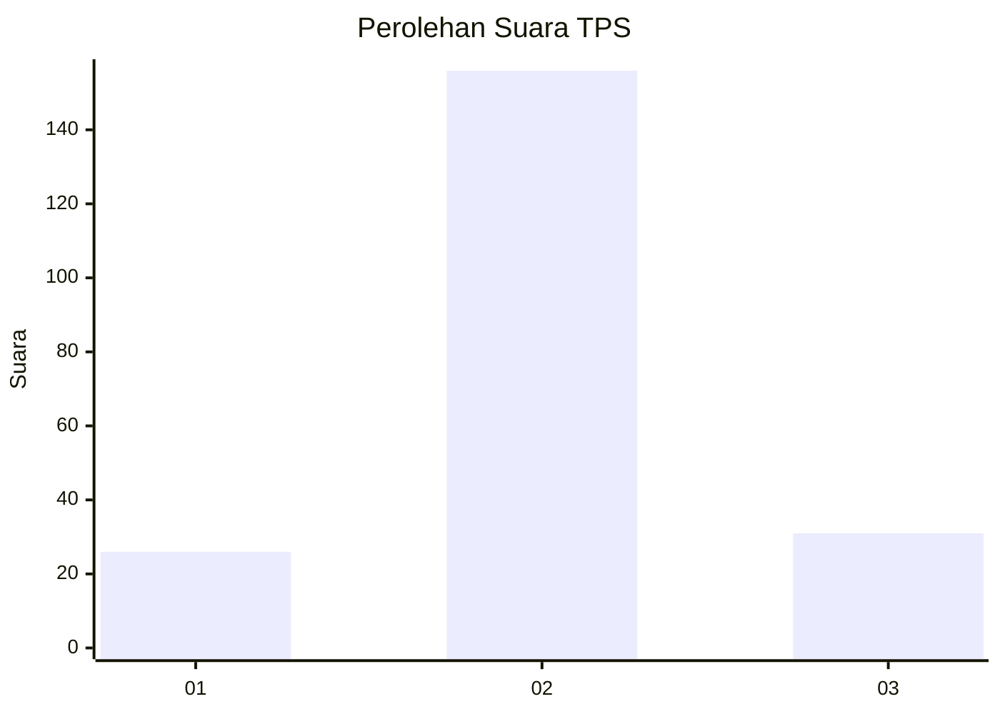
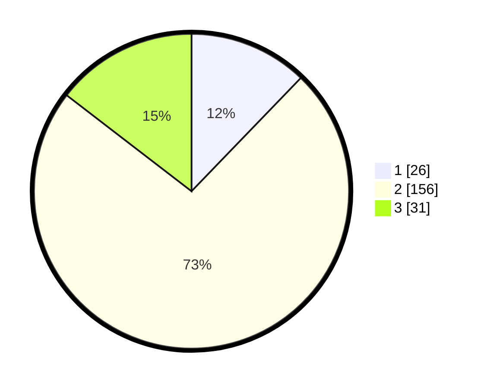

# Hasil

## Grafik

## Tabel

| No. | Nama Paslon    | Suara | Suara (raw) | Persentase |
|:--- |:-------------- | -----:| -----------:| ----------:|
| 1   | ANIES MUHAIMIN | 26    | [26][p-1]   | 12,21      |
| 2   | PRABOWO GIBRAN | 156   | [156][p-2]  | 73,24      |
| 3   | GANJAR MAHFUD  | 31    | [31][p-3]   | 14,55      |

[p-1]: https://github.com/gigit-pemilu/pemilu-2024/blob/main/pilpres/hitung-suara/sub/35-jawa-timur/sub/23-tuban/sub/19-widang/sub/2001-patihan/sub/004-tps/sub/paslon-1.txt
[p-2]: https://github.com/gigit-pemilu/pemilu-2024/blob/main/pilpres/hitung-suara/sub/35-jawa-timur/sub/23-tuban/sub/19-widang/sub/2001-patihan/sub/004-tps/sub/paslon-2.txt
[p-3]: https://github.com/gigit-pemilu/pemilu-2024/blob/main/pilpres/hitung-suara/sub/35-jawa-timur/sub/23-tuban/sub/19-widang/sub/2001-patihan/sub/004-tps/sub/paslon-3.txt

## Foto C Plano

https://sirekap-obj-formc.kpu.go.id/7620/pemilu/ppwp/35/23/19/20/01/3523192001004-20240219-181345--edfd9e66-490f-4eab-bb4e-f9e6a19ac7d2.jpg

https://sirekap-obj-formc.kpu.go.id/7620/pemilu/ppwp/35/23/19/20/01/3523192001004-20240219-181420--05ebd51a-2f34-4269-93d1-d660e7825615.jpg

https://sirekap-obj-formc.kpu.go.id/7620/pemilu/ppwp/35/23/19/20/01/3523192001004-20240219-181704--0d265e39-d6fd-44d7-a020-d78319a04419.jpg

## Metadata

| Key        | Value               |
| ---------- | ------------------- |
| Time Stamp | 2024-02-19 20:00:00 |

