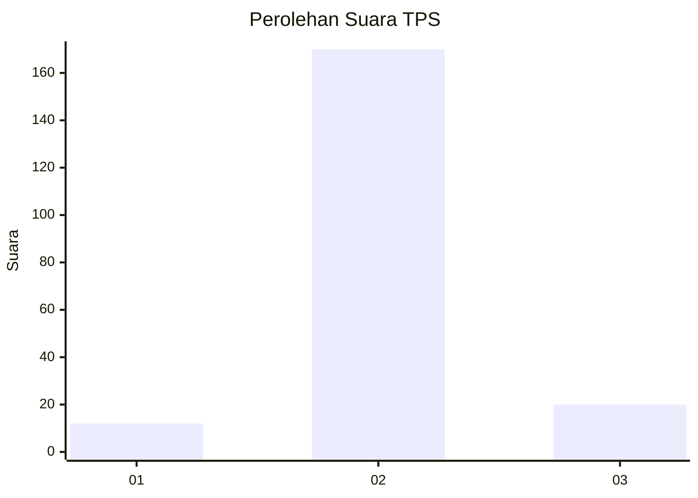
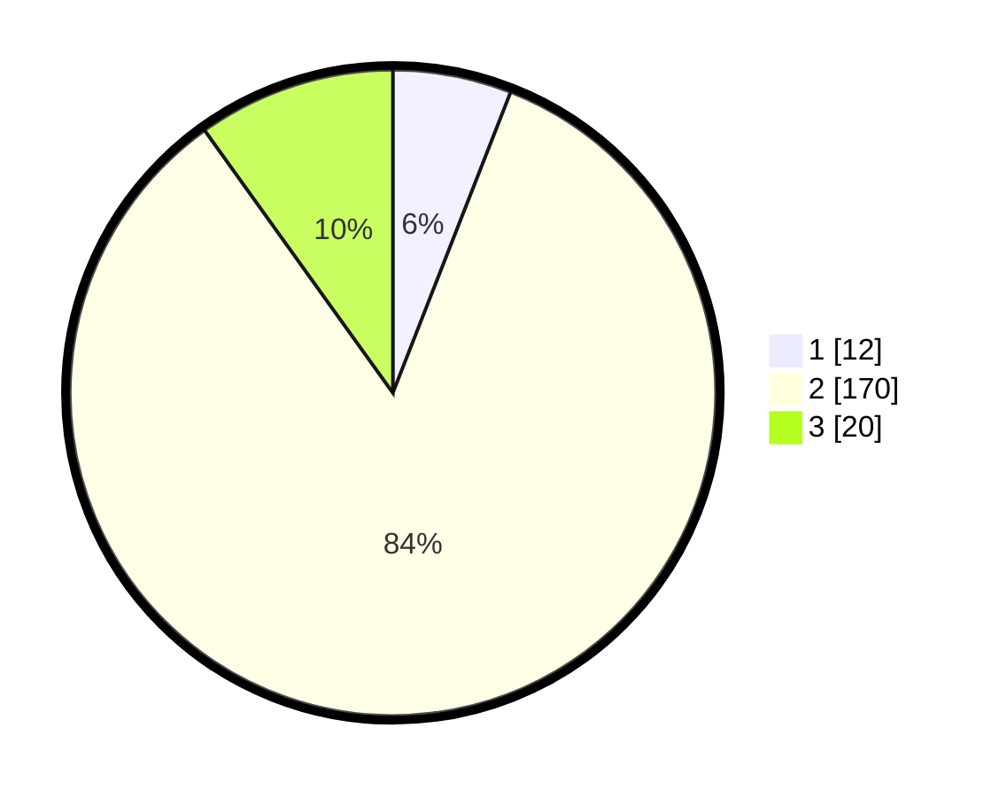

# Hasil

## Grafik

## Tabel

| No. | Nama Paslon    | Suara | Suara (raw) | Persentase |
|:--- |:-------------- | -----:| -----------:| ----------:|
| 1   | ANIES MUHAIMIN | 12    | [12][p-1]   | 5,94       |
| 2   | PRABOWO GIBRAN | 170   | [170][p-2]  | 84,16      |
| 3   | GANJAR MAHFUD  | 20    | [20][p-3]   | 9,90       |

[p-1]: https://github.com/gigit-pemilu/pemilu-2024-35-jawa-timur/blob/main/pilpres/hitung-suara/sub/35-jawa-timur/sub/23-tuban/sub/19-widang/sub/2001-patihan/sub/006-tps/sub/paslon-1.txt
[p-2]: https://github.com/gigit-pemilu/pemilu-2024-35-jawa-timur/blob/main/pilpres/hitung-suara/sub/35-jawa-timur/sub/23-tuban/sub/19-widang/sub/2001-patihan/sub/006-tps/sub/paslon-2.txt
[p-3]: https://github.com/gigit-pemilu/pemilu-2024-35-jawa-timur/blob/main/pilpres/hitung-suara/sub/35-jawa-timur/sub/23-tuban/sub/19-widang/sub/2001-patihan/sub/006-tps/sub/paslon-3.txt

## Foto C Plano

https://sirekap-obj-formc.kpu.go.id/f55e/pemilu/ppwp/35/23/19/20/01/3523192001006-20240214-212537--75bad495-1f4d-46a3-81e2-8229d3c2b821.jpg

https://sirekap-obj-formc.kpu.go.id/f55e/pemilu/ppwp/35/23/19/20/01/3523192001006-20240214-204643--55bbef75-9fd0-4f88-af2a-99fb2c67434f.jpg

https://sirekap-obj-formc.kpu.go.id/f55e/pemilu/ppwp/35/23/19/20/01/3523192001006-20240214-204705--ab75a92f-b0d2-4923-aa78-6c6735cffff0.jpg

## Metadata

| Key        | Value               |
| ---------- | ------------------- |
| Time Stamp | 2024-02-15 12:00:28 |

