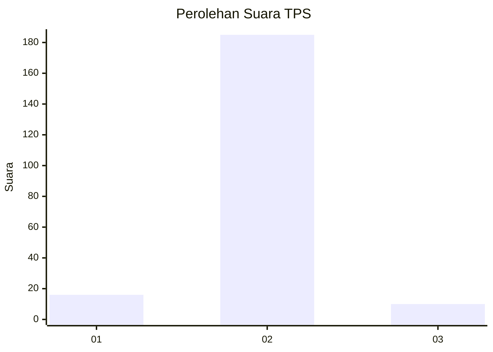
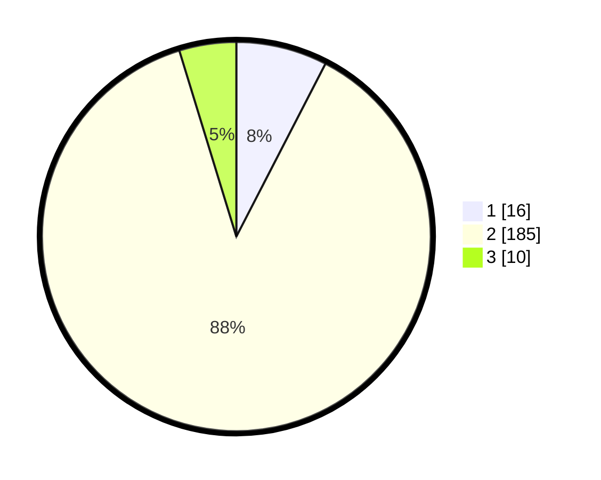

# Hasil

## Grafik

## Tabel

| No. | Nama Paslon    | Suara | Suara (raw) | Persentase |
|:--- |:-------------- | -----:| -----------:| ----------:|
| 1   | ANIES MUHAIMIN | 16    | [16][p-1]   | 7,58       |
| 2   | PRABOWO GIBRAN | 185   | [185][p-2]  | 87,68      |
| 3   | GANJAR MAHFUD  | 10    | [10][p-3]   | 4,74       |

[p-1]: https://github.com/gigit-pemilu/pemilu-2024-35-jawa-timur/blob/main/pilpres/hitung-suara/sub/35-jawa-timur/sub/23-tuban/sub/19-widang/sub/2002-minohorejo/sub/001-tps/sub/paslon-1.txt
[p-2]: https://github.com/gigit-pemilu/pemilu-2024-35-jawa-timur/blob/main/pilpres/hitung-suara/sub/35-jawa-timur/sub/23-tuban/sub/19-widang/sub/2002-minohorejo/sub/001-tps/sub/paslon-2.txt
[p-3]: https://github.com/gigit-pemilu/pemilu-2024-35-jawa-timur/blob/main/pilpres/hitung-suara/sub/35-jawa-timur/sub/23-tuban/sub/19-widang/sub/2002-minohorejo/sub/001-tps/sub/paslon-3.txt

## Foto C Plano

https://sirekap-obj-formc.kpu.go.id/3731/pemilu/ppwp/35/23/19/20/02/3523192002001-20240220-090437--121bccb1-60d4-49e2-b368-e94805a3049b.jpg

https://sirekap-obj-formc.kpu.go.id/3731/pemilu/ppwp/35/23/19/20/02/3523192002001-20240220-090526--233e0e27-1a3a-479c-bd52-c7056f0ca575.jpg

https://sirekap-obj-formc.kpu.go.id/3731/pemilu/ppwp/35/23/19/20/02/3523192002001-20240220-090609--e88a4067-4f25-4ae2-9f7e-38ade003ce45.jpg

## Metadata

| Key        | Value               |
| ---------- | ------------------- |
| Time Stamp | 2024-02-21 00:00:00 |

