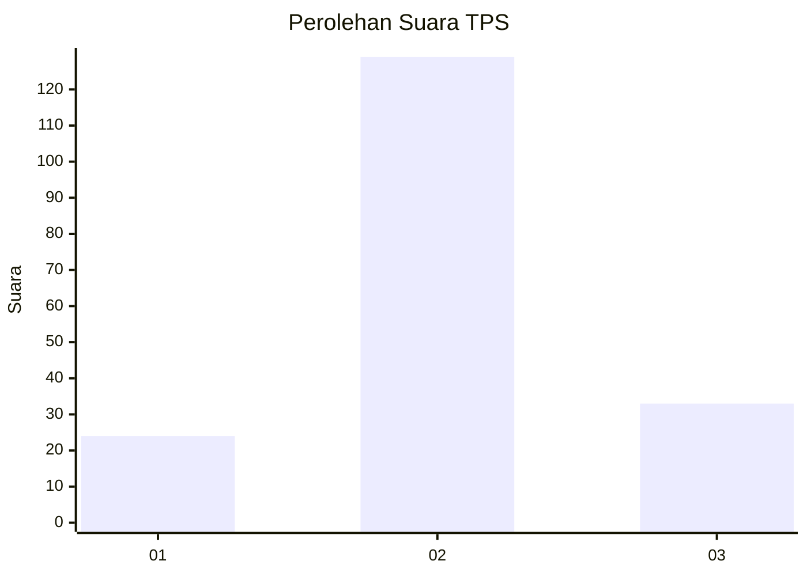
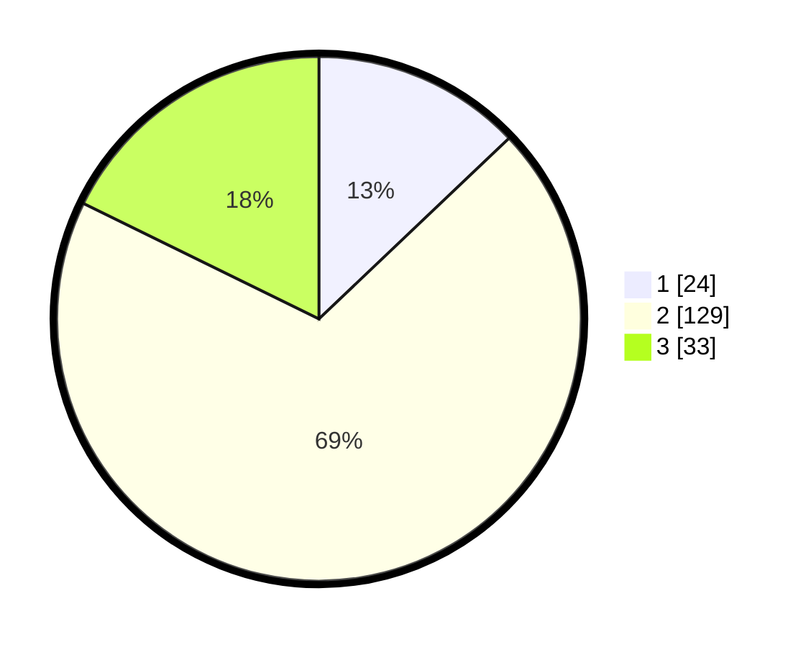

# Hasil

## Grafik

## Tabel

| No. | Nama Paslon    | Suara | Suara (raw) | Persentase |
|:--- |:-------------- | -----:| -----------:| ----------:|
| 1   | ANIES MUHAIMIN | 24    | [24][p-1]   | 12,90      |
| 2   | PRABOWO GIBRAN | 129   | [129][p-2]  | 69,35      |
| 3   | GANJAR MAHFUD  | 33    | [33][p-3]   | 17,74      |

[p-1]: https://github.com/gigit-pemilu/pemilu-2024/blob/main/pilpres/hitung-suara/sub/35-jawa-timur/sub/23-tuban/sub/19-widang/sub/2004-compreng/sub/001-tps/sub/paslon-1.txt
[p-2]: https://github.com/gigit-pemilu/pemilu-2024/blob/main/pilpres/hitung-suara/sub/35-jawa-timur/sub/23-tuban/sub/19-widang/sub/2004-compreng/sub/001-tps/sub/paslon-2.txt
[p-3]: https://github.com/gigit-pemilu/pemilu-2024/blob/main/pilpres/hitung-suara/sub/35-jawa-timur/sub/23-tuban/sub/19-widang/sub/2004-compreng/sub/001-tps/sub/paslon-3.txt

## Foto C Plano

https://sirekap-obj-formc.kpu.go.id/2d0b/pemilu/ppwp/35/23/19/20/04/3523192004001-20240215-031019--056fa7b7-9f91-478a-a23f-b372e66898bd.jpg

https://sirekap-obj-formc.kpu.go.id/2d0b/pemilu/ppwp/35/23/19/20/04/3523192004001-20240215-031357--e6d9cb29-b5d9-4311-b9fe-efda0166c8e7.jpg

https://sirekap-obj-formc.kpu.go.id/2d0b/pemilu/ppwp/35/23/19/20/04/3523192004001-20240216-205145--0c0e1e8f-b49e-4d4f-a89e-0629ec681c93.jpg

## Metadata

| Key        | Value               |
| ---------- | ------------------- |
| Time Stamp | 2024-02-16 21:01:00 |

