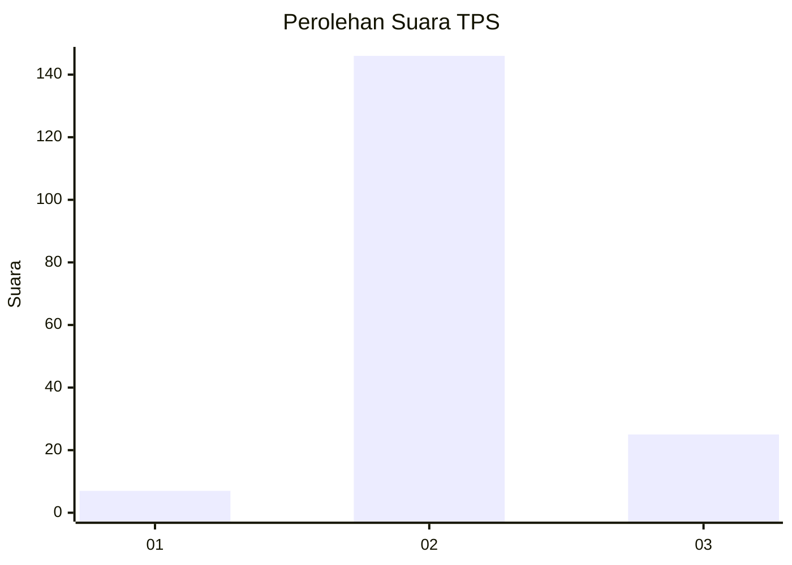
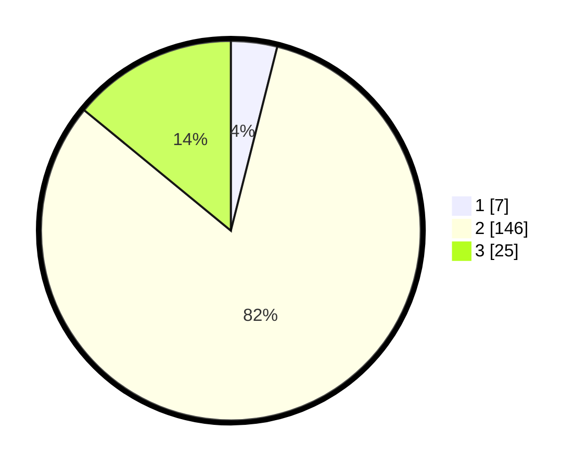

# Hasil

## Grafik

## Tabel

| No. | Nama Paslon    | Suara | Suara (raw) | Persentase |
|:--- |:-------------- | -----:| -----------:| ----------:|
| 1   | ANIES MUHAIMIN | 7     | [7][p-1]    | 3,93       |
| 2   | PRABOWO GIBRAN | 146   | [146][p-2]  | 82,02      |
| 3   | GANJAR MAHFUD  | 25    | [25][p-3]   | 14,04      |

[p-1]: https://github.com/gigit-pemilu/pemilu-2024/blob/main/pilpres/hitung-suara/sub/35-jawa-timur/sub/23-tuban/sub/19-widang/sub/2004-compreng/sub/009-tps/sub/paslon-1.txt
[p-2]: https://github.com/gigit-pemilu/pemilu-2024/blob/main/pilpres/hitung-suara/sub/35-jawa-timur/sub/23-tuban/sub/19-widang/sub/2004-compreng/sub/009-tps/sub/paslon-2.txt
[p-3]: https://github.com/gigit-pemilu/pemilu-2024/blob/main/pilpres/hitung-suara/sub/35-jawa-timur/sub/23-tuban/sub/19-widang/sub/2004-compreng/sub/009-tps/sub/paslon-3.txt

## Foto C Plano

https://sirekap-obj-formc.kpu.go.id/cf7e/pemilu/ppwp/35/23/19/20/04/3523192004009-20240215-010932--67fbe4e0-e5dc-4ea5-9a0e-6851efcd747c.jpg

https://sirekap-obj-formc.kpu.go.id/cf7e/pemilu/ppwp/35/23/19/20/04/3523192004009-20240215-015554--22a756b3-7c06-4ac2-9890-2647bad8ee9a.jpg

https://sirekap-obj-formc.kpu.go.id/cf7e/pemilu/ppwp/35/23/19/20/04/3523192004009-20240215-015731--765894e9-e0e4-457d-8de5-4529f9dec65f.jpg

## Metadata

| Key        | Value               |
| ---------- | ------------------- |
| Time Stamp | 2024-02-15 12:00:28 |

