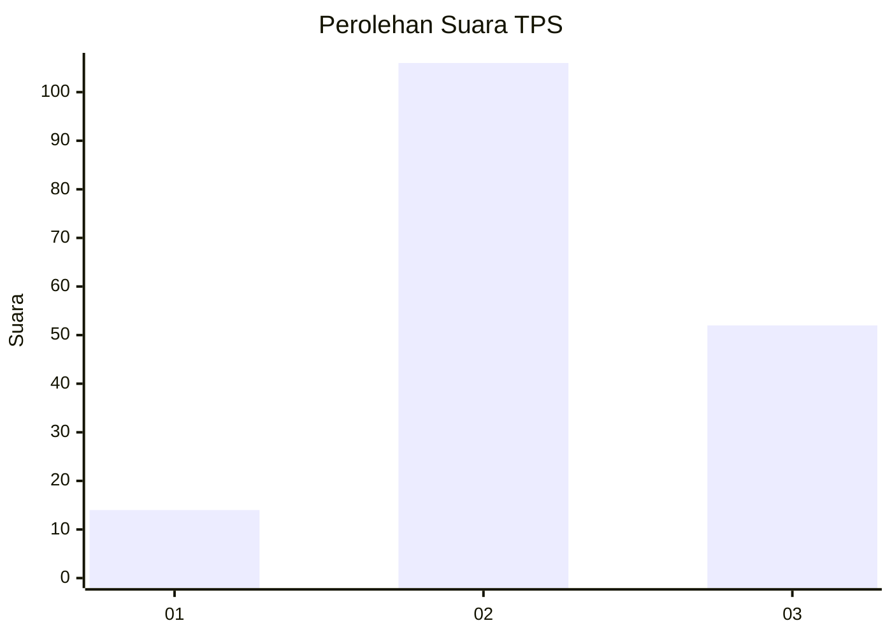
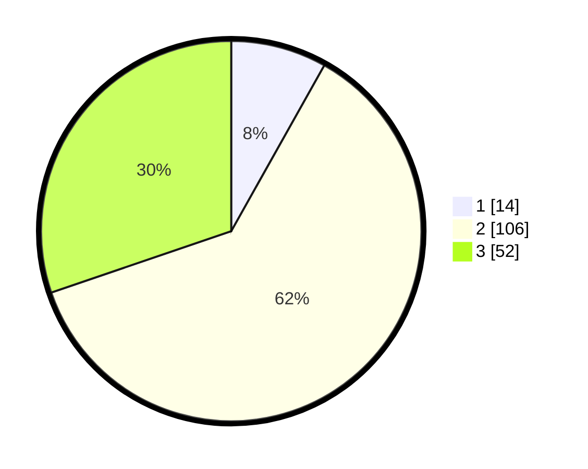

# Hasil

## Grafik

## Tabel

| No. | Nama Paslon    | Suara | Suara (raw) | Persentase |
|:--- |:-------------- | -----:| -----------:| ----------:|
| 1   | ANIES MUHAIMIN | 14    | [14][p-1]   | 8,14       |
| 2   | PRABOWO GIBRAN | 106   | [106][p-2]  | 61,63      |
| 3   | GANJAR MAHFUD  | 52    | [52][p-3]   | 30,23      |

[p-1]: https://github.com/gigit-pemilu/pemilu-2024/blob/main/pilpres/hitung-suara/sub/35-jawa-timur/sub/23-tuban/sub/20-grabagan/sub/2004-waleran/sub/003-tps/sub/paslon-1.txt
[p-2]: https://github.com/gigit-pemilu/pemilu-2024/blob/main/pilpres/hitung-suara/sub/35-jawa-timur/sub/23-tuban/sub/20-grabagan/sub/2004-waleran/sub/003-tps/sub/paslon-2.txt
[p-3]: https://github.com/gigit-pemilu/pemilu-2024/blob/main/pilpres/hitung-suara/sub/35-jawa-timur/sub/23-tuban/sub/20-grabagan/sub/2004-waleran/sub/003-tps/sub/paslon-3.txt

## Foto C Plano

https://sirekap-obj-formc.kpu.go.id/af49/pemilu/ppwp/35/23/20/20/04/3523202004003-20240214-230453--b54fa1eb-74fe-4035-8347-aed913fd0c2f.jpg

https://sirekap-obj-formc.kpu.go.id/af49/pemilu/ppwp/35/23/20/20/04/3523202004003-20240216-105911--c678fe00-43d0-4f4a-bd59-a48a37310e31.jpg

https://sirekap-obj-formc.kpu.go.id/af49/pemilu/ppwp/35/23/20/20/04/3523202004003-20240217-223259--444404bf-40b6-4934-8611-ba0ad12a08d6.jpg

## Metadata

| Key        | Value               |
| ---------- | ------------------- |
| Time Stamp | 2024-02-19 06:16:00 |

