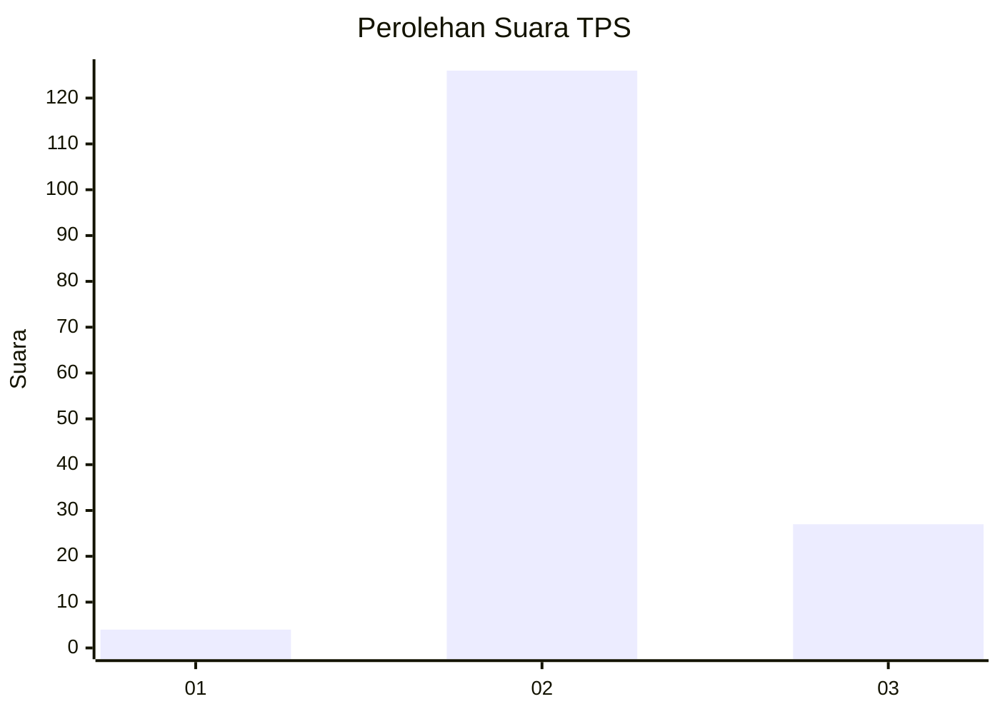

# Hasil

## Grafik

## Tabel

| No. | Nama Paslon    | Suara | Suara (raw) | Persentase |
|:--- |:-------------- | -----:| -----------:| ----------:|
| 1   | ANIES MUHAIMIN | 4     | [4][p-1]    | 2,55       |
| 2   | PRABOWO GIBRAN | 126   | [126][p-2]  | 80,25      |
| 3   | GANJAR MAHFUD  | 27    | [27][p-3]   | 17,20      |

[p-1]: https://github.com/gigit-pemilu/pemilu-2024/blob/main/pilpres/hitung-suara/sub/35-jawa-timur/sub/24-lamongan/sub/01-sukorame/sub/2007-sewor/sub/004-tps/sub/paslon-1.txt
[p-2]: https://github.com/gigit-pemilu/pemilu-2024/blob/main/pilpres/hitung-suara/sub/35-jawa-timur/sub/24-lamongan/sub/01-sukorame/sub/2007-sewor/sub/004-tps/sub/paslon-2.txt
[p-3]: https://github.com/gigit-pemilu/pemilu-2024/blob/main/pilpres/hitung-suara/sub/35-jawa-timur/sub/24-lamongan/sub/01-sukorame/sub/2007-sewor/sub/004-tps/sub/paslon-3.txt

## Foto C Plano

https://sirekap-obj-formc.kpu.go.id/6162/pemilu/ppwp/35/24/01/20/07/3524012007004-20240216-230026--0cc53ae5-34e1-42c8-a876-ebe5065fc3e2.jpg

https://sirekap-obj-formc.kpu.go.id/6162/pemilu/ppwp/35/24/01/20/07/3524012007004-20240216-231457--e47b344c-f630-4b2f-9fe5-e5e4185a73ea.jpg

https://sirekap-obj-formc.kpu.go.id/6162/pemilu/ppwp/35/24/01/20/07/3524012007004-20240218-132128--93a26b1a-d56e-4cdd-8ec6-9a55626ff08b.jpg

## Metadata

| Key        | Value               |
| ---------- | ------------------- |
| Time Stamp | 2024-02-19 06:16:00 |

