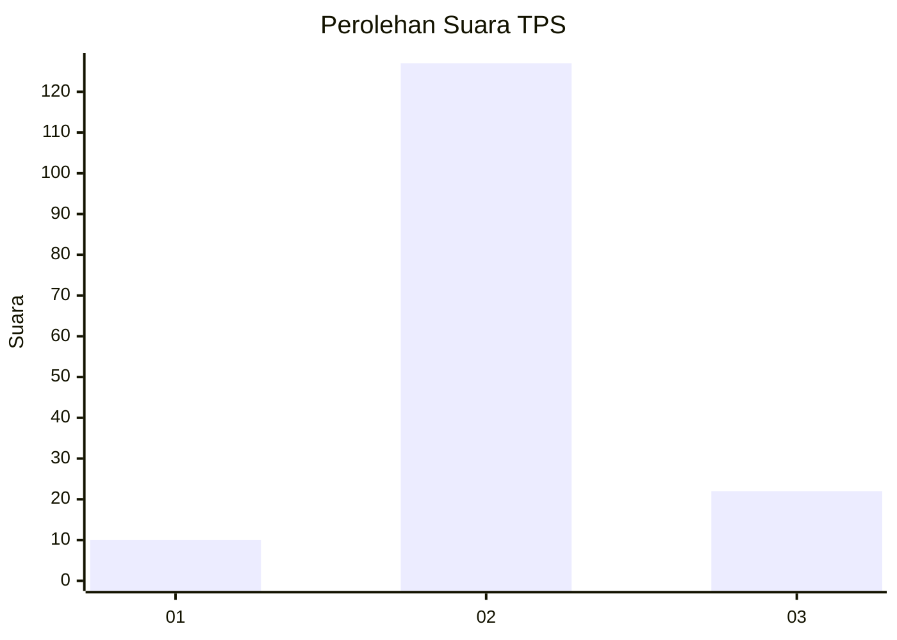
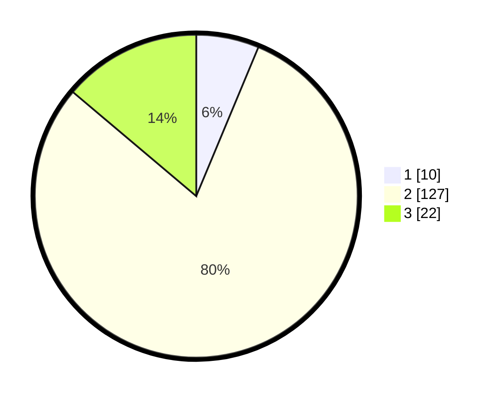

# Hasil

## Grafik

## Tabel

| No. | Nama Paslon    | Suara | Suara (raw) | Persentase |
|:--- |:-------------- | -----:| -----------:| ----------:|
| 1   | ANIES MUHAIMIN | 10    | [10][p-1]   | 6,29       |
| 2   | PRABOWO GIBRAN | 127   | [127][p-2]  | 79,87      |
| 3   | GANJAR MAHFUD  | 22    | [22][p-3]   | 13,84      |

[p-1]: https://github.com/gigit-pemilu/pemilu-2024-35-jawa-timur/blob/main/pilpres/hitung-suara/sub/35-jawa-timur/sub/24-lamongan/sub/05-babat/sub/2016-datinawong/sub/011-tps/sub/paslon-1.txt
[p-2]: https://github.com/gigit-pemilu/pemilu-2024-35-jawa-timur/blob/main/pilpres/hitung-suara/sub/35-jawa-timur/sub/24-lamongan/sub/05-babat/sub/2016-datinawong/sub/011-tps/sub/paslon-2.txt
[p-3]: https://github.com/gigit-pemilu/pemilu-2024-35-jawa-timur/blob/main/pilpres/hitung-suara/sub/35-jawa-timur/sub/24-lamongan/sub/05-babat/sub/2016-datinawong/sub/011-tps/sub/paslon-3.txt

## Foto C Plano

https://sirekap-obj-formc.kpu.go.id/d378/pemilu/ppwp/35/24/05/20/16/3524052016011-20240224-231509--06254ef0-0ff1-4c35-b10c-d6e99cda7d81.jpg

https://sirekap-obj-formc.kpu.go.id/d378/pemilu/ppwp/35/24/05/20/16/3524052016011-20240224-231719--0d6cd940-c49b-4653-87a2-e8cccf65db08.jpg

https://sirekap-obj-formc.kpu.go.id/d378/pemilu/ppwp/35/24/05/20/16/3524052016011-20240224-231835--ad084022-3eab-4dcc-9215-7958c10982d9.jpg

## Metadata

| Key        | Value               |
| ---------- | ------------------- |
| Time Stamp | 2024-02-29 10:00:00 |

