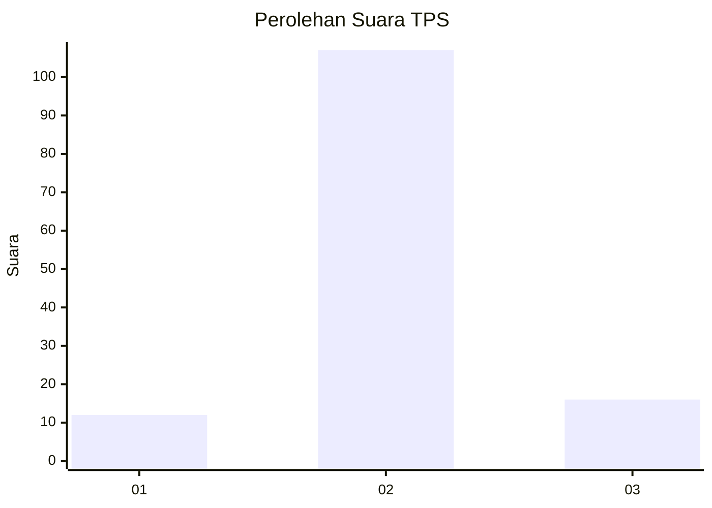
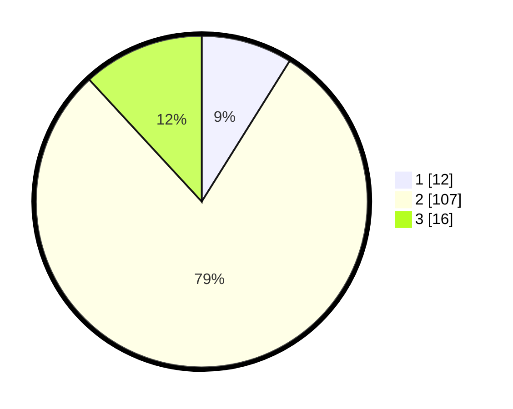

# Hasil

## Grafik

## Tabel

| No. | Nama Paslon    | Suara | Suara (raw) | Persentase |
|:--- |:-------------- | -----:| -----------:| ----------:|
| 1   | ANIES MUHAIMIN | 12    | [12][p-1]   | 8,89       |
| 2   | PRABOWO GIBRAN | 107   | [107][p-2]  | 79,26      |
| 3   | GANJAR MAHFUD  | 16    | [16][p-3]   | 11,85      |

[p-1]: https://github.com/gigit-pemilu/pemilu-2024-35-jawa-timur/blob/main/pilpres/hitung-suara/sub/35-jawa-timur/sub/24-lamongan/sub/05-babat/sub/2020-keyongan/sub/009-tps/sub/paslon-1.txt
[p-2]: https://github.com/gigit-pemilu/pemilu-2024-35-jawa-timur/blob/main/pilpres/hitung-suara/sub/35-jawa-timur/sub/24-lamongan/sub/05-babat/sub/2020-keyongan/sub/009-tps/sub/paslon-2.txt
[p-3]: https://github.com/gigit-pemilu/pemilu-2024-35-jawa-timur/blob/main/pilpres/hitung-suara/sub/35-jawa-timur/sub/24-lamongan/sub/05-babat/sub/2020-keyongan/sub/009-tps/sub/paslon-3.txt

## Foto C Plano

https://sirekap-obj-formc.kpu.go.id/8be1/pemilu/ppwp/35/24/05/20/20/3524052020009-20240218-131741--963ffac9-37e0-4f91-bf1b-0974d05631fa.jpg

https://sirekap-obj-formc.kpu.go.id/8be1/pemilu/ppwp/35/24/05/20/20/3524052020009-20240218-131846--dac7dd8b-4053-4938-bd59-f14c5c6555b9.jpg

https://sirekap-obj-formc.kpu.go.id/8be1/pemilu/ppwp/35/24/05/20/20/3524052020009-20240218-131943--141909ae-6ac5-4fc8-b9ab-9d5a87d49129.jpg

## Metadata

| Key        | Value               |
| ---------- | ------------------- |
| Time Stamp | 2024-02-19 06:16:00 |

## DATA PEMILIH TETAP

Jumlah pemilih dalam DPT: **203**.
 * L: **108**.
 * P: **95**.

## DATA PENGGUNA HAK PILIH

Jumlah pengguna hak pilih dalam DPT: **145**.
 * L: **870**.
 * P: **875**.

Jumlah pengguna hak pilih dalam DPTb: **888**.
 * L: **888**.
 * P: **888**.

Jumlah pengguna hak pilih dalam DPK: **880**.
 * L: **888**.
 * P: **8**.

Jumlah pengguna hak pilih: **645**.
 * L: **830**.
 * P: **875**.

## JUMLAH SUARA SAH DAN TIDAK SAH

JUMLAH SELURUH SUARA SAH: **835**.

JUMLAH SUARA TIDAK SAH: **880**.

JUMLAH SELURUH SUARA SAH DAN SUARA TIDAK SAH: **345**.

