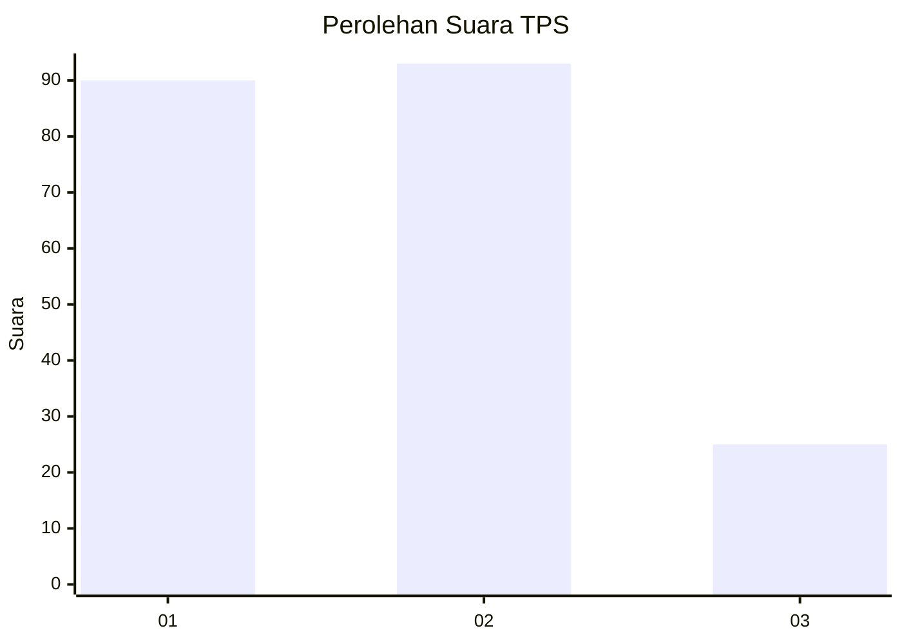
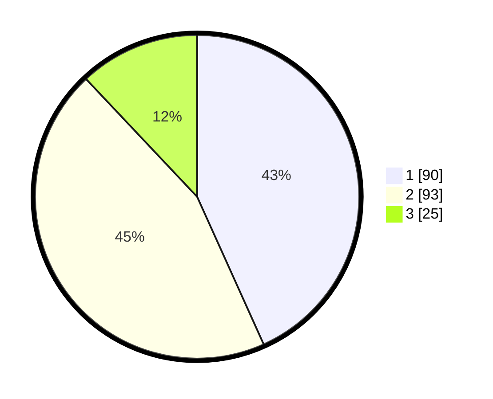

# Hasil

## Grafik

## Tabel

| No. | Nama Paslon    | Suara | Suara (raw) | Persentase |
|:--- |:-------------- | -----:| -----------:| ----------:|
| 1   | ANIES MUHAIMIN | 90    | [90][p-1]   | 43,27      |
| 2   | PRABOWO GIBRAN | 93    | [93][p-2]   | 44,71      |
| 3   | GANJAR MAHFUD  | 25    | [25][p-3]   | 12,02      |

[p-1]: https://github.com/gigit-pemilu/pemilu-2024/blob/main/pilpres/hitung-suara/sub/35-jawa-timur/sub/24-lamongan/sub/07-brondong/sub/2008-sedayulawas/sub/001-tps/sub/paslon-1.txt
[p-2]: https://github.com/gigit-pemilu/pemilu-2024/blob/main/pilpres/hitung-suara/sub/35-jawa-timur/sub/24-lamongan/sub/07-brondong/sub/2008-sedayulawas/sub/001-tps/sub/paslon-2.txt
[p-3]: https://github.com/gigit-pemilu/pemilu-2024/blob/main/pilpres/hitung-suara/sub/35-jawa-timur/sub/24-lamongan/sub/07-brondong/sub/2008-sedayulawas/sub/001-tps/sub/paslon-3.txt

## Foto C Plano

https://sirekap-obj-formc.kpu.go.id/8d68/pemilu/ppwp/35/24/07/20/08/3524072008001-20240222-114326--c65b23fd-e893-41ef-aff5-281d515ccb93.jpg

https://sirekap-obj-formc.kpu.go.id/8d68/pemilu/ppwp/35/24/07/20/08/3524072008001-20240222-114711--9ffc7a57-22bf-455f-aa36-2682e5e5ebad.jpg

https://sirekap-obj-formc.kpu.go.id/8d68/pemilu/ppwp/35/24/07/20/08/3524072008001-20240222-113932--8dddf140-c4f1-463e-9375-330774ccb8bc.jpg

## Metadata

| Key        | Value               |
| ---------- | ------------------- |
| Time Stamp | 2024-02-24 22:31:28 |

