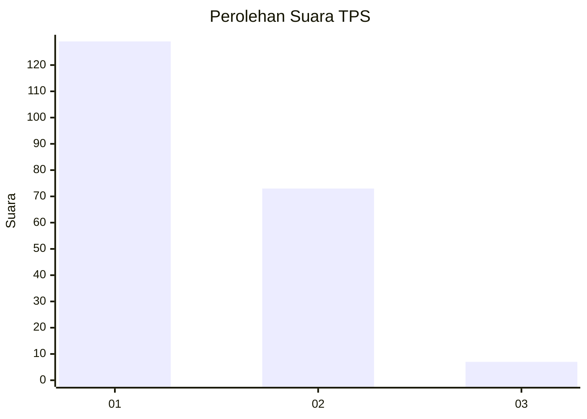
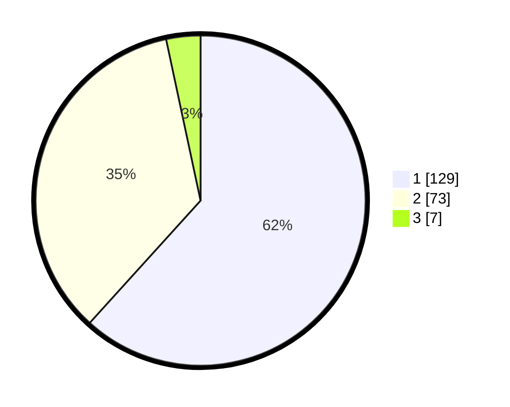

# Hasil

## Grafik

## Tabel

| No. | Nama Paslon    | Suara | Suara (raw) | Persentase |
|:--- |:-------------- | -----:| -----------:| ----------:|
| 1   | ANIES MUHAIMIN | 129   | [129][p-1]  | 61,72      |
| 2   | PRABOWO GIBRAN | 73    | [73][p-2]   | 34,93      |
| 3   | GANJAR MAHFUD  | 7     | [7][p-3]    | 3,35       |

[p-1]: https://github.com/gigit-pemilu/pemilu-2024-35-jawa-timur/blob/main/pilpres/hitung-suara/sub/35-jawa-timur/sub/24-lamongan/sub/07-brondong/sub/2008-sedayulawas/sub/016-tps/sub/paslon-1.txt
[p-2]: https://github.com/gigit-pemilu/pemilu-2024-35-jawa-timur/blob/main/pilpres/hitung-suara/sub/35-jawa-timur/sub/24-lamongan/sub/07-brondong/sub/2008-sedayulawas/sub/016-tps/sub/paslon-2.txt
[p-3]: https://github.com/gigit-pemilu/pemilu-2024-35-jawa-timur/blob/main/pilpres/hitung-suara/sub/35-jawa-timur/sub/24-lamongan/sub/07-brondong/sub/2008-sedayulawas/sub/016-tps/sub/paslon-3.txt

## Foto C Plano

https://sirekap-obj-formc.kpu.go.id/2ae1/pemilu/ppwp/35/24/07/20/08/3524072008016-20240219-205954--aacf15d2-b686-48db-9c8b-fc3c4b19f4d7.jpg

https://sirekap-obj-formc.kpu.go.id/2ae1/pemilu/ppwp/35/24/07/20/08/3524072008016-20240219-211143--0eb0e5a2-c8c8-47d2-92d9-1155806d5a6e.jpg

https://sirekap-obj-formc.kpu.go.id/2ae1/pemilu/ppwp/35/24/07/20/08/3524072008016-20240219-210251--55ce858f-d563-4f3c-8d36-aeea76108790.jpg

## Metadata

| Key        | Value               |
| ---------- | ------------------- |
| Time Stamp | 2024-02-21 22:00:00 |

