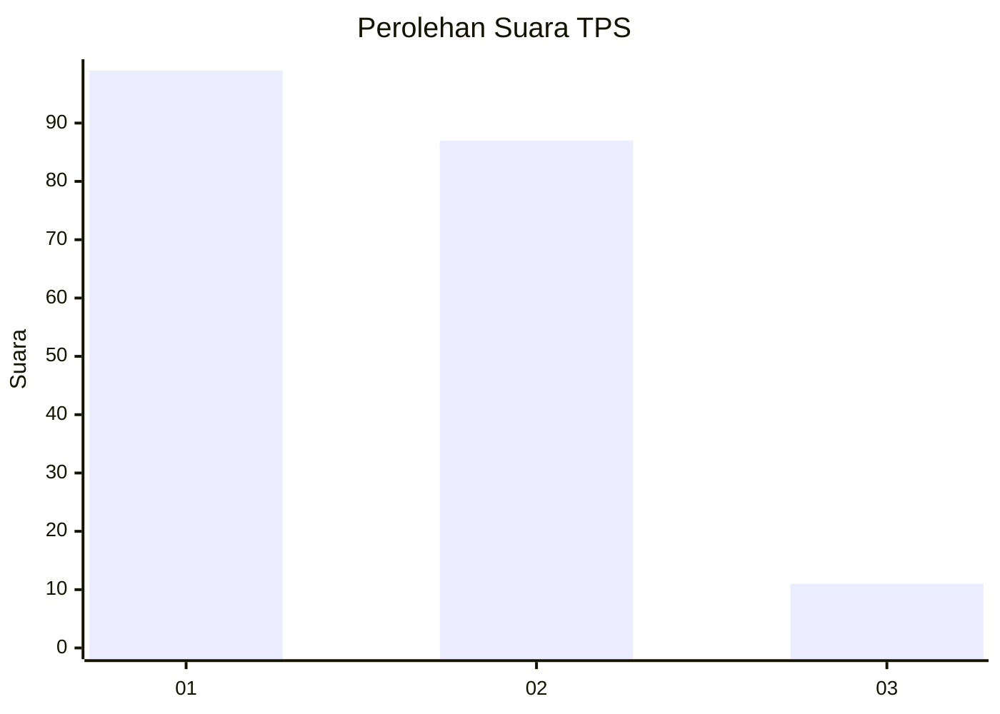
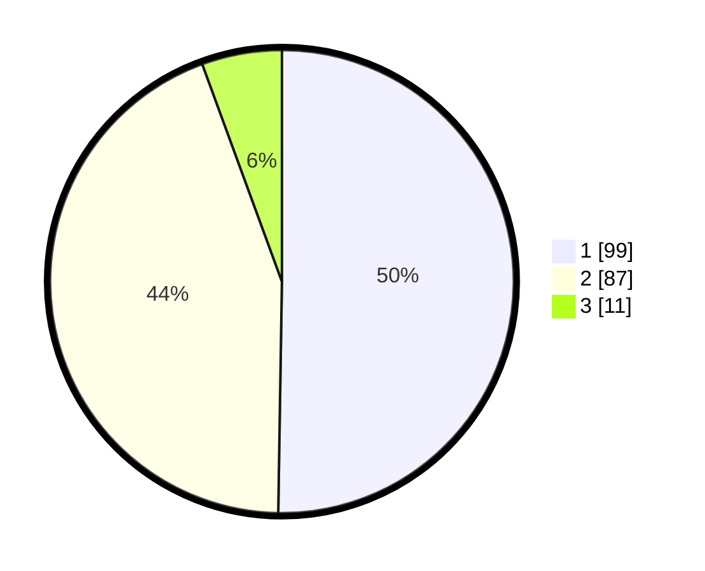

# Hasil

## Grafik

## Tabel

| No. | Nama Paslon    | Suara | Suara (raw) | Persentase |
|:--- |:-------------- | -----:| -----------:| ----------:|
| 1   | ANIES MUHAIMIN | 99    | [99][p-1]   | 50,25      |
| 2   | PRABOWO GIBRAN | 87    | [87][p-2]   | 44,16      |
| 3   | GANJAR MAHFUD  | 11    | [11][p-3]   | 5,58       |

[p-1]: https://github.com/gigit-pemilu/pemilu-2024/blob/main/pilpres/hitung-suara/sub/35-jawa-timur/sub/24-lamongan/sub/07-brondong/sub/2008-sedayulawas/sub/019-tps/sub/paslon-1.txt
[p-2]: https://github.com/gigit-pemilu/pemilu-2024/blob/main/pilpres/hitung-suara/sub/35-jawa-timur/sub/24-lamongan/sub/07-brondong/sub/2008-sedayulawas/sub/019-tps/sub/paslon-2.txt
[p-3]: https://github.com/gigit-pemilu/pemilu-2024/blob/main/pilpres/hitung-suara/sub/35-jawa-timur/sub/24-lamongan/sub/07-brondong/sub/2008-sedayulawas/sub/019-tps/sub/paslon-3.txt

## Foto C Plano

https://sirekap-obj-formc.kpu.go.id/7c20/pemilu/ppwp/35/24/07/20/08/3524072008019-20240217-234555--5b27a70d-276e-43d2-bf40-f9fa5b622636.jpg

https://sirekap-obj-formc.kpu.go.id/7c20/pemilu/ppwp/35/24/07/20/08/3524072008019-20240217-234512--9042688e-753a-4879-813d-d600d827c8fc.jpg

https://sirekap-obj-formc.kpu.go.id/7c20/pemilu/ppwp/35/24/07/20/08/3524072008019-20240222-183142--49f09ada-369c-4a0c-ae9a-7eb1e63a18bc.jpg

## Metadata

| Key        | Value               |
| ---------- | ------------------- |
| Time Stamp | 2024-02-22 19:00:00 |

