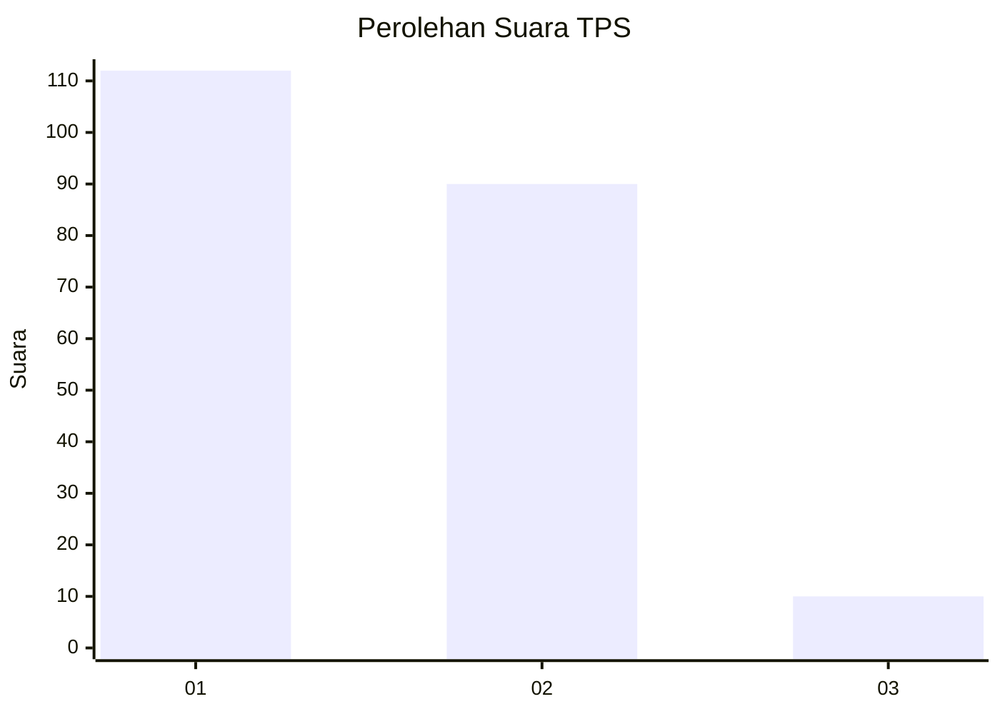
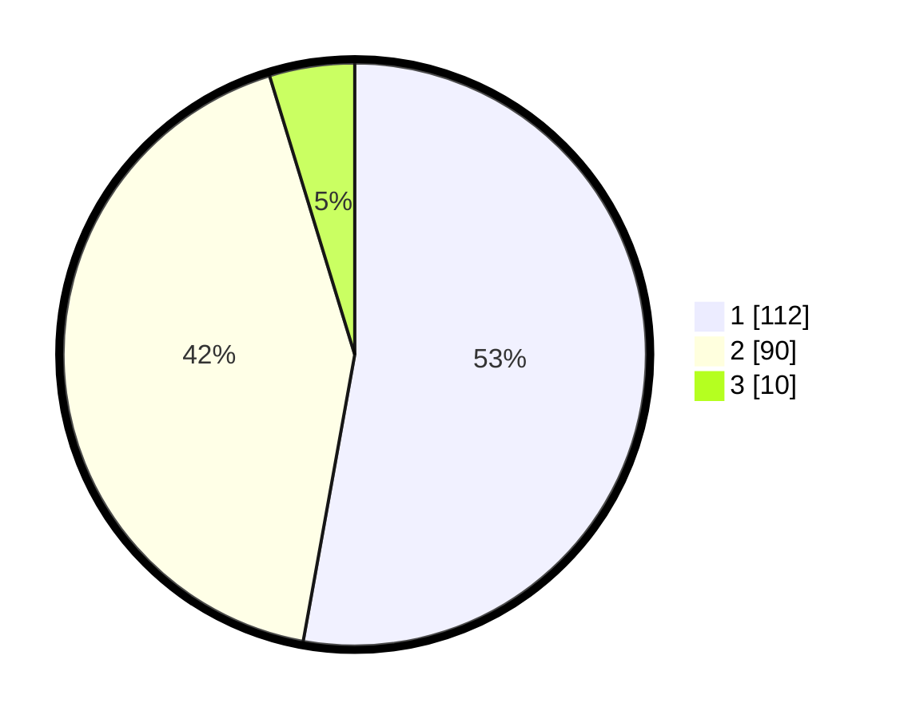

# Hasil

## Grafik

## Tabel

| No. | Nama Paslon    | Suara | Suara (raw) | Persentase |
|:--- |:-------------- | -----:| -----------:| ----------:|
| 1   | ANIES MUHAIMIN | 112   | [112][p-1]  | 52,83      |
| 2   | PRABOWO GIBRAN | 90    | [90][p-2]   | 42,45      |
| 3   | GANJAR MAHFUD  | 10    | [10][p-3]   | 4,72       |

[p-1]: https://github.com/gigit-pemilu/pemilu-2024/blob/main/pilpres/hitung-suara/sub/35-jawa-timur/sub/24-lamongan/sub/07-brondong/sub/2008-sedayulawas/sub/035-tps/sub/paslon-1.txt
[p-2]: https://github.com/gigit-pemilu/pemilu-2024/blob/main/pilpres/hitung-suara/sub/35-jawa-timur/sub/24-lamongan/sub/07-brondong/sub/2008-sedayulawas/sub/035-tps/sub/paslon-2.txt
[p-3]: https://github.com/gigit-pemilu/pemilu-2024/blob/main/pilpres/hitung-suara/sub/35-jawa-timur/sub/24-lamongan/sub/07-brondong/sub/2008-sedayulawas/sub/035-tps/sub/paslon-3.txt

## Foto C Plano

https://sirekap-obj-formc.kpu.go.id/70dd/pemilu/ppwp/35/24/07/20/08/3524072008035-20240216-154537--94db309a-319c-47c9-a151-2696c2dad169.jpg

https://sirekap-obj-formc.kpu.go.id/70dd/pemilu/ppwp/35/24/07/20/08/3524072008035-20240216-154632--56bc3aeb-3dab-4d9a-9918-00cadabd75d6.jpg

https://sirekap-obj-formc.kpu.go.id/70dd/pemilu/ppwp/35/24/07/20/08/3524072008035-20240216-154714--0e30933a-bc11-4421-bc03-0dee64266419.jpg

## Metadata

| Key        | Value               |
| ---------- | ------------------- |
| Time Stamp | 2024-02-17 16:00:02 |

