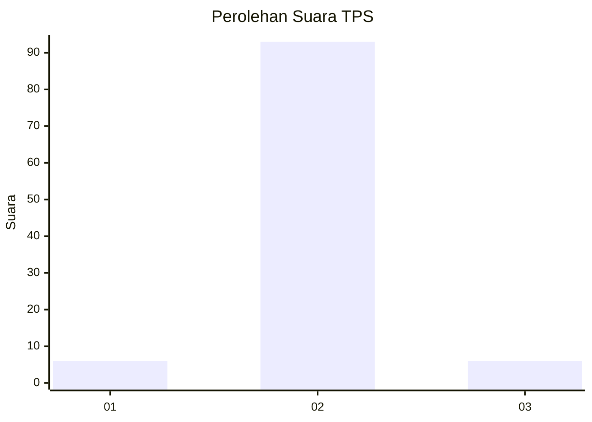
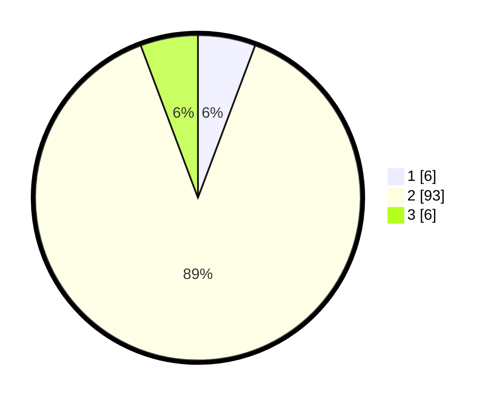

# Hasil

## Grafik

## Tabel

| No. | Nama Paslon    | Suara | Suara (raw) | Persentase |
|:--- |:-------------- | -----:| -----------:| ----------:|
| 1   | ANIES MUHAIMIN | 6     | [6][p-1]    | 5,71       |
| 2   | PRABOWO GIBRAN | 93    | [93][p-2]   | 88,57      |
| 3   | GANJAR MAHFUD  | 6     | [6][p-3]    | 5,71       |

[p-1]: https://github.com/gigit-pemilu/pemilu-2024/blob/main/pilpres/hitung-suara/sub/35-jawa-timur/sub/24-lamongan/sub/08-laren/sub/2001-dateng/sub/003-tps/sub/paslon-1.txt
[p-2]: https://github.com/gigit-pemilu/pemilu-2024/blob/main/pilpres/hitung-suara/sub/35-jawa-timur/sub/24-lamongan/sub/08-laren/sub/2001-dateng/sub/003-tps/sub/paslon-2.txt
[p-3]: https://github.com/gigit-pemilu/pemilu-2024/blob/main/pilpres/hitung-suara/sub/35-jawa-timur/sub/24-lamongan/sub/08-laren/sub/2001-dateng/sub/003-tps/sub/paslon-3.txt

## Foto C Plano

https://sirekap-obj-formc.kpu.go.id/3ff3/pemilu/ppwp/35/24/08/20/01/3524082001003-20240216-143807--978e8930-18fb-4366-a8f1-0e15d84270ed.jpg

https://sirekap-obj-formc.kpu.go.id/3ff3/pemilu/ppwp/35/24/08/20/01/3524082001003-20240215-004352--bbe370a4-655f-4c1c-afeb-2a0d294a41a1.jpg

https://sirekap-obj-formc.kpu.go.id/3ff3/pemilu/ppwp/35/24/08/20/01/3524082001003-20240216-143808--ef8afc64-0f0f-4bb0-8e2b-4aebb9ef34cf.jpg

## Metadata

| Key        | Value               |
| ---------- | ------------------- |
| Time Stamp | 2024-02-16 16:25:10 |

## DATA PEMILIH TETAP

Jumlah pemilih dalam DPT: **234**.
 * L: **110**.
 * P: **124**.

## DATA PENGGUNA HAK PILIH

Jumlah pengguna hak pilih dalam DPT: **109**.
 * L: **45**.
 * P: **64**.

Jumlah pengguna hak pilih dalam DPTb: **0**.
 * L: **0**.
 * P: **0**.

Jumlah pengguna hak pilih dalam DPK: **0**.
 * L: **0**.
 * P: **0**.

Jumlah pengguna hak pilih: **109**.
 * L: **45**.
 * P: **64**.

## JUMLAH SUARA SAH DAN TIDAK SAH

JUMLAH SELURUH SUARA SAH: **105**.

JUMLAH SUARA TIDAK SAH: **4**.

JUMLAH SELURUH SUARA SAH DAN SUARA TIDAK SAH: **109**.

