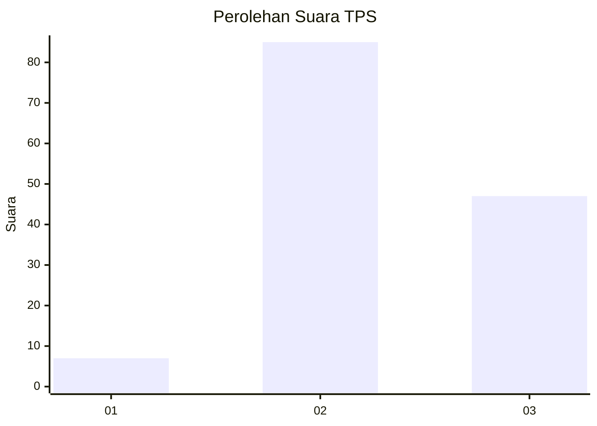
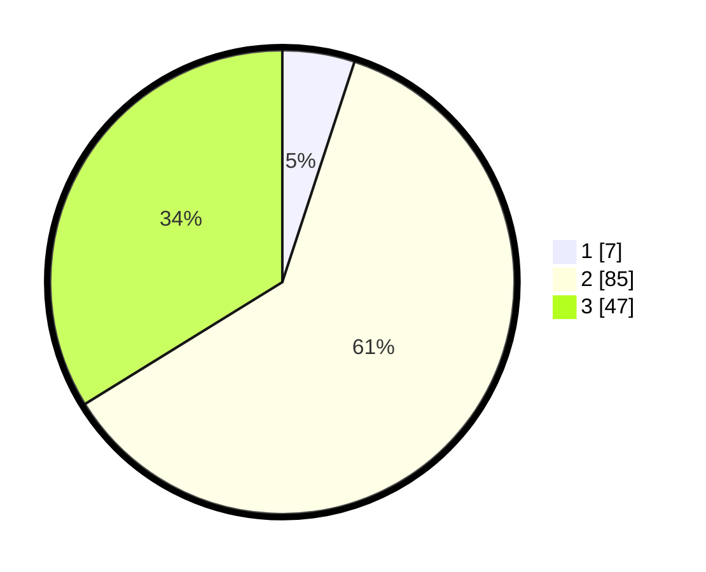

# Hasil

## Grafik

## Tabel

| No. | Nama Paslon    | Suara | Suara (raw) | Persentase |
|:--- |:-------------- | -----:| -----------:| ----------:|
| 1   | ANIES MUHAIMIN | 7     | [7][p-1]    | 5,04       |
| 2   | PRABOWO GIBRAN | 85    | [85][p-2]   | 61,15      |
| 3   | GANJAR MAHFUD  | 47    | [47][p-3]   | 33,81      |

[p-1]: https://github.com/gigit-pemilu/pemilu-2024/blob/main/pilpres/hitung-suara/sub/35-jawa-timur/sub/24-lamongan/sub/09-sekaran/sub/2001-besur/sub/002-tps/sub/paslon-1.txt
[p-2]: https://github.com/gigit-pemilu/pemilu-2024/blob/main/pilpres/hitung-suara/sub/35-jawa-timur/sub/24-lamongan/sub/09-sekaran/sub/2001-besur/sub/002-tps/sub/paslon-2.txt
[p-3]: https://github.com/gigit-pemilu/pemilu-2024/blob/main/pilpres/hitung-suara/sub/35-jawa-timur/sub/24-lamongan/sub/09-sekaran/sub/2001-besur/sub/002-tps/sub/paslon-3.txt

## Foto C Plano

https://sirekap-obj-formc.kpu.go.id/0b81/pemilu/ppwp/35/24/09/20/01/3524092001002-20240217-102113--c0ecf0d5-0788-4585-b170-72ae1e005ca8.jpg

https://sirekap-obj-formc.kpu.go.id/0b81/pemilu/ppwp/35/24/09/20/01/3524092001002-20240217-102720--8bfb44e6-ac80-45b6-9925-673ac446bef1.jpg

https://sirekap-obj-formc.kpu.go.id/0b81/pemilu/ppwp/35/24/09/20/01/3524092001002-20240217-102929--da8db783-e45a-4ddf-ade1-dbe8dd10f849.jpg

## Metadata

| Key        | Value               |
| ---------- | ------------------- |
| Time Stamp | 2024-02-17 10:30:03 |

## DATA PEMILIH TETAP

Jumlah pemilih dalam DPT: **227**.
 * L: **116**.
 * P: **111**.

## DATA PENGGUNA HAK PILIH

Jumlah pengguna hak pilih dalam DPT: **148**.
 * L: **69**.
 * P: **79**.

Jumlah pengguna hak pilih dalam DPTb: **0**.
 * L: **0**.
 * P: **0**.

Jumlah pengguna hak pilih dalam DPK: **0**.
 * L: **0**.
 * P: **0**.

Jumlah pengguna hak pilih: **148**.
 * L: **69**.
 * P: **79**.

## JUMLAH SUARA SAH DAN TIDAK SAH

JUMLAH SELURUH SUARA SAH: **139**.

JUMLAH SUARA TIDAK SAH: **9**.

JUMLAH SELURUH SUARA SAH DAN SUARA TIDAK SAH: **148**.

