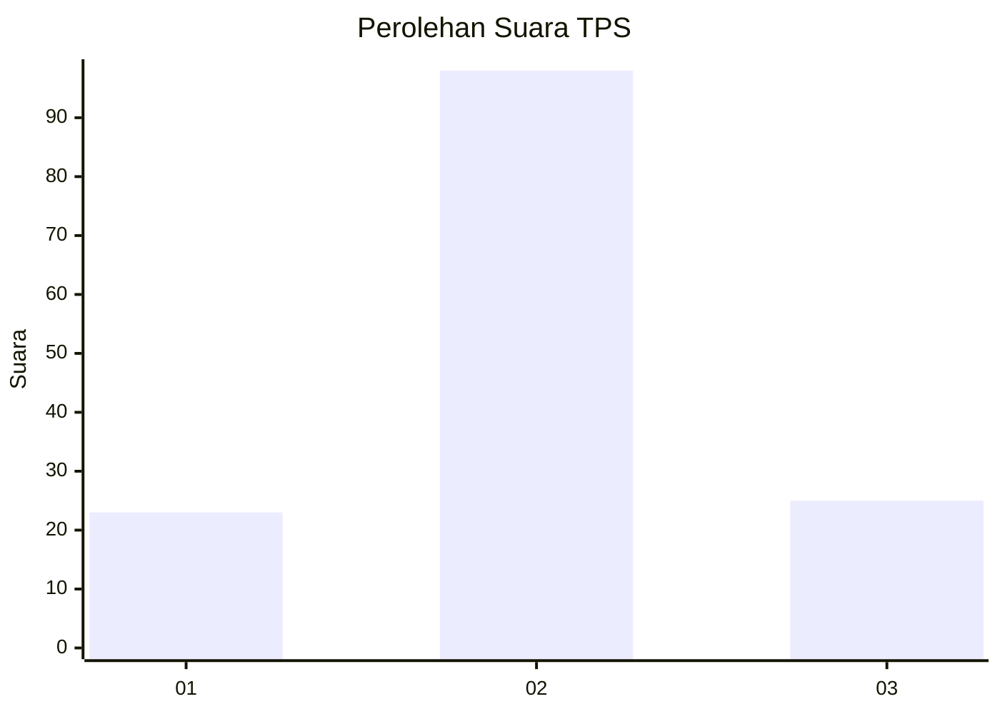
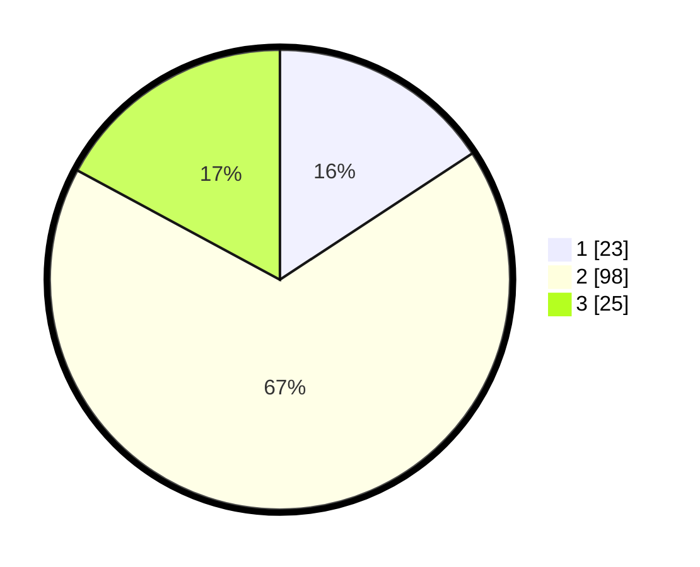

# Hasil

## Grafik

## Tabel

| No. | Nama Paslon    | Suara | Suara (raw) | Persentase |
|:--- |:-------------- | -----:| -----------:| ----------:|
| 1   | ANIES MUHAIMIN | 23    | [23][p-1]   | 15,75      |
| 2   | PRABOWO GIBRAN | 98    | [98][p-2]   | 67,12      |
| 3   | GANJAR MAHFUD  | 25    | [25][p-3]   | 17,12      |

[p-1]: https://github.com/gigit-pemilu/pemilu-2024/blob/main/pilpres/hitung-suara/sub/35-jawa-timur/sub/24-lamongan/sub/09-sekaran/sub/2008-jugo/sub/003-tps/sub/paslon-1.txt
[p-2]: https://github.com/gigit-pemilu/pemilu-2024/blob/main/pilpres/hitung-suara/sub/35-jawa-timur/sub/24-lamongan/sub/09-sekaran/sub/2008-jugo/sub/003-tps/sub/paslon-2.txt
[p-3]: https://github.com/gigit-pemilu/pemilu-2024/blob/main/pilpres/hitung-suara/sub/35-jawa-timur/sub/24-lamongan/sub/09-sekaran/sub/2008-jugo/sub/003-tps/sub/paslon-3.txt

## Foto C Plano

https://sirekap-obj-formc.kpu.go.id/8b81/pemilu/ppwp/35/24/09/20/08/3524092008003-20240217-103817--aa80fcc0-484a-42c2-bd3b-febdf7d2da1d.jpg

https://sirekap-obj-formc.kpu.go.id/8b81/pemilu/ppwp/35/24/09/20/08/3524092008003-20240217-103603--518ac4e4-79ce-4bda-8fa7-21ec5eaa9563.jpg

## Metadata

| Key        | Value               |
| ---------- | ------------------- |
| Time Stamp | 2024-02-25 13:00:00 |

