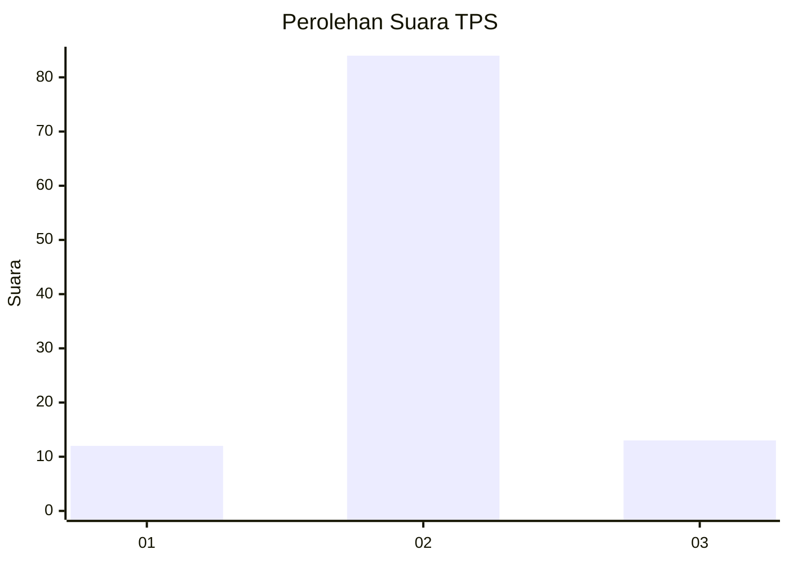
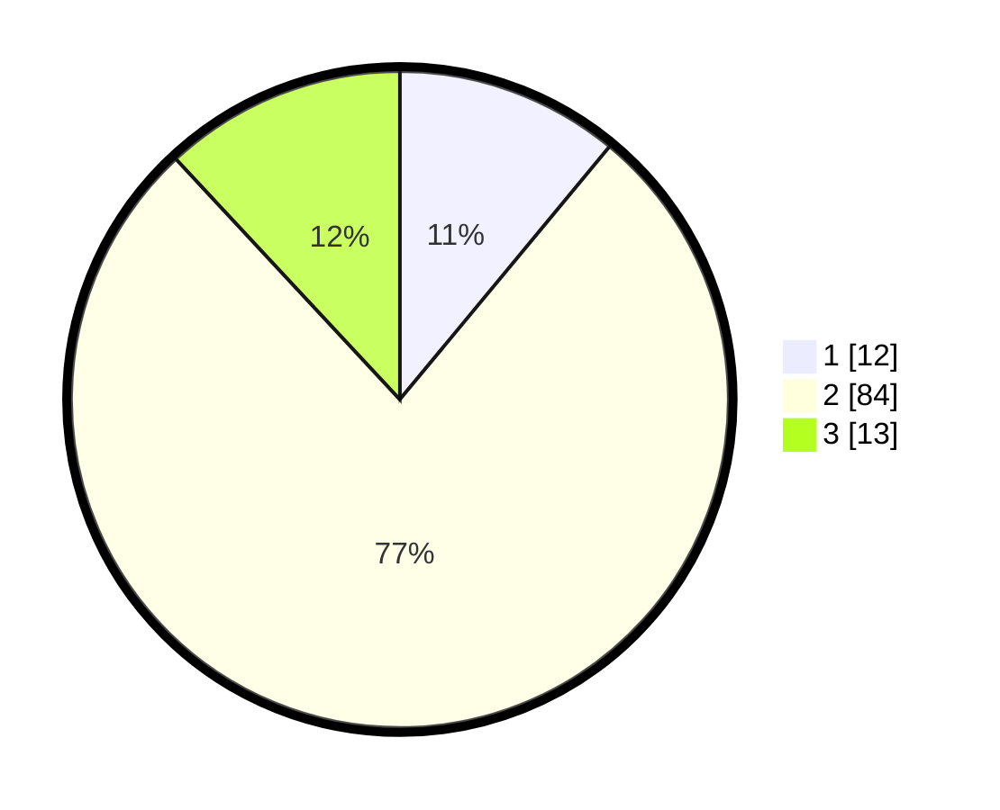

# Hasil

## Grafik

## Tabel

| No. | Nama Paslon    | Suara | Suara (raw) | Persentase |
|:--- |:-------------- | -----:| -----------:| ----------:|
| 1   | ANIES MUHAIMIN | 12    | [12][p-1]   | 11,01      |
| 2   | PRABOWO GIBRAN | 84    | [84][p-2]   | 77,06      |
| 3   | GANJAR MAHFUD  | 13    | [13][p-3]   | 11,93      |

[p-1]: https://github.com/gigit-pemilu/pemilu-2024/blob/main/pilpres/hitung-suara/sub/35-jawa-timur/sub/24-lamongan/sub/09-sekaran/sub/2011-latek/sub/002-tps/sub/paslon-1.txt
[p-2]: https://github.com/gigit-pemilu/pemilu-2024/blob/main/pilpres/hitung-suara/sub/35-jawa-timur/sub/24-lamongan/sub/09-sekaran/sub/2011-latek/sub/002-tps/sub/paslon-2.txt
[p-3]: https://github.com/gigit-pemilu/pemilu-2024/blob/main/pilpres/hitung-suara/sub/35-jawa-timur/sub/24-lamongan/sub/09-sekaran/sub/2011-latek/sub/002-tps/sub/paslon-3.txt

## Foto C Plano

https://sirekap-obj-formc.kpu.go.id/a1c7/pemilu/ppwp/35/24/09/20/11/3524092011002-20240217-145522--a5069f70-7986-4652-89b4-b0f89f6b1cd8.jpg

https://sirekap-obj-formc.kpu.go.id/a1c7/pemilu/ppwp/35/24/09/20/11/3524092011002-20240217-150113--d7720bae-baf9-4148-97a8-01831a95f3dc.jpg

https://sirekap-obj-formc.kpu.go.id/a1c7/pemilu/ppwp/35/24/09/20/11/3524092011002-20240217-145311--a8b43f7b-04bc-4b16-a799-54882fd949ea.jpg

## Metadata

| Key        | Value               |
| ---------- | ------------------- |
| Time Stamp | 2024-02-19 06:16:00 |

## DATA PEMILIH TETAP

Jumlah pemilih dalam DPT: **217**.
 * L: **114**.
 * P: **103**.

## DATA PENGGUNA HAK PILIH

Jumlah pengguna hak pilih dalam DPT: **109**.
 * L: **48**.
 * P: **61**.

Jumlah pengguna hak pilih dalam DPTb: **109**.
 * L: **48**.
 * P: **61**.

Jumlah pengguna hak pilih dalam DPK: **5**.
 * L: **3**.
 * P: **2**.

Jumlah pengguna hak pilih: **114**.
 * L: **51**.
 * P: **63**.

## JUMLAH SUARA SAH DAN TIDAK SAH

JUMLAH SELURUH SUARA SAH: **109**.

JUMLAH SUARA TIDAK SAH: **5**.

JUMLAH SELURUH SUARA SAH DAN SUARA TIDAK SAH: **114**.

