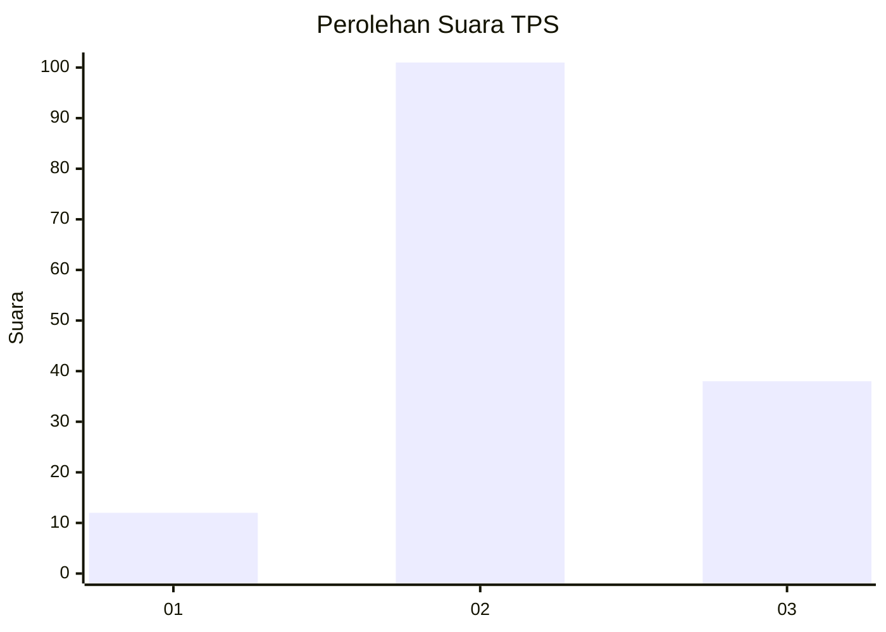
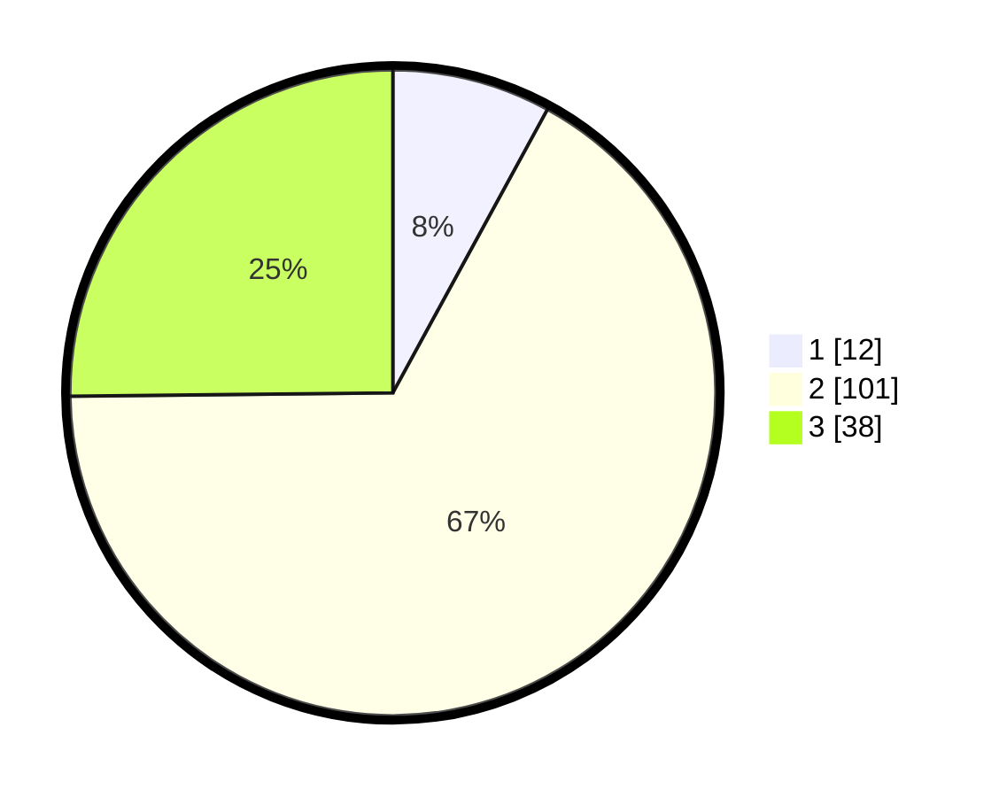

# Hasil

## Grafik

## Tabel

| No. | Nama Paslon    | Suara | Suara (raw) | Persentase |
|:--- |:-------------- | -----:| -----------:| ----------:|
| 1   | ANIES MUHAIMIN | 12    | [12][p-1]   | 7,95       |
| 2   | PRABOWO GIBRAN | 101   | [101][p-2]  | 66,89      |
| 3   | GANJAR MAHFUD  | 38    | [38][p-3]   | 25,17      |

[p-1]: https://github.com/gigit-pemilu/pemilu-2024-35-jawa-timur/blob/main/pilpres/hitung-suara/sub/35-jawa-timur/sub/24-lamongan/sub/09-sekaran/sub/2013-sekaran/sub/006-tps/sub/paslon-1.txt
[p-2]: https://github.com/gigit-pemilu/pemilu-2024-35-jawa-timur/blob/main/pilpres/hitung-suara/sub/35-jawa-timur/sub/24-lamongan/sub/09-sekaran/sub/2013-sekaran/sub/006-tps/sub/paslon-2.txt
[p-3]: https://github.com/gigit-pemilu/pemilu-2024-35-jawa-timur/blob/main/pilpres/hitung-suara/sub/35-jawa-timur/sub/24-lamongan/sub/09-sekaran/sub/2013-sekaran/sub/006-tps/sub/paslon-3.txt

## Foto C Plano

https://sirekap-obj-formc.kpu.go.id/0678/pemilu/ppwp/35/24/09/20/13/3524092013006-20240219-162729--a5b79f77-6a5a-4fad-89f3-1273083b52ff.jpg

https://sirekap-obj-formc.kpu.go.id/0678/pemilu/ppwp/35/24/09/20/13/3524092013006-20240219-162840--4ca7122e-af68-4346-8438-518e51bf3cc3.jpg

https://sirekap-obj-formc.kpu.go.id/0678/pemilu/ppwp/35/24/09/20/13/3524092013006-20240219-162927--7b161cc8-73cb-4d46-96c0-c8f972e3d68d.jpg

## Metadata

| Key        | Value               |
| ---------- | ------------------- |
| Time Stamp | 2024-02-25 17:00:00 |

