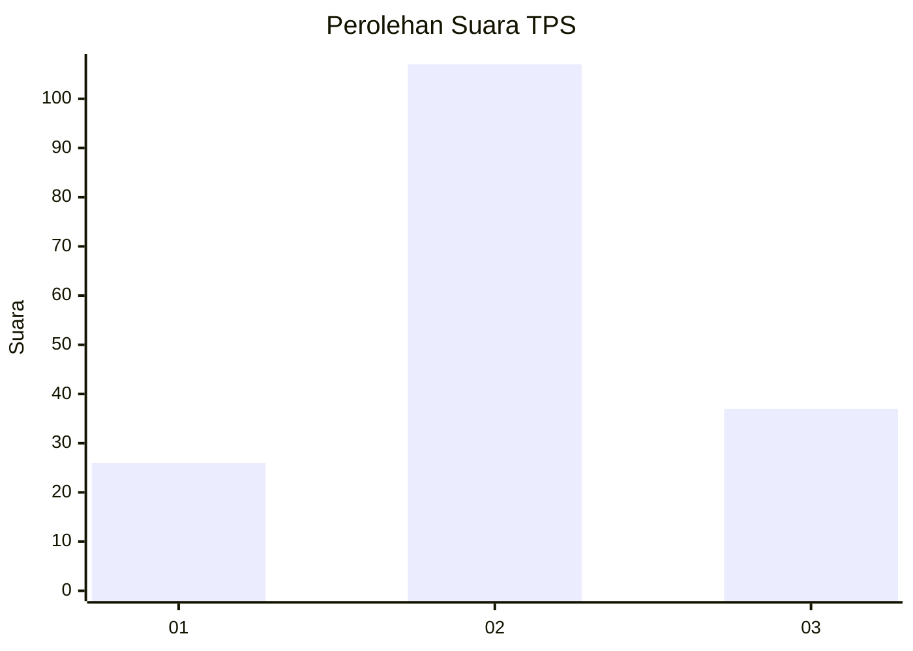
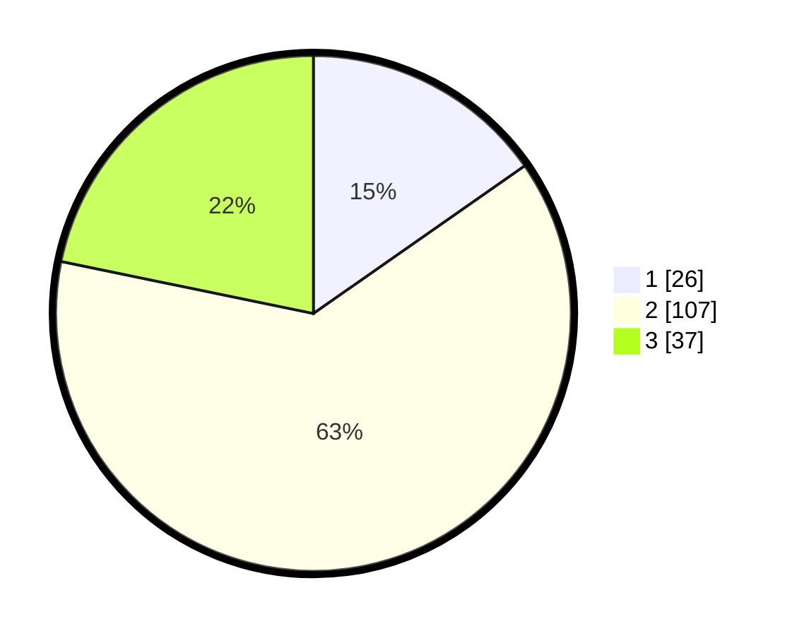

# Hasil

## Grafik

## Tabel

| No. | Nama Paslon    | Suara | Suara (raw) | Persentase |
|:--- |:-------------- | -----:| -----------:| ----------:|
| 1   | ANIES MUHAIMIN | 26    | [26][p-1]   | 15,29      |
| 2   | PRABOWO GIBRAN | 107   | [107][p-2]  | 62,94      |
| 3   | GANJAR MAHFUD  | 37    | [37][p-3]   | 21,76      |

[p-1]: https://github.com/gigit-pemilu/pemilu-2024-35-jawa-timur/blob/main/pilpres/hitung-suara/sub/35-jawa-timur/sub/24-lamongan/sub/10-maduran/sub/2001-duriwetan/sub/003-tps/sub/paslon-1.txt
[p-2]: https://github.com/gigit-pemilu/pemilu-2024-35-jawa-timur/blob/main/pilpres/hitung-suara/sub/35-jawa-timur/sub/24-lamongan/sub/10-maduran/sub/2001-duriwetan/sub/003-tps/sub/paslon-2.txt
[p-3]: https://github.com/gigit-pemilu/pemilu-2024-35-jawa-timur/blob/main/pilpres/hitung-suara/sub/35-jawa-timur/sub/24-lamongan/sub/10-maduran/sub/2001-duriwetan/sub/003-tps/sub/paslon-3.txt

## Foto C Plano

https://sirekap-obj-formc.kpu.go.id/5e40/pemilu/ppwp/35/24/10/20/01/3524102001003-20240214-225537--bd6fb3f5-62d9-4482-b999-84700a0fa0f1.jpg

https://sirekap-obj-formc.kpu.go.id/5e40/pemilu/ppwp/35/24/10/20/01/3524102001003-20240214-190338--029f97d9-1c05-439d-804f-61b9e7f47c1e.jpg

https://sirekap-obj-formc.kpu.go.id/5e40/pemilu/ppwp/35/24/10/20/01/3524102001003-20240214-225706--16e1eaa8-fbc7-4d43-afff-db21e18de3e3.jpg

## Metadata

| Key        | Value               |
| ---------- | ------------------- |
| Time Stamp | 2024-02-16 12:51:22 |

