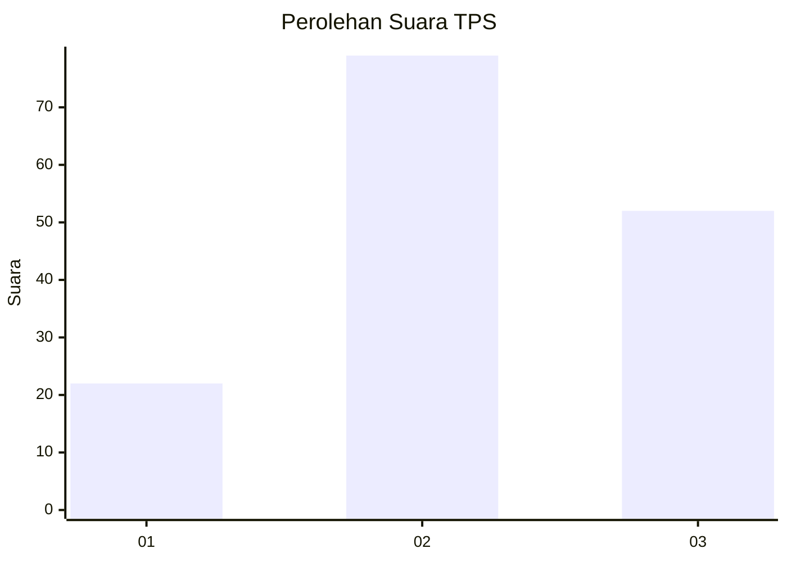
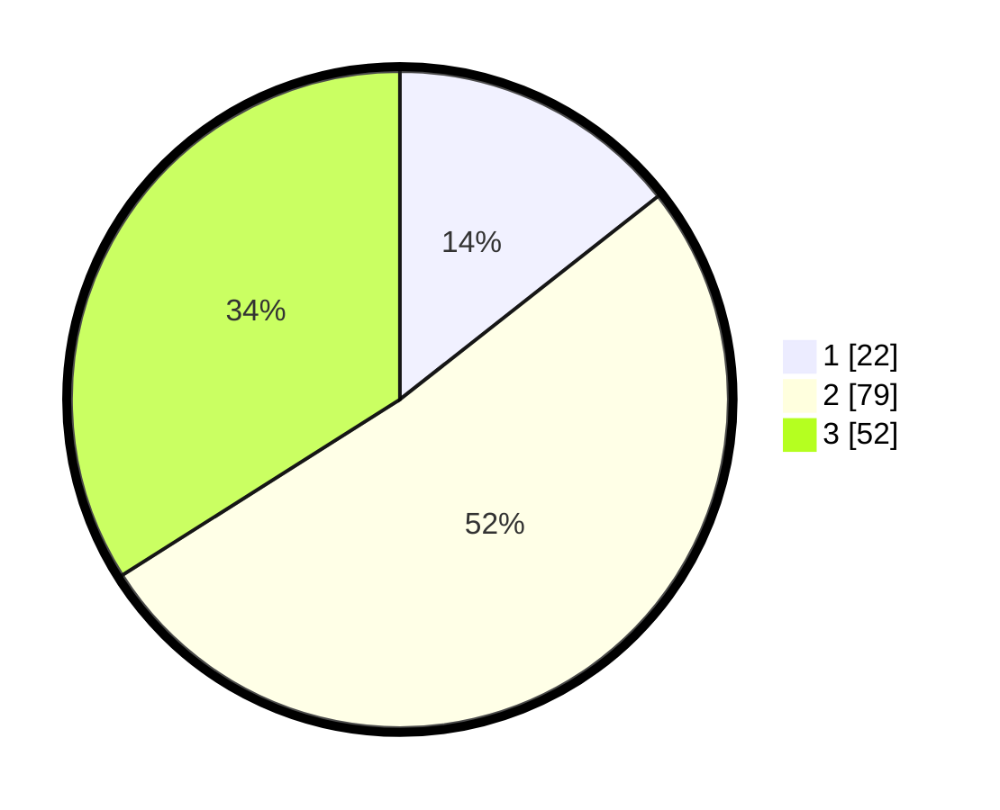

# Hasil

## Grafik

## Tabel

| No. | Nama Paslon    | Suara | Suara (raw) | Persentase |
|:--- |:-------------- | -----:| -----------:| ----------:|
| 1   | ANIES MUHAIMIN | 22    | [22][p-1]   | 14,38      |
| 2   | PRABOWO GIBRAN | 79    | [79][p-2]   | 51,63      |
| 3   | GANJAR MAHFUD  | 52    | [52][p-3]   | 33,99      |

[p-1]: https://github.com/gigit-pemilu/pemilu-2024-35-jawa-timur/blob/main/pilpres/hitung-suara/sub/35-jawa-timur/sub/24-lamongan/sub/10-maduran/sub/2004-siwuran/sub/002-tps/sub/paslon-1.txt
[p-2]: https://github.com/gigit-pemilu/pemilu-2024-35-jawa-timur/blob/main/pilpres/hitung-suara/sub/35-jawa-timur/sub/24-lamongan/sub/10-maduran/sub/2004-siwuran/sub/002-tps/sub/paslon-2.txt
[p-3]: https://github.com/gigit-pemilu/pemilu-2024-35-jawa-timur/blob/main/pilpres/hitung-suara/sub/35-jawa-timur/sub/24-lamongan/sub/10-maduran/sub/2004-siwuran/sub/002-tps/sub/paslon-3.txt

## Foto C Plano

https://sirekap-obj-formc.kpu.go.id/68de/pemilu/ppwp/35/24/10/20/04/3524102004002-20240219-192129--e4d3cb75-f4e1-4f7a-a0e4-720f657d6cdd.jpg

https://sirekap-obj-formc.kpu.go.id/68de/pemilu/ppwp/35/24/10/20/04/3524102004002-20240219-192257--ba5aa9dd-4bf2-4d36-9621-26a4780e6969.jpg

https://sirekap-obj-formc.kpu.go.id/68de/pemilu/ppwp/35/24/10/20/04/3524102004002-20240219-192355--77e26e50-b781-44d9-9e95-71c9af527b28.jpg

## Metadata

| Key        | Value               |
| ---------- | ------------------- |
| Time Stamp | 2024-02-24 22:31:28 |

