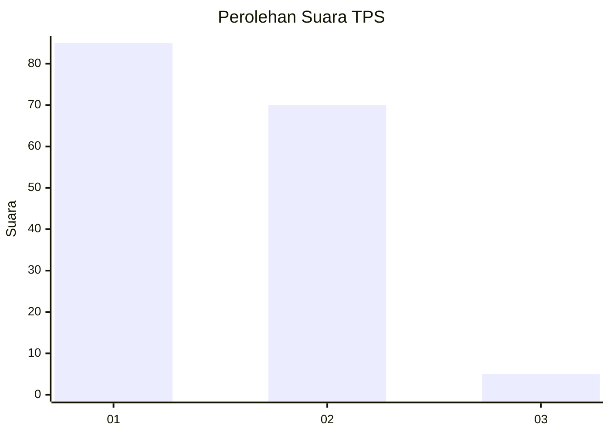
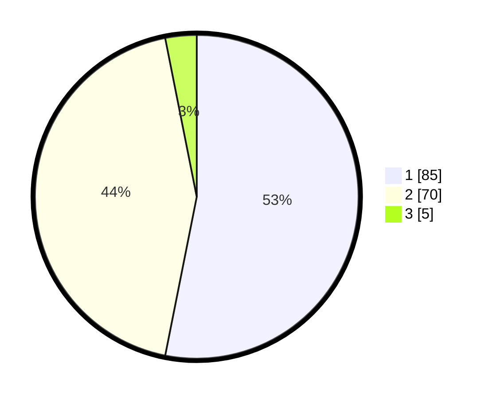

# Hasil

## Grafik

## Tabel

| No. | Nama Paslon    | Suara | Suara (raw) | Persentase |
|:--- |:-------------- | -----:| -----------:| ----------:|
| 1   | ANIES MUHAIMIN | 85    | [85][p-1]   | 53,13      |
| 2   | PRABOWO GIBRAN | 70    | [70][p-2]   | 43,75      |
| 3   | GANJAR MAHFUD  | 5     | [5][p-3]    | 3,13       |

[p-1]: https://github.com/gigit-pemilu/pemilu-2024/blob/main/pilpres/hitung-suara/sub/35-jawa-timur/sub/24-lamongan/sub/10-maduran/sub/2015-gedangan/sub/001-tps/sub/paslon-1.txt
[p-2]: https://github.com/gigit-pemilu/pemilu-2024/blob/main/pilpres/hitung-suara/sub/35-jawa-timur/sub/24-lamongan/sub/10-maduran/sub/2015-gedangan/sub/001-tps/sub/paslon-2.txt
[p-3]: https://github.com/gigit-pemilu/pemilu-2024/blob/main/pilpres/hitung-suara/sub/35-jawa-timur/sub/24-lamongan/sub/10-maduran/sub/2015-gedangan/sub/001-tps/sub/paslon-3.txt

## Foto C Plano

https://sirekap-obj-formc.kpu.go.id/c16d/pemilu/ppwp/35/24/10/20/15/3524102015001-20240215-005016--9f8be4dd-bb9f-4490-bbc1-121e80b18512.jpg

https://sirekap-obj-formc.kpu.go.id/c16d/pemilu/ppwp/35/24/10/20/15/3524102015001-20240214-202218--ee50dec3-2935-4e03-8e06-a55301aa787c.jpg

https://sirekap-obj-formc.kpu.go.id/c16d/pemilu/ppwp/35/24/10/20/15/3524102015001-20240215-005030--e3fdd807-0a0c-4fea-99bd-9daa7a6fcabc.jpg

## Metadata

| Key        | Value               |
| ---------- | ------------------- |
| Time Stamp | 2024-02-19 06:16:00 |

