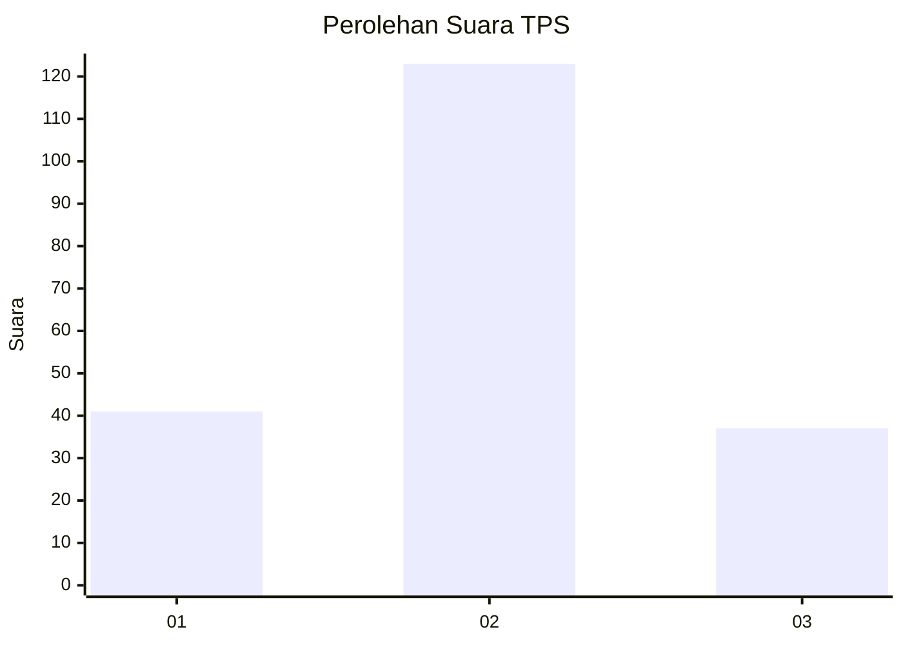
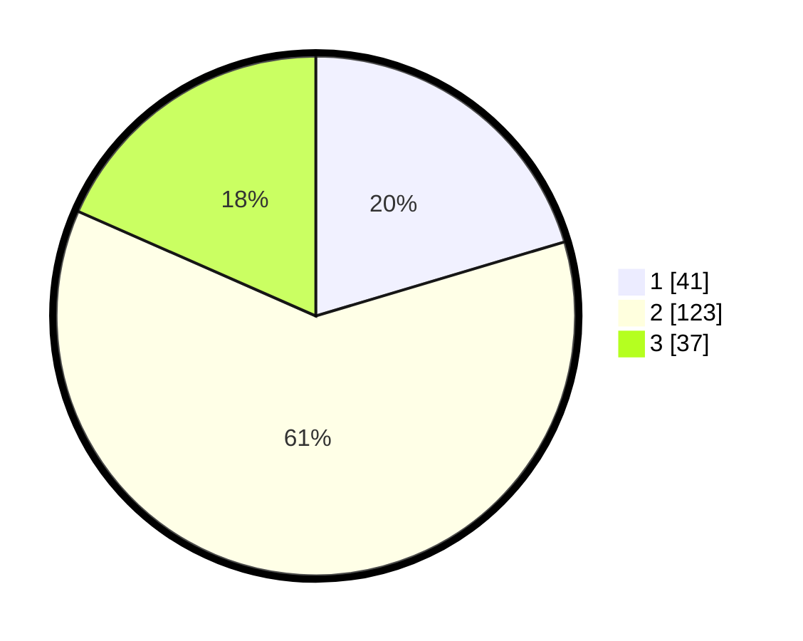

# Hasil

## Grafik

## Tabel

| No. | Nama Paslon    | Suara | Suara (raw) | Persentase |
|:--- |:-------------- | -----:| -----------:| ----------:|
| 1   | ANIES MUHAIMIN | 41    | [41][p-1]   | 20,40      |
| 2   | PRABOWO GIBRAN | 123   | [123][p-2]  | 61,19      |
| 3   | GANJAR MAHFUD  | 37    | [37][p-3]   | 18,41      |

[p-1]: https://github.com/gigit-pemilu/pemilu-2024/blob/main/pilpres/hitung-suara/sub/35-jawa-timur/sub/24-lamongan/sub/13-pucuk/sub/2002-gempolpading/sub/005-tps/sub/paslon-1.txt
[p-2]: https://github.com/gigit-pemilu/pemilu-2024/blob/main/pilpres/hitung-suara/sub/35-jawa-timur/sub/24-lamongan/sub/13-pucuk/sub/2002-gempolpading/sub/005-tps/sub/paslon-2.txt
[p-3]: https://github.com/gigit-pemilu/pemilu-2024/blob/main/pilpres/hitung-suara/sub/35-jawa-timur/sub/24-lamongan/sub/13-pucuk/sub/2002-gempolpading/sub/005-tps/sub/paslon-3.txt

## Foto C Plano

https://sirekap-obj-formc.kpu.go.id/80eb/pemilu/ppwp/35/24/13/20/02/3524132002005-20240218-225504--c0cf5e2e-9ff3-44d9-b6e5-f3f983d42150.jpg

https://sirekap-obj-formc.kpu.go.id/80eb/pemilu/ppwp/35/24/13/20/02/3524132002005-20240218-221616--48104d12-0904-4125-b326-5af37b1074ed.jpg

https://sirekap-obj-formc.kpu.go.id/80eb/pemilu/ppwp/35/24/13/20/02/3524132002005-20240218-220951--6ea41f8b-50ca-46df-addb-1203cb741342.jpg

## Metadata

| Key        | Value               |
| ---------- | ------------------- |
| Time Stamp | 2024-02-21 21:00:04 |

