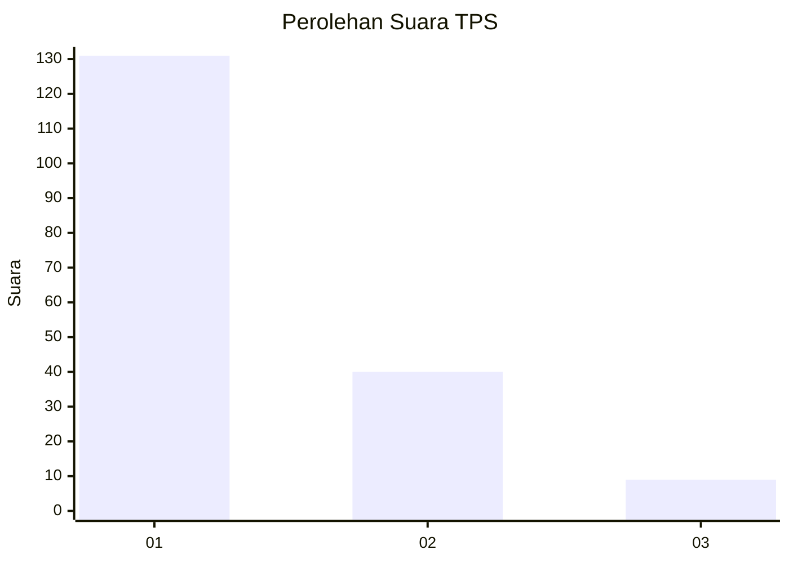
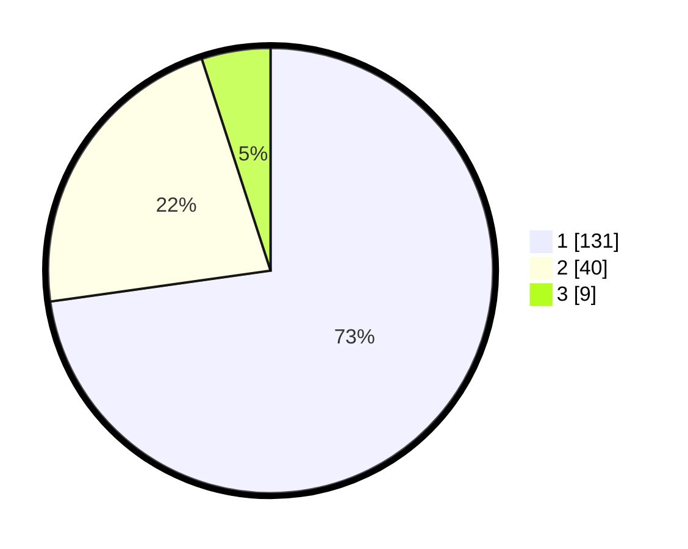

# Hasil

## Grafik

## Tabel

| No. | Nama Paslon    | Suara | Suara (raw) | Persentase |
|:--- |:-------------- | -----:| -----------:| ----------:|
| 1   | ANIES MUHAIMIN | 131   | [131][p-1]  | 72,78      |
| 2   | PRABOWO GIBRAN | 40    | [40][p-2]   | 22,22      |
| 3   | GANJAR MAHFUD  | 9     | [9][p-3]    | 5,00       |

[p-1]: https://github.com/gigit-pemilu/pemilu-2024/blob/main/pilpres/hitung-suara/sub/35-jawa-timur/sub/24-lamongan/sub/14-paciran/sub/2003-paciran/sub/021-tps/sub/paslon-1.txt
[p-2]: https://github.com/gigit-pemilu/pemilu-2024/blob/main/pilpres/hitung-suara/sub/35-jawa-timur/sub/24-lamongan/sub/14-paciran/sub/2003-paciran/sub/021-tps/sub/paslon-2.txt
[p-3]: https://github.com/gigit-pemilu/pemilu-2024/blob/main/pilpres/hitung-suara/sub/35-jawa-timur/sub/24-lamongan/sub/14-paciran/sub/2003-paciran/sub/021-tps/sub/paslon-3.txt

## Foto C Plano

https://sirekap-obj-formc.kpu.go.id/77ee/pemilu/ppwp/35/24/14/20/03/3524142003021-20240214-195109--2ed2df30-a2c2-4547-b75b-0fd437b9e680.jpg

https://sirekap-obj-formc.kpu.go.id/77ee/pemilu/ppwp/35/24/14/20/03/3524142003021-20240214-195125--e341271e-9ff0-4e82-ba99-f212bd8b5550.jpg

https://sirekap-obj-formc.kpu.go.id/77ee/pemilu/ppwp/35/24/14/20/03/3524142003021-20240214-195140--108df61c-c6e3-4efb-a3d3-03f2d6828442.jpg

## Metadata

| Key        | Value               |
| ---------- | ------------------- |
| Time Stamp | 2024-02-24 22:31:28 |

