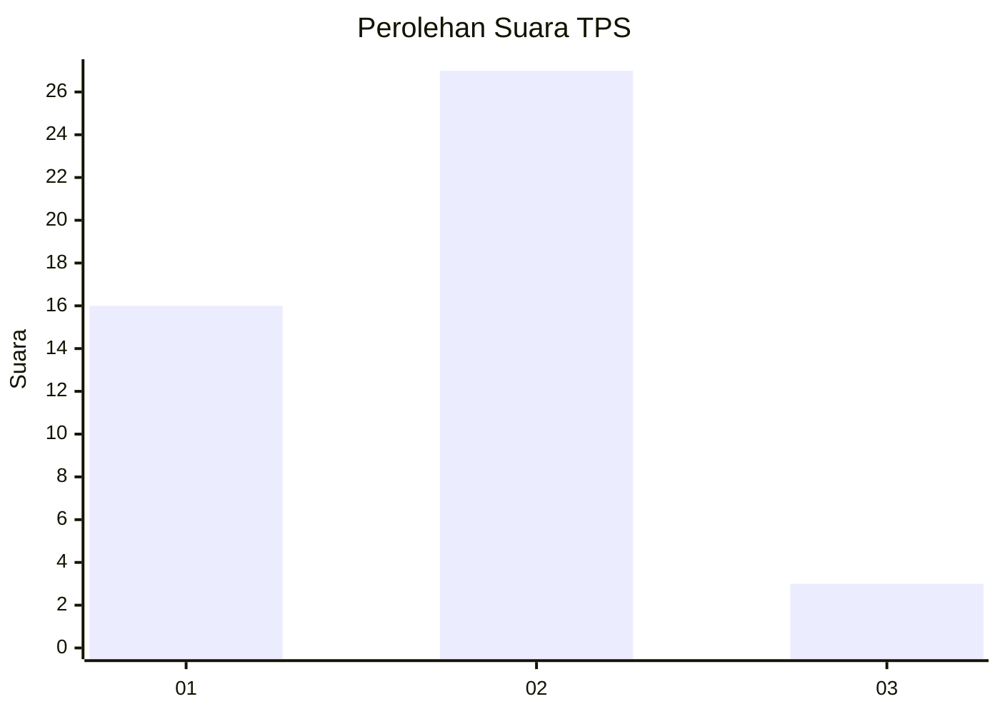
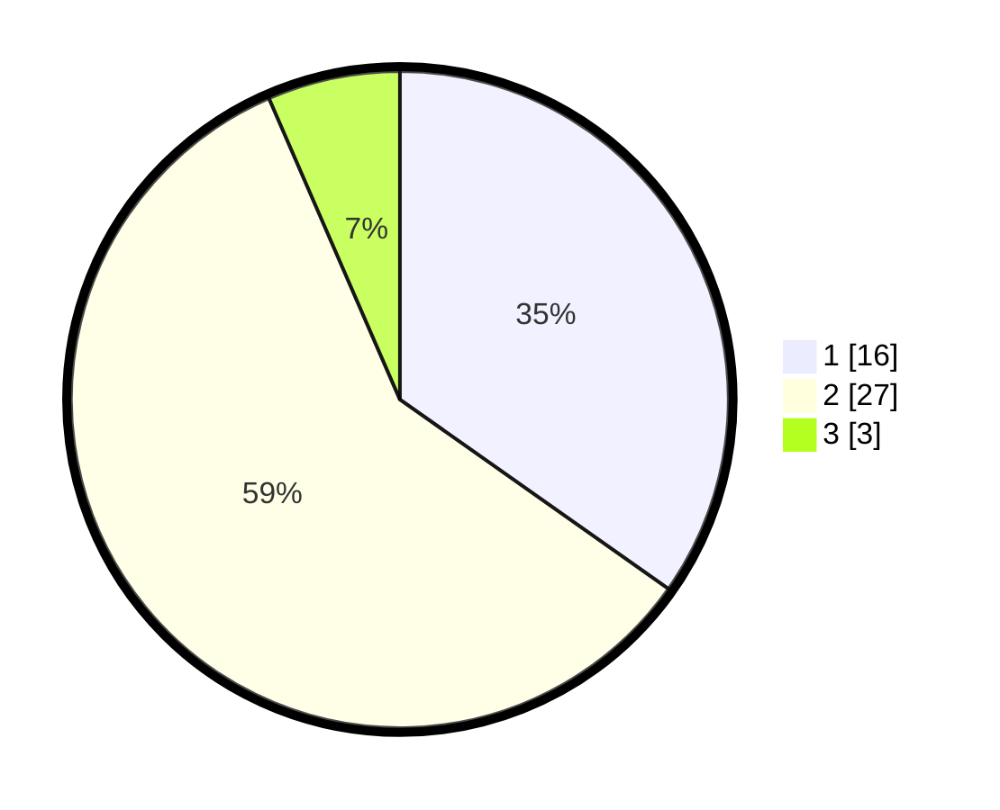

# Hasil

## Grafik

## Tabel

| No. | Nama Paslon    | Suara | Suara (raw) | Persentase |
|:--- |:-------------- | -----:| -----------:| ----------:|
| 1   | ANIES MUHAIMIN | 16    | [16][p-1]   | 34,78      |
| 2   | PRABOWO GIBRAN | 27    | [27][p-2]   | 58,70      |
| 3   | GANJAR MAHFUD  | 3     | [3][p-3]    | 6,52       |

[p-1]: https://github.com/gigit-pemilu/pemilu-2024-35-jawa-timur/blob/main/pilpres/hitung-suara/sub/35-jawa-timur/sub/24-lamongan/sub/14-paciran/sub/2004-sumurgayam/sub/004-tps/sub/paslon-1.txt
[p-2]: https://github.com/gigit-pemilu/pemilu-2024-35-jawa-timur/blob/main/pilpres/hitung-suara/sub/35-jawa-timur/sub/24-lamongan/sub/14-paciran/sub/2004-sumurgayam/sub/004-tps/sub/paslon-2.txt
[p-3]: https://github.com/gigit-pemilu/pemilu-2024-35-jawa-timur/blob/main/pilpres/hitung-suara/sub/35-jawa-timur/sub/24-lamongan/sub/14-paciran/sub/2004-sumurgayam/sub/004-tps/sub/paslon-3.txt

## Foto C Plano

https://sirekap-obj-formc.kpu.go.id/974b/pemilu/ppwp/35/24/14/20/04/3524142004004-20240216-124450--13486b7a-4baa-4ba4-ae7d-dceaf8141b98.jpg

https://sirekap-obj-formc.kpu.go.id/974b/pemilu/ppwp/35/24/14/20/04/3524142004004-20240216-124458--398fa47a-af23-4d6c-9a92-cd61f490655f.jpg

https://sirekap-obj-formc.kpu.go.id/974b/pemilu/ppwp/35/24/14/20/04/3524142004004-20240216-124455--9bfc42bc-2634-446a-a784-6bbe9a19be70.jpg

## Metadata

| Key        | Value               |
| ---------- | ------------------- |
| Time Stamp | 2024-02-17 14:45:18 |

## DATA PEMILIH TETAP

Jumlah pemilih dalam DPT: **146**.
 * L: **81**.
 * P: **65**.

## DATA PENGGUNA HAK PILIH

Jumlah pengguna hak pilih dalam DPT: **39**.
 * L: **18**.
 * P: **21**.

Jumlah pengguna hak pilih dalam DPTb: **0**.
 * L: **0**.
 * P: **0**.

Jumlah pengguna hak pilih dalam DPK: **8**.
 * L: **3**.
 * P: **5**.

Jumlah pengguna hak pilih: **47**.
 * L: **21**.
 * P: **26**.

## JUMLAH SUARA SAH DAN TIDAK SAH

JUMLAH SELURUH SUARA SAH: **46**.

JUMLAH SUARA TIDAK SAH: **1**.

JUMLAH SELURUH SUARA SAH DAN SUARA TIDAK SAH: **47**.

