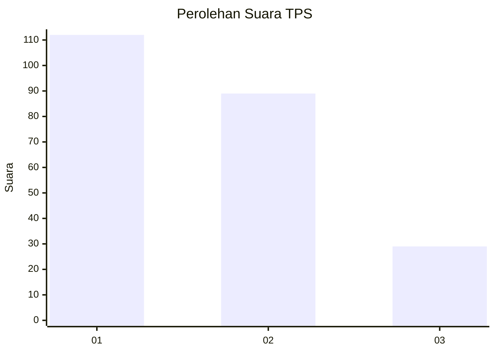
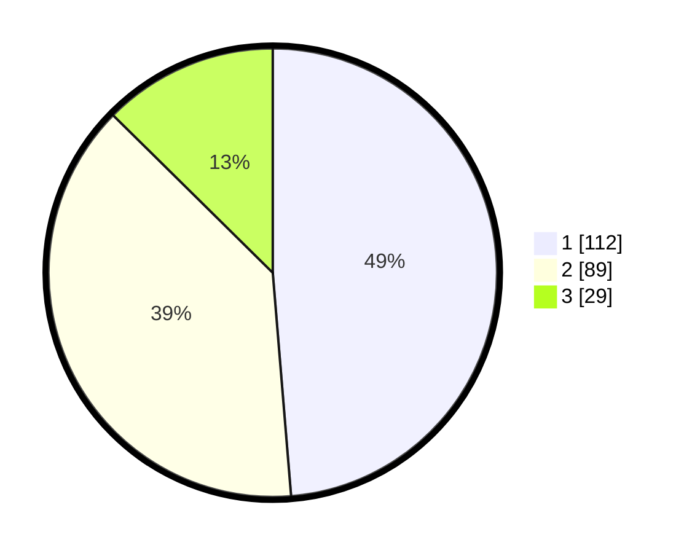

# Hasil

## Grafik

## Tabel

| No. | Nama Paslon    | Suara | Suara (raw) | Persentase |
|:--- |:-------------- | -----:| -----------:| ----------:|
| 1   | ANIES MUHAIMIN | 112   | [112][p-1]  | 48,70      |
| 2   | PRABOWO GIBRAN | 89    | [89][p-2]   | 38,70      |
| 3   | GANJAR MAHFUD  | 29    | [29][p-3]   | 12,61      |

[p-1]: https://github.com/gigit-pemilu/pemilu-2024/blob/main/pilpres/hitung-suara/sub/35-jawa-timur/sub/24-lamongan/sub/15-solokuro/sub/2005-payaman/sub/013-tps/sub/paslon-1.txt
[p-2]: https://github.com/gigit-pemilu/pemilu-2024/blob/main/pilpres/hitung-suara/sub/35-jawa-timur/sub/24-lamongan/sub/15-solokuro/sub/2005-payaman/sub/013-tps/sub/paslon-2.txt
[p-3]: https://github.com/gigit-pemilu/pemilu-2024/blob/main/pilpres/hitung-suara/sub/35-jawa-timur/sub/24-lamongan/sub/15-solokuro/sub/2005-payaman/sub/013-tps/sub/paslon-3.txt

## Foto C Plano

https://sirekap-obj-formc.kpu.go.id/df81/pemilu/ppwp/35/24/15/20/05/3524152005013-20240223-224921--dc164102-fcdf-4270-892b-fa00f7f15e90.jpg

https://sirekap-obj-formc.kpu.go.id/df81/pemilu/ppwp/35/24/15/20/05/3524152005013-20240223-225121--eab3e484-b546-441c-a3f9-5e1f73826e73.jpg

https://sirekap-obj-formc.kpu.go.id/df81/pemilu/ppwp/35/24/15/20/05/3524152005013-20240223-225010--6b030bb1-5ede-4ed3-af59-4f5e6a2fb9bc.jpg

## Metadata

| Key        | Value               |
| ---------- | ------------------- |
| Time Stamp | 2024-02-25 20:00:00 |

