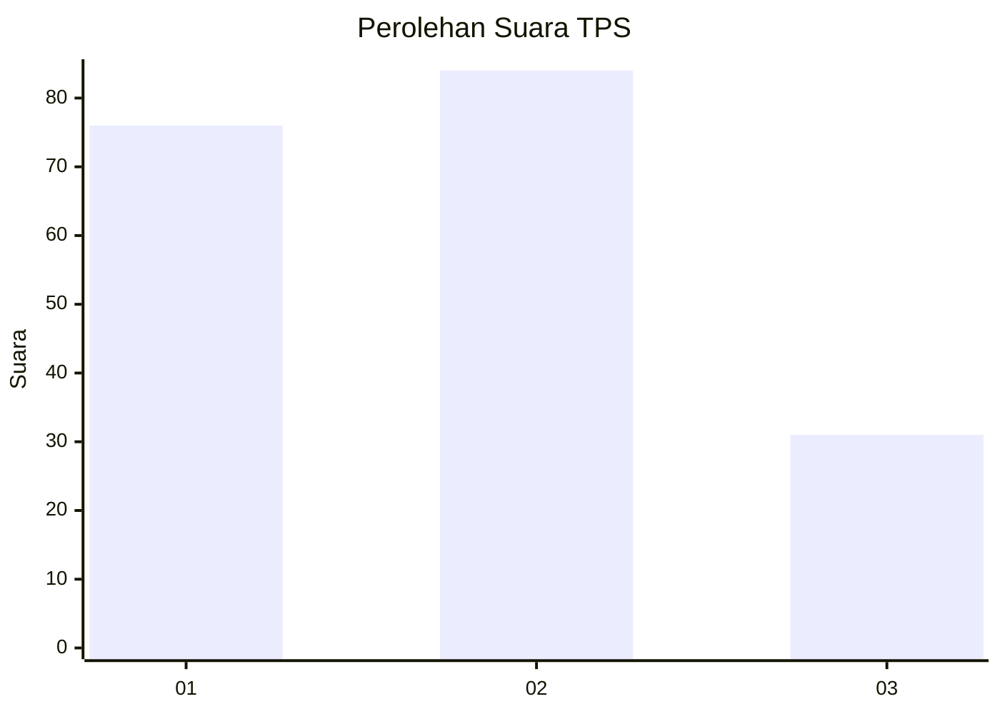
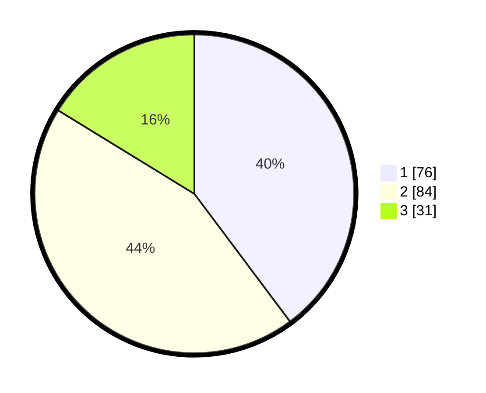

# Hasil

## Grafik

## Tabel

| No. | Nama Paslon    | Suara | Suara (raw) | Persentase |
|:--- |:-------------- | -----:| -----------:| ----------:|
| 1   | ANIES MUHAIMIN | 76    | [76][p-1]   | 39,79      |
| 2   | PRABOWO GIBRAN | 84    | [84][p-2]   | 43,98      |
| 3   | GANJAR MAHFUD  | 31    | [31][p-3]   | 16,23      |

[p-1]: https://github.com/gigit-pemilu/pemilu-2024/blob/main/pilpres/hitung-suara/sub/35-jawa-timur/sub/24-lamongan/sub/15-solokuro/sub/2006-solokuro/sub/003-tps/sub/paslon-1.txt
[p-2]: https://github.com/gigit-pemilu/pemilu-2024/blob/main/pilpres/hitung-suara/sub/35-jawa-timur/sub/24-lamongan/sub/15-solokuro/sub/2006-solokuro/sub/003-tps/sub/paslon-2.txt
[p-3]: https://github.com/gigit-pemilu/pemilu-2024/blob/main/pilpres/hitung-suara/sub/35-jawa-timur/sub/24-lamongan/sub/15-solokuro/sub/2006-solokuro/sub/003-tps/sub/paslon-3.txt

## Foto C Plano

https://sirekap-obj-formc.kpu.go.id/a966/pemilu/ppwp/35/24/15/20/06/3524152006003-20240214-215409--bc12d6bb-8740-4cbd-8d1c-2e59b49a31db.jpg

https://sirekap-obj-formc.kpu.go.id/a966/pemilu/ppwp/35/24/15/20/06/3524152006003-20240214-215430--0a895a02-2295-401b-9aa1-6a6a323e33e8.jpg

https://sirekap-obj-formc.kpu.go.id/a966/pemilu/ppwp/35/24/15/20/06/3524152006003-20240215-044008--01ee76ae-99f1-4314-9c9b-a7989c104c4b.jpg

## Metadata

| Key        | Value               |
| ---------- | ------------------- |
| Time Stamp | 2024-02-19 06:16:00 |

