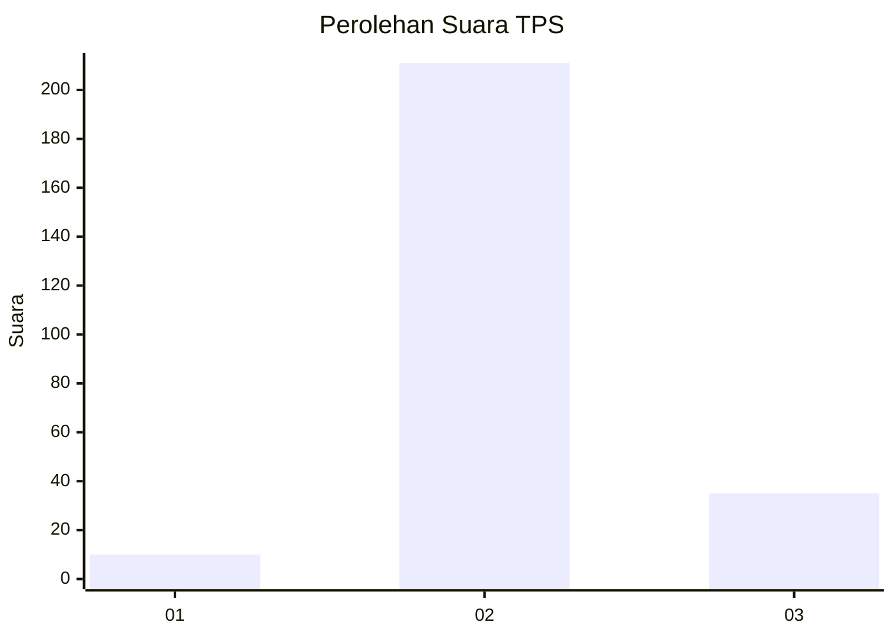
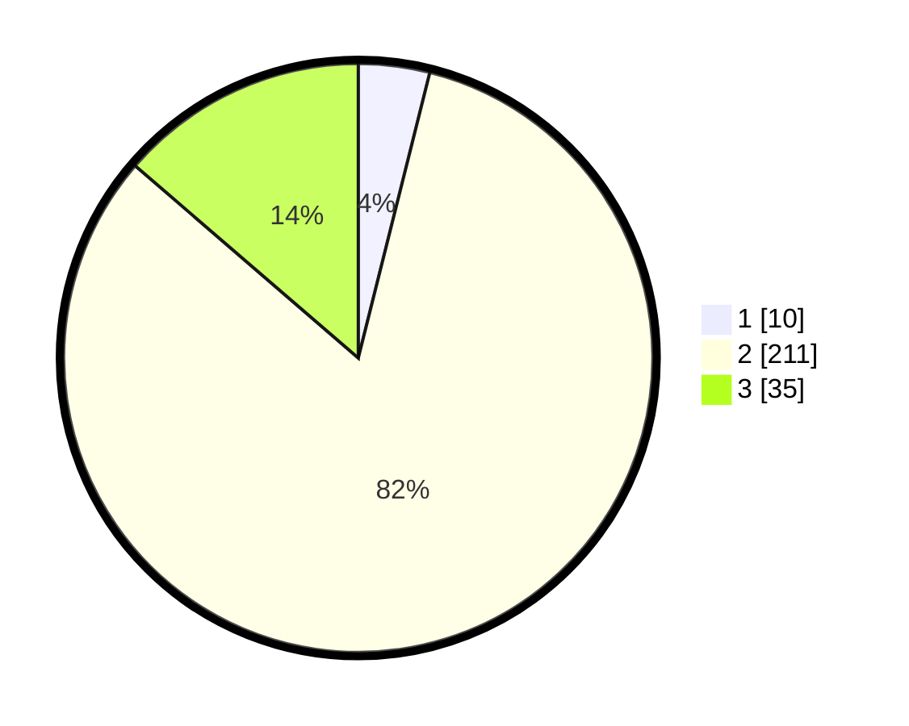

# Hasil

## Grafik

## Tabel

| No. | Nama Paslon    | Suara | Suara (raw) | Persentase |
|:--- |:-------------- | -----:| -----------:| ----------:|
| 1   | ANIES MUHAIMIN | 10    | [10][p-1]   | 3,91       |
| 2   | PRABOWO GIBRAN | 211   | [211][p-2]  | 82,42      |
| 3   | GANJAR MAHFUD  | 35    | [35][p-3]   | 13,67      |

[p-1]: https://github.com/gigit-pemilu/pemilu-2024/blob/main/pilpres/hitung-suara/sub/35-jawa-timur/sub/24-lamongan/sub/16-mantup/sub/2009-sukosari/sub/001-tps/sub/paslon-1.txt
[p-2]: https://github.com/gigit-pemilu/pemilu-2024/blob/main/pilpres/hitung-suara/sub/35-jawa-timur/sub/24-lamongan/sub/16-mantup/sub/2009-sukosari/sub/001-tps/sub/paslon-2.txt
[p-3]: https://github.com/gigit-pemilu/pemilu-2024/blob/main/pilpres/hitung-suara/sub/35-jawa-timur/sub/24-lamongan/sub/16-mantup/sub/2009-sukosari/sub/001-tps/sub/paslon-3.txt

## Foto C Plano

https://sirekap-obj-formc.kpu.go.id/bb98/pemilu/ppwp/35/24/16/20/09/3524162009001-20240219-172657--60abc219-a3cb-48b5-a239-cb453e1cfc14.jpg

https://sirekap-obj-formc.kpu.go.id/bb98/pemilu/ppwp/35/24/16/20/09/3524162009001-20240219-173951--6866181e-c434-4060-85b7-5d1a9d7794d3.jpg

https://sirekap-obj-formc.kpu.go.id/bb98/pemilu/ppwp/35/24/16/20/09/3524162009001-20240219-174306--4194dc67-18fb-4d8a-9795-f9d47d16e6e5.jpg

## Metadata

| Key        | Value               |
| ---------- | ------------------- |
| Time Stamp | 2024-02-24 22:31:28 |

