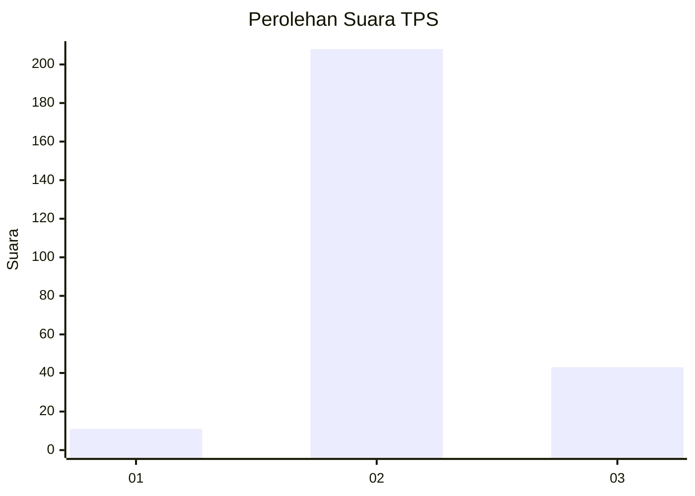
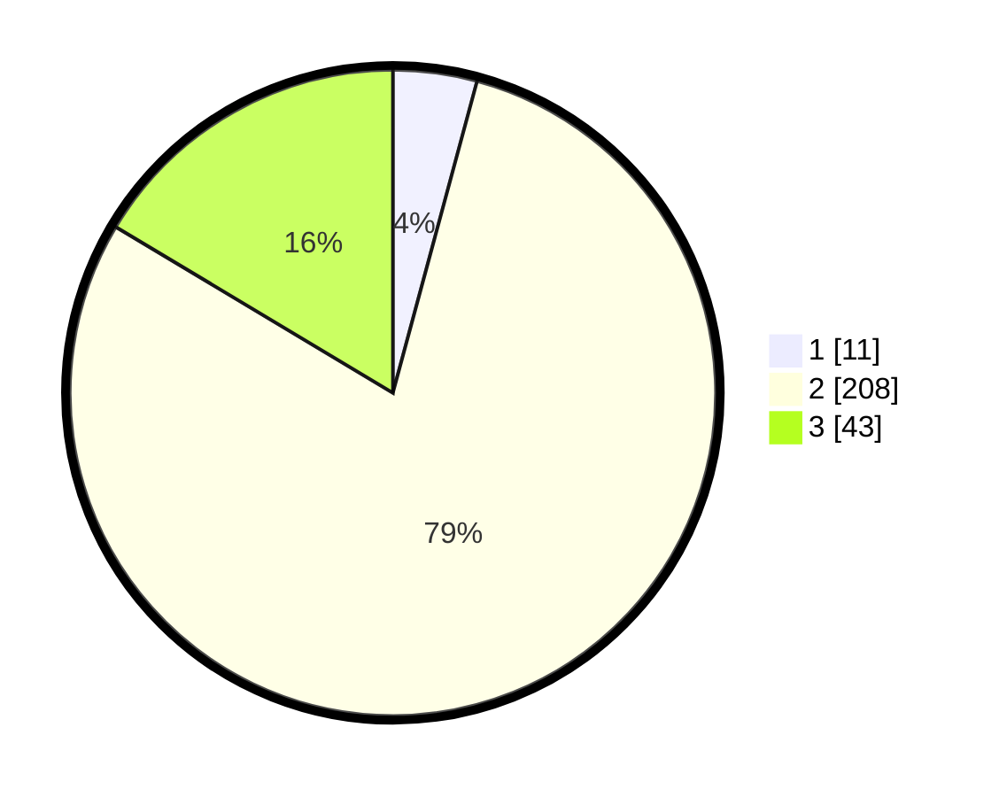

# Hasil

## Grafik

## Tabel

| No. | Nama Paslon    | Suara | Suara (raw) | Persentase |
|:--- |:-------------- | -----:| -----------:| ----------:|
| 1   | ANIES MUHAIMIN | 11    | [11][p-1]   | 4,20       |
| 2   | PRABOWO GIBRAN | 208   | [208][p-2]  | 79,39      |
| 3   | GANJAR MAHFUD  | 43    | [43][p-3]   | 16,41      |

[p-1]: https://github.com/gigit-pemilu/pemilu-2024/blob/main/pilpres/hitung-suara/sub/35-jawa-timur/sub/24-lamongan/sub/17-sukodadi/sub/2003-sukolilo/sub/001-tps/sub/paslon-1.txt
[p-2]: https://github.com/gigit-pemilu/pemilu-2024/blob/main/pilpres/hitung-suara/sub/35-jawa-timur/sub/24-lamongan/sub/17-sukodadi/sub/2003-sukolilo/sub/001-tps/sub/paslon-2.txt
[p-3]: https://github.com/gigit-pemilu/pemilu-2024/blob/main/pilpres/hitung-suara/sub/35-jawa-timur/sub/24-lamongan/sub/17-sukodadi/sub/2003-sukolilo/sub/001-tps/sub/paslon-3.txt

## Foto C Plano

https://sirekap-obj-formc.kpu.go.id/e6b7/pemilu/ppwp/35/24/17/20/03/3524172003001-20240216-143137--79523984-23bb-43d7-bb77-d138c5c36e7a.jpg

https://sirekap-obj-formc.kpu.go.id/e6b7/pemilu/ppwp/35/24/17/20/03/3524172003001-20240216-143138--cfdcf6c5-7ae0-4fe5-8d89-7cf1f167ff09.jpg

https://sirekap-obj-formc.kpu.go.id/e6b7/pemilu/ppwp/35/24/17/20/03/3524172003001-20240216-143137--31922298-a58e-411e-a94e-0b2468f3a0c0.jpg

## Metadata

| Key        | Value               |
| ---------- | ------------------- |
| Time Stamp | 2024-02-16 21:01:00 |

## DATA PEMILIH TETAP

Jumlah pemilih dalam DPT: **288**.
 * L: **144**.
 * P: **144**.

## DATA PENGGUNA HAK PILIH

Jumlah pengguna hak pilih dalam DPT: **252**.
 * L: **130**.
 * P: **122**.

Jumlah pengguna hak pilih dalam DPTb: **0**.
 * L: **0**.
 * P: **0**.

Jumlah pengguna hak pilih dalam DPK: **25**.
 * L: **14**.
 * P: **11**.

Jumlah pengguna hak pilih: **277**.
 * L: **144**.
 * P: **133**.

## JUMLAH SUARA SAH DAN TIDAK SAH

JUMLAH SELURUH SUARA SAH: **262**.

JUMLAH SUARA TIDAK SAH: **15**.

JUMLAH SELURUH SUARA SAH DAN SUARA TIDAK SAH: **277**.

