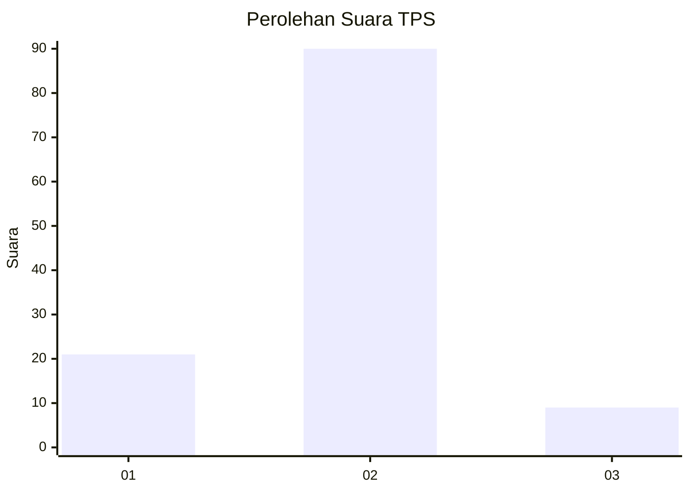
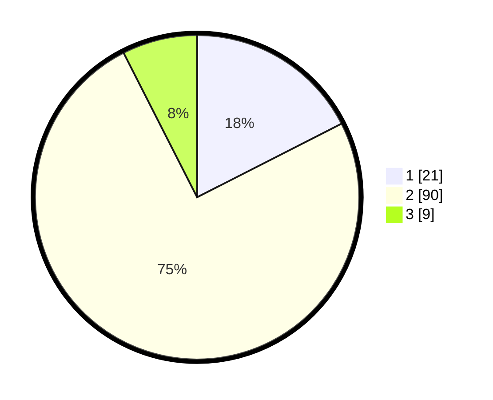

# Hasil

## Grafik

## Tabel

| No. | Nama Paslon    | Suara | Suara (raw) | Persentase |
|:--- |:-------------- | -----:| -----------:| ----------:|
| 1   | ANIES MUHAIMIN | 21    | [21][p-1]   | 17,50      |
| 2   | PRABOWO GIBRAN | 90    | [90][p-2]   | 75,00      |
| 3   | GANJAR MAHFUD  | 9     | [9][p-3]    | 7,50       |

[p-1]: https://github.com/gigit-pemilu/pemilu-2024/blob/main/pilpres/hitung-suara/sub/35-jawa-timur/sub/24-lamongan/sub/18-karanggeneng/sub/2001-bantengputih/sub/005-tps/sub/paslon-1.txt
[p-2]: https://github.com/gigit-pemilu/pemilu-2024/blob/main/pilpres/hitung-suara/sub/35-jawa-timur/sub/24-lamongan/sub/18-karanggeneng/sub/2001-bantengputih/sub/005-tps/sub/paslon-2.txt
[p-3]: https://github.com/gigit-pemilu/pemilu-2024/blob/main/pilpres/hitung-suara/sub/35-jawa-timur/sub/24-lamongan/sub/18-karanggeneng/sub/2001-bantengputih/sub/005-tps/sub/paslon-3.txt

## Foto C Plano

https://sirekap-obj-formc.kpu.go.id/2dc1/pemilu/ppwp/35/24/18/20/01/3524182001005-20240214-194200--4975f345-7055-4995-827f-761fde2379cf.jpg

https://sirekap-obj-formc.kpu.go.id/2dc1/pemilu/ppwp/35/24/18/20/01/3524182001005-20240214-203808--d4d1eb2a-8027-46f9-813e-4d5350f0b7bc.jpg

https://sirekap-obj-formc.kpu.go.id/2dc1/pemilu/ppwp/35/24/18/20/01/3524182001005-20240214-195538--4528e9f8-1db9-4f85-a836-c411d4462a5d.jpg

## Metadata

| Key        | Value               |
| ---------- | ------------------- |
| Time Stamp | 2024-02-16 14:00:34 |

## DATA PEMILIH TETAP

Jumlah pemilih dalam DPT: **202**.
 * L: **101**.
 * P: **101**.

## DATA PENGGUNA HAK PILIH

Jumlah pengguna hak pilih dalam DPT: **127**.
 * L: **56**.
 * P: **71**.

Jumlah pengguna hak pilih dalam DPTb: **0**.
 * L: **0**.
 * P: **0**.

Jumlah pengguna hak pilih dalam DPK: **0**.
 * L: **0**.
 * P: **0**.

Jumlah pengguna hak pilih: **127**.
 * L: **56**.
 * P: **71**.

## JUMLAH SUARA SAH DAN TIDAK SAH

JUMLAH SELURUH SUARA SAH: **120**.

JUMLAH SUARA TIDAK SAH: **7**.

JUMLAH SELURUH SUARA SAH DAN SUARA TIDAK SAH: **127**.

