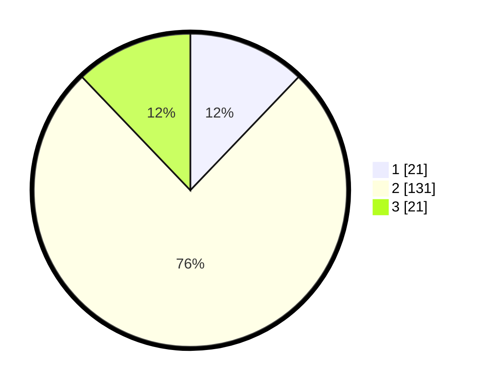

# Hasil

## Grafik

## Tabel

| No. | Nama Paslon    | Suara | Suara (raw) | Persentase |
|:--- |:-------------- | -----:| -----------:| ----------:|
| 1   | ANIES MUHAIMIN | 21    | [21][p-1]   | 12,14      |
| 2   | PRABOWO GIBRAN | 131   | [131][p-2]  | 75,72      |
| 3   | GANJAR MAHFUD  | 21    | [21][p-3]   | 12,14      |

[p-1]: https://github.com/gigit-pemilu/pemilu-2024/blob/main/pilpres/hitung-suara/sub/35-jawa-timur/sub/24-lamongan/sub/18-karanggeneng/sub/2006-sungelebak/sub/011-tps/sub/paslon-1.txt
[p-2]: https://github.com/gigit-pemilu/pemilu-2024/blob/main/pilpres/hitung-suara/sub/35-jawa-timur/sub/24-lamongan/sub/18-karanggeneng/sub/2006-sungelebak/sub/011-tps/sub/paslon-2.txt
[p-3]: https://github.com/gigit-pemilu/pemilu-2024/blob/main/pilpres/hitung-suara/sub/35-jawa-timur/sub/24-lamongan/sub/18-karanggeneng/sub/2006-sungelebak/sub/011-tps/sub/paslon-3.txt

## Foto C Plano

https://sirekap-obj-formc.kpu.go.id/2fa2/pemilu/ppwp/35/24/18/20/06/3524182006011-20240214-141458--b93aa5ee-fcd9-4cc7-9c08-fbec1501a9d6.jpg

https://sirekap-obj-formc.kpu.go.id/2fa2/pemilu/ppwp/35/24/18/20/06/3524182006011-20240214-141558--0271f43b-adac-42d1-a955-2159a8d1130a.jpg

https://sirekap-obj-formc.kpu.go.id/2fa2/pemilu/ppwp/35/24/18/20/06/3524182006011-20240214-141746--a18589a9-d74a-4a3e-a00d-c4eb2a235e9d.jpg

## Metadata

| Key        | Value               |
| ---------- | ------------------- |
| Time Stamp | 2024-02-16 14:30:33 |

## DATA PEMILIH TETAP

Jumlah pemilih dalam DPT: **220**.
 * L: **117**.
 * P: **110**.

## DATA PENGGUNA HAK PILIH

Jumlah pengguna hak pilih dalam DPT: **106**.
 * L: **490**.
 * P: **426**.

Jumlah pengguna hak pilih dalam DPTb: **8**.
 * L: **660**.
 * P: **400**.

Jumlah pengguna hak pilih dalam DPK: **2**.
 * L: **400**.
 * P: **40**.

Jumlah pengguna hak pilih: **176**.
 * L: **290**.
 * P: **606**.

## JUMLAH SUARA SAH DAN TIDAK SAH

JUMLAH SELURUH SUARA SAH: **173**.

JUMLAH SUARA TIDAK SAH: **3**.

JUMLAH SELURUH SUARA SAH DAN SUARA TIDAK SAH: **176**.

