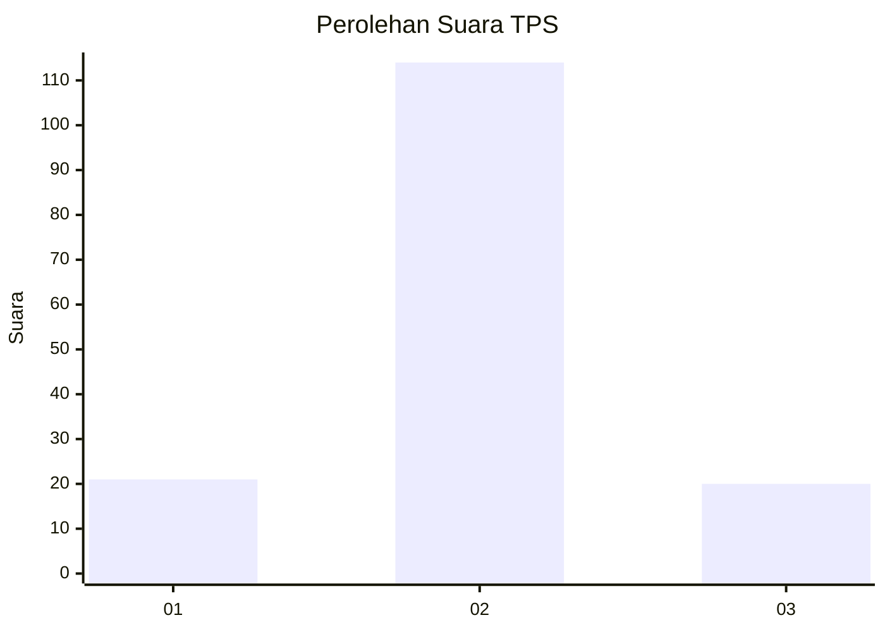
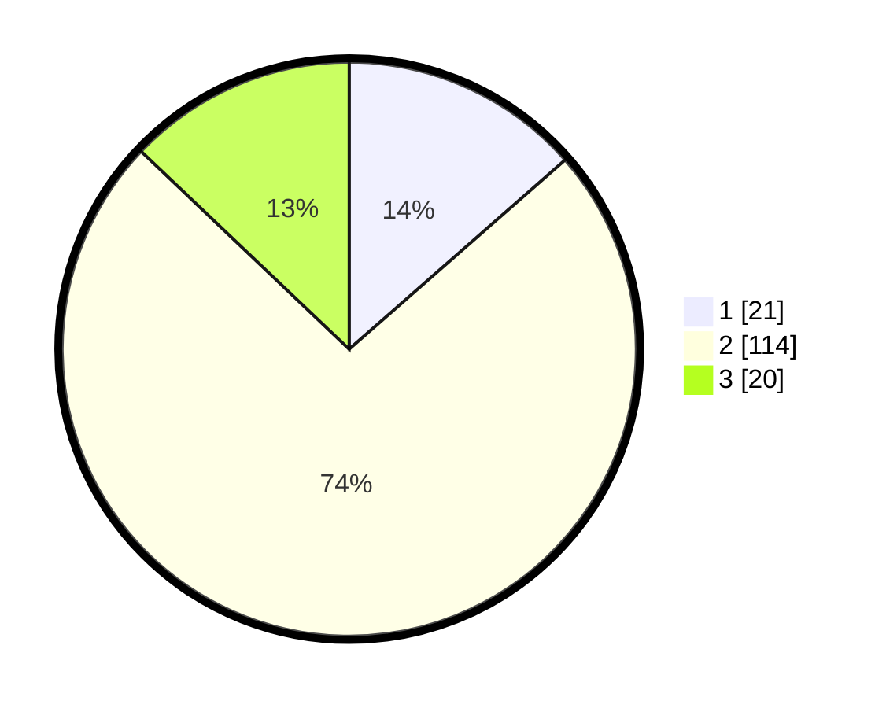

# Hasil

## Grafik

## Tabel

| No. | Nama Paslon    | Suara | Suara (raw) | Persentase |
|:--- |:-------------- | -----:| -----------:| ----------:|
| 1   | ANIES MUHAIMIN | 21    | [21][p-1]   | 13,55      |
| 2   | PRABOWO GIBRAN | 114   | [114][p-2]  | 73,55      |
| 3   | GANJAR MAHFUD  | 20    | [20][p-3]   | 12,90      |

[p-1]: https://github.com/gigit-pemilu/pemilu-2024-35-jawa-timur/blob/main/pilpres/hitung-suara/sub/35-jawa-timur/sub/24-lamongan/sub/21-turi/sub/2018-kepudibener/sub/005-tps/sub/paslon-1.txt
[p-2]: https://github.com/gigit-pemilu/pemilu-2024-35-jawa-timur/blob/main/pilpres/hitung-suara/sub/35-jawa-timur/sub/24-lamongan/sub/21-turi/sub/2018-kepudibener/sub/005-tps/sub/paslon-2.txt
[p-3]: https://github.com/gigit-pemilu/pemilu-2024-35-jawa-timur/blob/main/pilpres/hitung-suara/sub/35-jawa-timur/sub/24-lamongan/sub/21-turi/sub/2018-kepudibener/sub/005-tps/sub/paslon-3.txt

## Foto C Plano

https://sirekap-obj-formc.kpu.go.id/c4d2/pemilu/ppwp/35/24/21/20/18/3524212018005-20240216-190525--ca1402da-d405-41c8-8515-5d81fbf6ce17.jpg

https://sirekap-obj-formc.kpu.go.id/c4d2/pemilu/ppwp/35/24/21/20/18/3524212018005-20240216-192510--71bf12e8-a176-474d-b324-873d408d7078.jpg

https://sirekap-obj-formc.kpu.go.id/c4d2/pemilu/ppwp/35/24/21/20/18/3524212018005-20240214-233321--31799ac1-32ff-47d9-844b-94df05e6a2f2.jpg

## Metadata

| Key        | Value               |
| ---------- | ------------------- |
| Time Stamp | 2024-02-16 21:01:00 |

