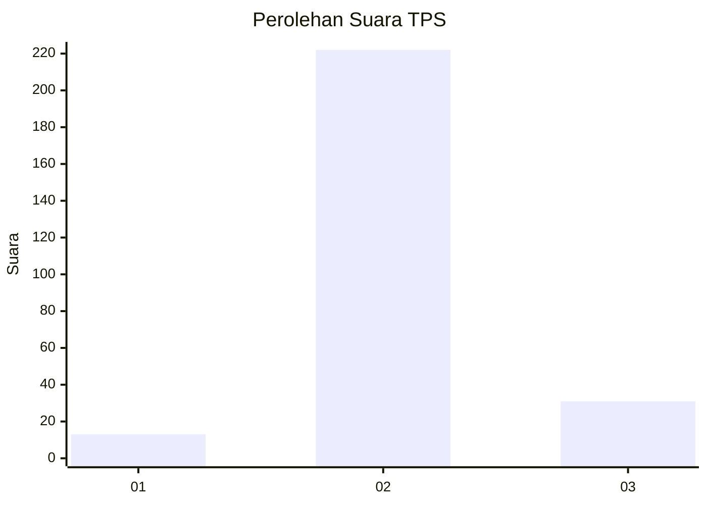
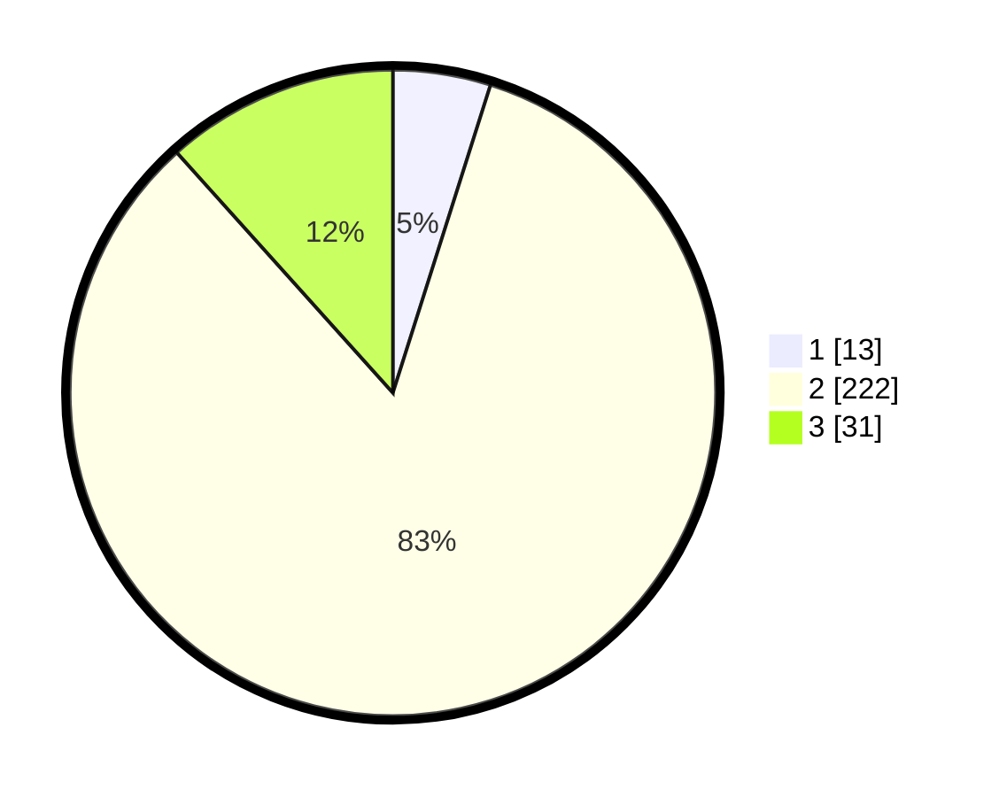

# Hasil

## Grafik

## Tabel

| No. | Nama Paslon    | Suara | Suara (raw) | Persentase |
|:--- |:-------------- | -----:| -----------:| ----------:|
| 1   | ANIES MUHAIMIN | 13    | [13][p-1]   | 4,89       |
| 2   | PRABOWO GIBRAN | 222   | [222][p-2]  | 83,46      |
| 3   | GANJAR MAHFUD  | 31    | [31][p-3]   | 11,65      |

[p-1]: https://github.com/gigit-pemilu/pemilu-2024/blob/main/pilpres/hitung-suara/sub/35-jawa-timur/sub/24-lamongan/sub/23-tikung/sub/2004-bakalanpule/sub/009-tps/sub/paslon-1.txt
[p-2]: https://github.com/gigit-pemilu/pemilu-2024/blob/main/pilpres/hitung-suara/sub/35-jawa-timur/sub/24-lamongan/sub/23-tikung/sub/2004-bakalanpule/sub/009-tps/sub/paslon-2.txt
[p-3]: https://github.com/gigit-pemilu/pemilu-2024/blob/main/pilpres/hitung-suara/sub/35-jawa-timur/sub/24-lamongan/sub/23-tikung/sub/2004-bakalanpule/sub/009-tps/sub/paslon-3.txt

## Foto C Plano

https://sirekap-obj-formc.kpu.go.id/d70e/pemilu/ppwp/35/24/23/20/04/3524232004009-20240215-001044--51ec65f9-fd72-42ba-a827-5c1ca9065394.jpg

https://sirekap-obj-formc.kpu.go.id/d70e/pemilu/ppwp/35/24/23/20/04/3524232004009-20240215-001125--b9517388-9f85-462c-a2ec-d5c966abb706.jpg

https://sirekap-obj-formc.kpu.go.id/d70e/pemilu/ppwp/35/24/23/20/04/3524232004009-20240215-001249--a84e5010-9b6f-4b03-b3ee-a9ae24366e0b.jpg

## Metadata

| Key        | Value               |
| ---------- | ------------------- |
| Time Stamp | 2024-02-15 21:01:18 |

