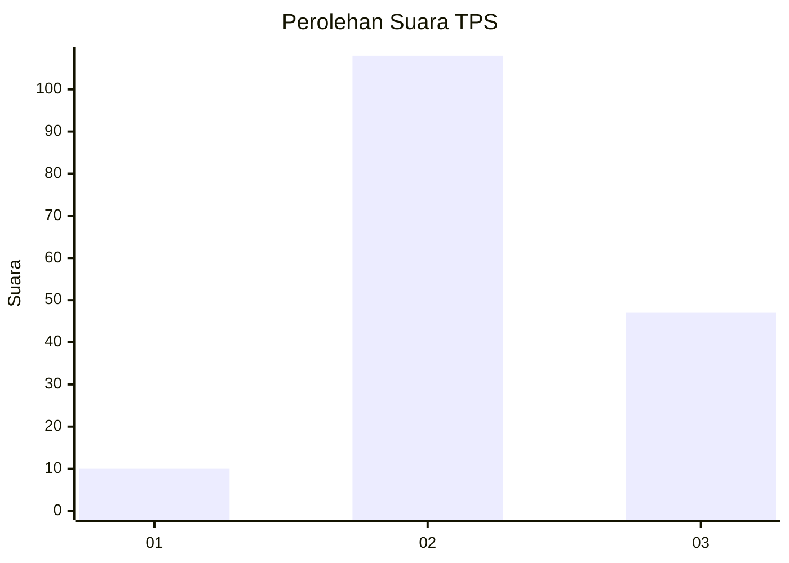
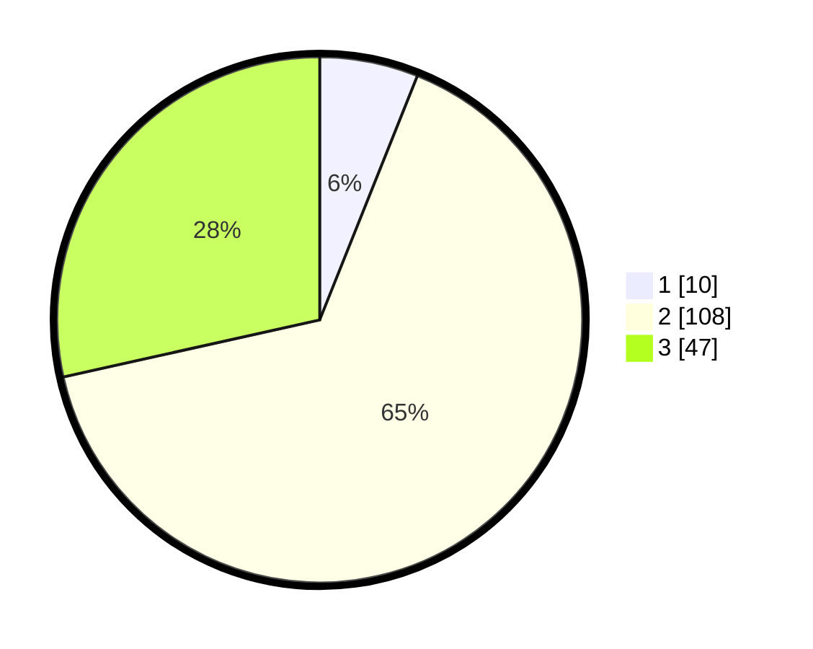

# Hasil

## Grafik

## Tabel

| No. | Nama Paslon    | Suara | Suara (raw) | Persentase |
|:--- |:-------------- | -----:| -----------:| ----------:|
| 1   | ANIES MUHAIMIN | 10    | [10][p-1]   | 6,06       |
| 2   | PRABOWO GIBRAN | 108   | [108][p-2]  | 65,45      |
| 3   | GANJAR MAHFUD  | 47    | [47][p-3]   | 28,48      |

[p-1]: https://github.com/gigit-pemilu/pemilu-2024/blob/main/pilpres/hitung-suara/sub/35-jawa-timur/sub/24-lamongan/sub/24-karangbinangun/sub/2017-windu/sub/005-tps/sub/paslon-1.txt
[p-2]: https://github.com/gigit-pemilu/pemilu-2024/blob/main/pilpres/hitung-suara/sub/35-jawa-timur/sub/24-lamongan/sub/24-karangbinangun/sub/2017-windu/sub/005-tps/sub/paslon-2.txt
[p-3]: https://github.com/gigit-pemilu/pemilu-2024/blob/main/pilpres/hitung-suara/sub/35-jawa-timur/sub/24-lamongan/sub/24-karangbinangun/sub/2017-windu/sub/005-tps/sub/paslon-3.txt

## Foto C Plano

https://sirekap-obj-formc.kpu.go.id/359f/pemilu/ppwp/35/24/24/20/17/3524242017005-20240214-141041--4be5e83e-2ce2-4772-935d-bb73cb753187.jpg

https://sirekap-obj-formc.kpu.go.id/359f/pemilu/ppwp/35/24/24/20/17/3524242017005-20240214-141218--e5ce9b4b-6a3d-4932-876f-27fe23810630.jpg

https://sirekap-obj-formc.kpu.go.id/359f/pemilu/ppwp/35/24/24/20/17/3524242017005-20240214-141700--f0cdecca-4c55-46c7-af52-04ec22855dee.jpg

## Metadata

| Key        | Value               |
| ---------- | ------------------- |
| Time Stamp | 2024-02-14 21:46:01 |

